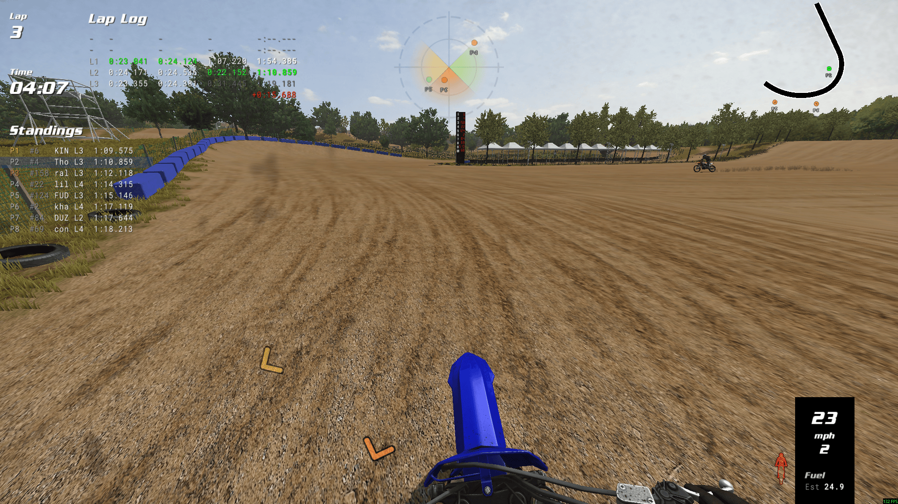

A customizable, [open-source](https://github.com/thomas4f/mxbmrp3) HUD plugin for MX Bikes and GP Bikes displaying real-time race information and telemetry.


*Example HUD layouts. All elements are fully customizable.*

### Features

- Live race standings, track map, and proximity radar with approach alerts
- Lap timing with splits, personal bests, gap-to-PB visualization, and online lap records (MX Bikes)
- Track specific riders with custom colors and icons across all HUDs
- Controller rumble feedback with customizable effects (bumps, slide, spin, lockup, wheelie, etc.)
- Discord Rich Presence integration showing current session and track
- Telemetry visualization and compact info widgets
- Drag-and-drop positioning with color themes and customizable hotkeys
- Automatic profile switching for Practice, Qualify, Race, and Spectate sessions

### Get Started

Download and install the plugin to begin customizing your HUD.

[](https://github.com/thomas4f/mxbmrp3/releases/latest/download/mxbmrp3-Setup.exe)
[](https://github.com/thomas4f/mxbmrp3/releases/latest/download/mxbmrp3.zip)

> **Quick Start**
> 1. Install the plugin
> 2. Launch the game and load a track
> 3. Right-click drag to reposition elements
> 4. Press **Tilde** or click **[=]** to customize visibility, scale, opacity, and more

See [Installation](#installation) for detailed setup instructions.

## Contents

- [Installation](#installation)
- [Controls](#controls)
- [Configuration](#configuration)
- [HUDs & Widgets](#huds--widgets)
- [Advanced Settings](#advanced-settings)
- [Modding](#modding)
- [Troubleshooting](#troubleshooting)
- [Development](#development)

## Installation

**Requirements:**
- MX Bikes **Beta 20 or newer** / GP Bikes **Beta 18 or newer**
- [Microsoft Visual C++ Redistributable (x64)](https://aka.ms/vc14/vc_redist.x64.exe) (the automatic installer will check for this)

### Automatic Installation

1. Download the latest installer [`mxbmrp3-Setup.exe`](https://github.com/thomas4f/mxbmrp3/releases/latest/download/mxbmrp3-Setup.exe)
2. Run the installer - it will:
   - Auto-detect your MX Bikes and GP Bikes installations (Steam or standalone)
   - Let you choose which games to install for
   - Install to the correct plugins folder for each game
   - Check for and offer to install Visual C++ Redistributable if needed
   - Handle upgrades automatically (preserves your settings)

### Manual Installation

1. Download the latest release archive [`mxbmrp3.zip`](https://github.com/thomas4f/mxbmrp3/releases/latest/download/mxbmrp3.zip)
2. Find your game's plugins folder:
   - **Steam**: Right-click the game in your library → **Manage** → **Browse local files** → open `plugins`
   - **Standalone**: Navigate to your game installation folder (e.g., `C:\Games\MX Bikes\` or `C:\Games\GP Bikes\`) → open `plugins`
3. Extract the plugin files:
   - Copy `mxbmrp3.dlo` (MX Bikes) or `mxbmrp3_gpb.dlo` (GP Bikes) to the `plugins/` folder
   - Copy the `mxbmrp3_data/` folder to the `plugins/` folder

   **Do NOT delete the existing game files** (`proxy64.dlo`, `proxy_udp64.dlo`, `xinput64.dli`, or `telemetry64.dlo` for GP Bikes) - these are native game files, not old plugin versions.

   Your directory should look like this after installation (files vary slightly by game):
   ```
   [Game]/
   │   mxbikes.exe / gpbikes.exe
   │   ...
   │
   └───plugins/
       ├── mxbmrp3_data/        ← Add this folder (from release)
       │   ├── fonts/           ← Font files (.fnt)
       │   ├── textures/        ← Texture files (.tga)
       │   └── icons/           ← Icon files (.tga)
       ├── mxbmrp3.dlo          ← Add this (MX Bikes only)
       ├── mxbmrp3_gpb.dlo      ← Add this (GP Bikes only)
       ├── proxy_udp64.dlo      ← Keep (native game file)
       ├── proxy64.dlo          ← Keep (native game file)
       ├── xinput64.dli         ← Keep (native game file)
       └── telemetry64.dlo      ← Keep (GP Bikes only)
   ```

### After Installation

Launch the game - the plugin will load automatically. Some elements are enabled by default and can be repositioned or configured via the settings menu. If nothing appears, see [Troubleshooting](#troubleshooting).

## Controls

### Mouse
- **Move Mouse** - Show cursor and `[=]` settings button (auto-hides after inactivity)
- **Left Click** - Interact with settings menu and HUD elements
- **Right Click & Drag** - Reposition elements

### Keyboard Shortcuts

Keyboard and controller hotkeys can be customized in Settings > Hotkeys. By default, only the settings menu hotkey is configured:

- **Tilde** (below Esc) - Toggle settings menu

## Configuration

Use the settings menu (Tilde key or `[=]` settings button) to configure all HUDs and widgets. **Hover over any setting to see its description** - all controls have in-game tooltips explaining their function.

The settings menu provides:
- **General** - Profiles, preferences, grid snapping
- **Appearance** - Font categories and color theme customization
- **Hotkeys** - Keyboard and controller bindings
- **Riders** - Track specific riders with custom colors and icons
- **Rumble** - Controller vibration feedback effects
- **Updates** - Check for new versions and install updates in-game
- **Individual HUD tabs** - Per-element visibility, scale, opacity, and options

All settings are automatically saved between sessions.

### Profiles

Four separate profiles store complete HUD layout configurations:
- **Practice** - Practice and warmup sessions
- **Qualify** - Pre-qualify, qualify practice, and qualify sessions
- **Race** - Race 1, Race 2, Straight Rhythm sessions
- **Spectate** - Spectating or viewing replays

Auto-switch (disabled by default) automatically changes profiles based on session type.

## HUDs & Widgets

All HUDs and widgets are configurable via the settings menu, with detailed per-option descriptions.

### HUDs

| HUD | Description |
|-----|-------------|
| **Standings** | Live race positions with gaps, status, and tracked rider indicators |
| **Map** | Top-down track map with rider positions (click to spectate) |
| **Radar** | Proximity radar with approach alerts and distance arrows |
| **Timing** | Split and lap times with gap comparisons |
| **Gap Bar** | Visual gap-to-PB bar with position markers |
| **Pitboard** | Pitboard-style lap information display |
| **Lap Log** | Historical lap times with PB indicators |
| **Ideal Lap** | Best sector times and theoretical ideal lap |
| **Records** | Online lap records (CBR or MXB-Ranked) with personal bests (MX Bikes only) |
| **Telemetry** | Throttle, brake, suspension graphs |
| **Performance** | FPS and plugin CPU usage |
| **Rumble** | Controller rumble effect visualization |
| **Session** | Session info (type, format, track, server, players, password) |

### Widgets

| Widget | Description |
|--------|-------------|
| **Lap** | Current lap number |
| **Position** | Race position |
| **Time** | Session time/countdown |
| **Speed** | Speed and gear |
| **Speedo** | Analog speedometer |
| **Tacho** | Analog tachometer |
| **Bars** | Telemetry bars (throttle, brake, clutch, RPM, suspension, fuel) |
| **Fuel** | Fuel calculator with consumption tracking |
| **Lean** | Bike lean angle with arc gauge |
| **Notices** | Race status notices (wrong way, blue flag, last lap, finished) |
| **Gamepad** | Controller visualization |

## Advanced Settings

Some power-user settings are only available via manual INI editing. To edit:

1. Disable **Auto-Save** in Settings > General
2. Edit `mxbmrp3_settings.ini` in your [user data folder](#modding)
3. Use the **Reload Config** hotkey to apply changes (bind it in Settings > Hotkeys)

The `[Advanced]` section includes options like `mapPixelSpacing` (track rendering density), gauge needle colors (`speedoNeedleColor`, `tachoNeedleColor`), `standingsTopPositions` (always-visible top positions), and drop shadow offsets. Colors use AABBGGRR hex format.

## Modding

Plugin data and custom assets are stored in `Documents\PiBoSo\[Game]\mxbmrp3\`.

### Custom Assets

Add custom fonts, textures, and icons by placing files in the appropriate subfolder:

```
mxbmrp3/
├── fonts/       ← Custom .fnt files
├── textures/    ← Custom .tga textures
└── icons/       ← Custom .tga icons
```

On game startup, the plugin syncs these files to the plugin's data directory (`plugins/mxbmrp3_data/`). User files with the same name as bundled assets will override them. This keeps your customizations separate from the plugin installation, so updates won't overwrite your files. **Restart the game after adding or modifying assets.**

**Textures** use the naming convention `{element_name}_{number}.tga` (e.g., `standings_hud_1.tga`). They're auto-discovered and selectable via the Texture control in each HUD's settings. Source design files (PSD) are available in [`assets/`](assets/).

**Fonts** (`.fnt` files) are auto-discovered and assignable to categories (Title, Normal, Strong, Marker, Small) in Settings > Appearance. To generate fonts, use the `fontgen` utility provided by PiBoSo. See [this forum post](https://forum.piboso.com/index.php?topic=1458.msg20183#msg20183) for details. An example configuration is provided in [`fontgen.cfg`](fontgen.cfg).

**Icons** (`.tga` files) are discovered alphabetically and available for tracked rider customization.

### Data Files

| File | Description |
|------|-------------|
| `mxbmrp3_settings.ini` | All HUD settings (positions, visibility, options) |
| `mxbmrp3_personal_bests.json` | Personal best lap times per track/bike/category |
| `mxbmrp3_tracked_riders.json` | Tracked riders with colors and icons |
| `rumble_profiles.json` | Per-bike rumble effect profiles |
| `odometer.json` | Per-bike odometer and trip meter data |

## Troubleshooting

**HUD Not Appearing**
- Check [Installation requirements](#installation) (MX Bikes Beta 20+ / GP Bikes Beta 18+, Visual C++ Redistributable)
- Verify the DLO file and `mxbmrp3_data/` are in the correct `plugins/` folder. Games have two directories - the **game installation** (contains the game .exe) and **user data** (`Documents\PiBoSo\[Game]\`). Plugins go in the game installation, not Documents.
- For GP Bikes, ensure you're using `mxbmrp3_gpb.dlo`, not `mxbmrp3.dlo`

**Text or Icons Not Appearing**
- Ensure `mxbmrp3_data/` folder is in the `plugins/` folder alongside the DLO file
- The `mxbmrp3_data/` folder contains fonts, textures, and icons required for rendering
- If you moved or renamed this folder, restore it from the release archive

**Game Fails to Start or Shows Black Screen**
- Ensure the [Visual C++ Redistributable (x64)](https://aka.ms/vc14/vc_redist.x64.exe) is installed
- Restart your computer after installing - the runtime may not load until after a reboot
- Try removing the plugin DLO file temporarily to verify the game starts without it

**Elements Appearing Twice (Ghost/Duplicate)**
- Check for duplicate DLO files - only ONE plugin DLO should exist in your plugins folder

**Elements Overlapping**
- Drag elements to reposition them
- Use settings menu to adjust scale

**Controller Not Working**
- If you accidentally deleted `xinput64.dli` from the plugins folder, controller input may stop working
- To restore: verify game files integrity (Steam) or reinstall the game

For bug reports or feature requests, open an issue on [GitHub](https://github.com/thomas4f/mxbmrp3/issues).

## Development

Built with C++17, Visual Studio 2022, Piboso Plugin API, and Claude Code.

- [`CLAUDE.md`](CLAUDE.md) - Quick-start guide for developers and AI assistants
- [`ARCHITECTURE.md`](ARCHITECTURE.md) - Comprehensive technical documentation with diagrams

### Building from Source

**Requirements:** Visual Studio 2022+, Windows SDK 10.0, Platform Toolset v143

1. Clone the repository:
   ```bash
   git clone https://github.com/thomas4f/mxbmrp3.git
   cd mxbmrp3
   ```
2. Open `mxbmrp3.sln` in Visual Studio 2022
3. Select configuration:
   - **MXB-Release** / **MXB-Debug** for MX Bikes
   - **GPB-Release** / **GPB-Debug** for GP Bikes
4. Build the solution (Ctrl+Shift+B)
5. Output:
   - MX Bikes: `build/MXB-Release/mxbmrp3.dlo`
   - GP Bikes: `build/GPB-Release/mxbmrp3_gpb.dlo`

### Roadmap

Ideas under consideration (no guarantees): extended telemetry (g-force), event log, HTTP data export for OBS overlays.

---

Licensed under the [MIT License](LICENSE). See [THIRD_PARTY_LICENSES.md](THIRD_PARTY_LICENSES.md) for bundled asset attributions.

Feedback and contributions are welcome.
