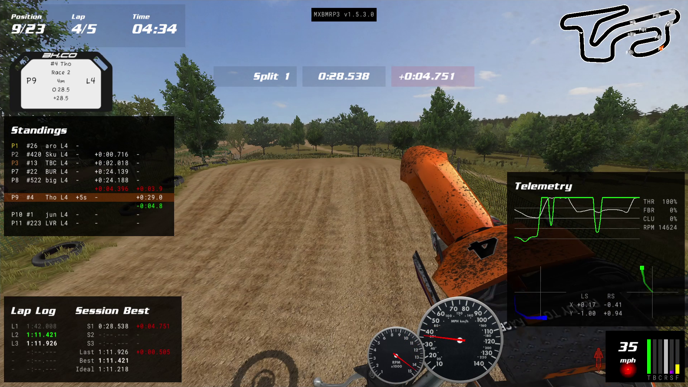

A customizable, [open-source](https://github.com/thomas4f/mxbmrp3) HUD plugin for MX Bikes displaying real-time race information and telemetry.


*Example HUD layout showing standings, map, telemetry, and widgets. All elements are fully customizable.*

### Features

- Live race standings, track map, and proximity radar with approach alerts
- Lap timing with splits, personal bests, gap-to-PB visualization, and online lap records
- Telemetry visualization and compact info widgets
- Drag-and-drop positioning with color themes
- Automatic profile switching for Practice, Qualify, Race, and Spectate sessions

### Get Started

Download and install the plugin to begin customizing your HUD. Most users should use the automatic installer. Use the ZIP for manual installation.

[](https://github.com/thomas4f/mxbmrp3/releases/latest/download/mxbmrp3-Setup.exe)
[](https://github.com/thomas4f/mxbmrp3/releases/latest/download/mxbmrp3.zip)

See [Installation](#installation) for setup instructions.

## Contents

- [Installation](#installation)
  - [Automatic](#automatic-installation)
  - [Manual](#manual-installation)
- [Controls](#controls)
- [Configuration](#configuration)
- [HUDs](#huds)
  - [Standings](#standings-hud)
  - [Map](#map-hud)
  - [Radar](#radar-hud)
  - [Timing](#timing-hud)
  - [Pitboard](#pitboard-hud)
  - [Lap Log](#lap-log-hud)
  - [Session Best](#session-best-hud)
  - [Records](#records-hud)
  - [Telemetry](#telemetry-hud)
  - [Input](#input-hud)
  - [Performance](#performance-hud)
- [Widgets](#widgets)
- [Modding](#modding)
- [Troubleshooting](#troubleshooting)
- [Development](#development)

## Installation

**Requirements:**
- MX Bikes **Beta 20 or newer**
- [Microsoft Visual C++ Redistributable](https://learn.microsoft.com/en-us/cpp/windows/latest-supported-vc-redist) (the automatic installer will check for this)

### Automatic Installation

1. Download the latest installer [`mxbmrp3-Setup.exe`](https://github.com/thomas4f/mxbmrp3/releases/latest/download/mxbmrp3-Setup.exe)
2. Run the installer - it will:
   - Auto-detect your MX Bikes installation (Steam or standalone)
   - Install to the correct plugins folder
   - Check for and offer to install Visual C++ Redistributable if needed
   - Handle upgrades automatically (preserves your settings)

### Manual Installation

1. Download the latest release archive [`mxbmrp3.zip`](https://github.com/thomas4f/mxbmrp3/releases/latest/download/mxbmrp3.zip)
2. Extract the plugin files to your MX Bikes plugins folder:
   - Copy `mxbmrp3.dlo` to `[MX Bikes]/plugins/`
   - Copy the `mxbmrp3_data/` folder to `[MX Bikes]/plugins/`

   **Do NOT delete the existing game files** (`proxy64.dlo`, `proxy_udp64.dlo`, `xinput64.dli`) - these are native MX Bikes files, not old plugin versions.

   Your directory should look like this after installation:
   ```
   MX Bikes/
   │   mxbikes.exe
   │   ...
   │
   └───plugins/
       ├── mxbmrp3_data/        ← Add this folder (from release)
       │       *.tga
       │       *.fnt
       ├── mxbmrp3.dlo          ← Add this (from release)
       ├── proxy_udp64.dlo      ← Keep (native game file)
       ├── proxy64.dlo          ← Keep (native game file)
       └── xinput64.dli         ← Keep (native game file)
   ```

### After Installation

Launch MX Bikes - the plugin will load automatically. Some elements are enabled by default and can be repositioned or configured via the settings menu. If nothing appears, see [Troubleshooting](#troubleshooting).

## Controls

### Mouse
- **Move Mouse** - Show cursor and `[=]` settings button (auto-hides after inactivity)
- **Left Click** - Interact with settings menu and HUD elements
- **Right Click & Drag** - Reposition elements

### Keyboard Shortcuts
- **F1** - Toggle Standings HUD
- **F2** - Toggle Map HUD
- **F3** - Toggle Radar HUD
- **F4** - Toggle Lap Log HUD
- **F5** - Toggle Session Best HUD
- **F6** - Toggle Telemetry HUD
- **F7** - Toggle Input HUD
- **F8** - Toggle Records HUD
- **F9** - Toggle all Widgets
- **Tilde** (below Esc, above Tab) or **Backslash** (above Enter) - Toggle settings menu
- **Ctrl+Tilde** or **Ctrl+Backslash** - Temporarily toggle all elements on/off

## Configuration

All element positions, scales, and visibility settings are automatically saved between sessions.

Use the settings menu (Tilde key or `[=]` settings button) to access tabs for each HUD:
- Toggle visibility
- Adjust scale and opacity
- Configure individual HUD settings (columns, rows, display modes)
- Customize color theme
- Set preferences (speed/fuel units, grid snapping)
- Check for updates (optional, checks GitHub releases on startup)
- Reset settings (per-tab, per-profile, or all profiles)

### Profiles

The plugin supports four separate profiles, each storing a complete HUD layout configuration:

- **Practice** - Used during practice and warmup sessions
- **Qualify** - Used during pre-qualify, qualify practice, and qualify sessions
- **Race** - Used during race sessions (Race 1, Race 2, Straight Rhythm)
- **Spectate** - Used when spectating or viewing replays

**Auto-Switch** (disabled by default): Automatically switches profiles based on session type. You can manually select a profile or disable auto-switching from the General tab in settings.

**Copy to All**: Applies the current profile's layout to all other profiles.

## HUDs

Full-featured displays with extensive customization options:

### Standings HUD
Displays live race positions with detailed rider information:
- Position, race number, rider name
- Bike brand (color-coded by manufacturer)
- Status column (L1, L2... for lap count, LL for last lap, FIN when finished, PIT, DNS/DSQ/RET)
- Gap times (official split-based and live timing)
- Pagination that focuses on player position
- Click rider names to follow them (spectating/replay mode)

### Map HUD
Top-down track map showing:
- Track layout with configurable rotation
- Rider positions in real-time
- Color modes: Position (ahead/behind), Brand (bike colors), or Uniform (gray)
- Configurable labels, track width, and outline
- Range mode: Full track view or follow-player zoom

### Radar HUD
Proximity radar showing nearby riders:
- Adjustable range
- Proximity alerts with configurable distance
- Color modes: Brand (bike colors), Position (ahead/behind), or Uniform (gray)
- Multiple label modes (position, race number, name)

### Timing HUD
Real-time split and lap time display:
- Accumulated split times with gap comparison
- Appears center-screen after crossing splits
- Configurable display duration

### Gap Bar HUD
Visual gap-to-personal-best display:
- Horizontal bar showing live gap (green=ahead, red=behind)
- Current position and ghost position markers
- Freezes to show official gap at splits/lap completion
- Configurable width, range, and freeze duration

### Pitboard HUD
Pitboard-style information display:
- Rider ID (race number and name)
- Position and lap status (L1, L2..., LL for last lap, FIN when finished)
- Session time
- Accumulated split times at splits, lap time at finish
- Gap to leader
- Display modes: Always visible, Pit area only, or Splits triggered

### Lap Log HUD
Historical lap times and performance:
- Lap-by-lap time listing
- Personal best indicators

### Session Best HUD
Quick reference for session records:
- Best lap time
- Ideal lap time
- Best sector times (S1, S2, S3 - individual sector durations, not accumulated)
- Current session information

### Records HUD
Lap records from online database:
- Track-specific lap records
- Rider name, bike, and lap time
- Configurable number of records displayed
- Category filtering

### Telemetry HUD
Real-time bike data visualization:
- Throttle, brake, clutch inputs
- Suspension travel
- RPM, gear, and fuel
- Customizable graphs or numeric display

### Input HUD
Visual representation of controller inputs:
- Real-time input display
- Useful for streaming or analysis

### Performance HUD
Plugin and game performance metrics:
- FPS counter
- Plugin CPU usage

## Widgets

Simple, focused display elements:

1. **Lap Widget** - Current lap number and total laps
2. **Position Widget** - Race position
3. **Time Widget** - Session time or countdown
4. **Session Widget** - Session type display
5. **Speed Widget** - Current speed with gear
6. **Speedo Widget** - Analog speedometer dial
7. **Tacho Widget** - Analog tachometer dial
8. **Bars Widget** - Visual telemetry bars (left to right):
   - **T** - Throttle (green)
   - **B** - Brakes (split: red front / dark red rear)
   - **C** - Clutch (blue)
   - **R** - RPM (gray)
   - **S** - Suspension (split: purple front / dark purple rear)
   - **F** - Fuel (yellow)
9. **Fuel Widget** - Fuel calculator with consumption tracking:
   - **Fue** - Current fuel level
   - **Use** - Total fuel used this session
   - **Avg** - Average consumption per lap
   - **Est** - Estimated laps remaining
10. **Notices Widget** - Race status notices (priority order: wrong way, blue flag, last lap, finished)

## Modding

Customize the look of any HUD or widget by replacing or creating TGA textures in the `mxbmrp3_data/` folder. Files use the naming convention `{name}.tga` (e.g., `standings_hud.tga`, `pitboard_hud.tga`, `speedo_widget.tga`). Enable "BG Texture" in settings to use your custom texture.

## Troubleshooting

**HUD Not Appearing**
- Verify `mxbmrp3.dlo` and `mxbmrp3_data/` directory are in `[MX Bikes]/plugins/` folder (see [Manual Installation](#manual-installation) for expected structure)
- Check [Installation requirements](#installation) (MX Bikes Beta 20+, Visual C++ Redistributable)

**Elements Appearing Twice (Ghost/Duplicate)**
- Check for duplicate `mxbmrp3.dlo` files - only ONE should exist in your plugins folder

**Elements Overlapping**
- Drag elements to reposition them
- Use settings menu to adjust scale

**Controller Not Working**
- If you accidentally deleted `xinput64.dli` from the plugins folder, controller input may stop working
- To restore: verify game files integrity (Steam) or reinstall MX Bikes

For bug reports or feature requests, open an issue on [GitHub](https://github.com/thomas4f/mxbmrp3/issues).

## Development

Built with C++17, Visual Studio 2022, MX Bikes Plugin API, and Claude Code.

- [`CLAUDE.md`](CLAUDE.md) - Quick-start guide for developers and AI assistants
- [`ARCHITECTURE.md`](ARCHITECTURE.md) - Comprehensive technical documentation with diagrams

### Building from Source

**Requirements:** Visual Studio 2022+, Windows SDK 10.0, Platform Toolset v143

1. Clone the repository:
   ```bash
   git clone https://github.com/thomas4f/mxbmrp3.git
   cd mxbmrp3
   ```
2. Open `mxbmrp3.sln` in Visual Studio 2022
3. Select **Release** configuration (or Debug for development)
4. Build the solution (Ctrl+Shift+B)
5. Output: `build/Release/mxbmrp3.dlo`

### Roadmap

Ideas under consideration (no guarantees): configurable keyboard shortcuts, persistent session history, extended telemetry (g-force, lean angle), event log, HTTP data export for OBS overlays.

---

Licensed under the [MIT License](LICENSE). Feedback and contributions are welcome.
