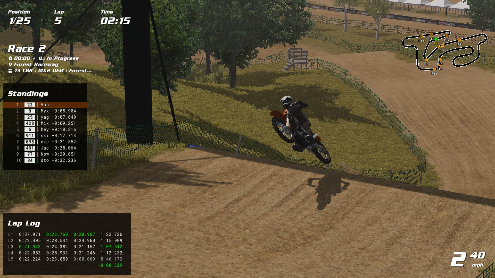

A customizable, [open-source](https://github.com/thomas4f/mxbmrp3) HUD plugin for MX Bikes and GP Bikes displaying real-time race information and telemetry.


*Example HUD layout. All elements are fully customizable.*

### Features

- Live race standings, track map, and proximity radar with approach alerts
- Lap timing with splits, personal bests, gap-to-PB visualization, and online lap records
- Event log with timestamped race events and per-event icons
- Track specific riders with custom colors and icons across all HUDs
- Controller rumble feedback with customizable effects
- Discord Rich Presence integration showing current session and track
- Riding stats tracking with per-lap, session, and all-time totals
- FMX freestyle trick detection with scoring and chain combos
- Telemetry visualization and compact info widgets
- Drag-and-drop positioning with color themes and customizable hotkeys
- Automatic profile switching for Practice, Qualify, Race, and Spectate sessions

### Get Started

Download and install the plugin to begin customizing your HUD.

[](https://github.com/thomas4f/mxbmrp3/releases/latest/download/mxbmrp3-Setup.exe)
[](https://github.com/thomas4f/mxbmrp3/releases/latest/download/mxbmrp3.zip)

> **Quick Start**
> 1. Install the plugin
> 2. Launch the game and load a track
> 3. Right-click drag to reposition elements
> 4. Press **Tilde (~)** or click the **[=]** settings button to customize visibility, scale, opacity, and more

See [Installation](#installation) for detailed setup instructions.

## Contents

- [Installation](#installation)
- [Controls](#controls)
- [Configuration](#configuration)
- [HUDs & Widgets](#huds--widgets)
- [Tips & Tricks](#tips--tricks)
- [Advanced Settings](#advanced-settings)
- [Modding](#modding)
- [Troubleshooting](#troubleshooting)
- [Development](#development)

## Installation

**Requirements:**
- MX Bikes **Beta 20 or newer** / GP Bikes **Beta 18 or newer**

### Automatic Installation

1. Download the latest installer [`mxbmrp3-Setup.exe`](https://github.com/thomas4f/mxbmrp3/releases/latest/download/mxbmrp3-Setup.exe)
2. Run the installer - it will:
   - Auto-detect your MX Bikes and GP Bikes installations (Steam or standalone)
   - Let you choose which games to install for
   - Install to the correct plugins folder for each game
   - Handle upgrades automatically (preserves your settings)

### Manual Installation

1. Download the latest release archive [`mxbmrp3.zip`](https://github.com/thomas4f/mxbmrp3/releases/latest/download/mxbmrp3.zip)
2. Find your game's plugins folder:
   - **Steam**: Right-click the game in your library → **Manage** → **Browse local files** → open `plugins`
   - **Standalone**: Navigate to your game installation folder (e.g., `C:\Games\MX Bikes\` or `C:\Games\GP Bikes\`) → open `plugins`
3. Extract the plugin files:
   - Copy `mxbmrp3.dlo` (MX Bikes) or `mxbmrp3_gpb.dlo` (GP Bikes) to the `plugins/` folder
   - Copy the `mxbmrp3_data/` folder to the `plugins/` folder

   **Do NOT delete the existing game files** (`proxy64.dlo`, `proxy_udp64.dlo`, `xinput64.dli`, or `telemetry64.dlo` for GP Bikes) - these are native game files, not old plugin versions.

   Your directory should look like this after installation (files vary slightly by game):
   ```
   [Game]/
   │   mxbikes.exe / gpbikes.exe
   │   ...
   │
   └───plugins/
       ├── mxbmrp3_data/        ← Add this folder (from release)
       │   ├── fonts/           ← Font files (.fnt)
       │   ├── textures/        ← Texture files (.tga)
       │   └── icons/           ← Icon files (.tga)
       ├── mxbmrp3.dlo          ← Add this (MX Bikes only)
       ├── mxbmrp3_gpb.dlo      ← Add this (GP Bikes only)
       ├── proxy_udp64.dlo      ← Keep (native game file)
       ├── proxy64.dlo          ← Keep (native game file)
       ├── xinput64.dli         ← Keep (native game file)
       └── telemetry64.dlo      ← Keep (GP Bikes only)
   ```

### After Installation

Launch the game - the plugin loads automatically. Some elements are enabled by default and can be repositioned or configured via the settings menu. See [Tips & Tricks](#tips--tricks) for useful setup ideas. If nothing appears, see [Troubleshooting](#troubleshooting).

## Controls

### Mouse
- **Move Mouse** - Show cursor and `[=]` settings button (auto-hides after inactivity)
- **Left Click** - Interact with settings menu and HUD elements
- **Right Click & Drag** - Reposition elements

### Keyboard Shortcuts

Keyboard and controller hotkeys can be customized in Settings > Hotkeys. By default, only the settings menu hotkey is configured:

- **Tilde** (below Esc) - Toggle settings menu

## Configuration

Use the settings menu (Tilde key or `[=]` settings button) to configure all HUDs and widgets. **Hover over any setting to see its description** - all controls have in-game tooltips explaining their function.

The settings menu provides:
- **General** - Profiles, preferences, grid snapping
- **Appearance** - Font categories and color theme customization
- **Hotkeys** - Keyboard and controller bindings
- **Riders** - Track specific riders with custom colors and icons
- **Rumble** - Controller vibration feedback effects
- **Updates** - Check for new versions and install updates in-game
- **Individual HUD tabs** - Per-element visibility, scale, opacity, and options

All settings are automatically saved between sessions.

### Profiles

Four separate profiles store complete HUD layout configurations:
- **Practice** - Practice and warmup sessions
- **Qualify** - Pre-qualify, qualify practice, and qualify sessions
- **Race** - Race 1, Race 2, Straight Rhythm sessions
- **Spectate** - Spectating or viewing replays

Auto-switch (disabled by default) automatically changes profiles based on session type.

## HUDs & Widgets

All HUDs and widgets are configurable via the settings menu or directly in the [.ini file](#advanced-settings).

### HUDs

| HUD | Description |
|-----|-------------|
| **Standings** | Live race positions with gaps, status, and tracked rider indicators |
| **Map** | Top-down track map with rider positions (click to spectate) |
| **Radar** | Proximity radar with approach alerts and distance arrows |
| **Timing** | Split and lap times with gap comparisons |
| **Gap Bar** | Visual gap-to-PB bar with position markers |
| **Pitboard** | Pitboard-style lap information display |
| **Lap Log** | Historical lap times with PB indicators |
| **Lap Consistency** | Lap time consistency analysis with trend visualization |
| **Ideal Lap** | Best sector times and theoretical ideal lap |
| **Records** | Online lap records (CBR or MXB-Ranked) with personal bests (MX Bikes only) |
| **FMX** | Freestyle trick detection with scoring and chain combos |
| **Telemetry** | Throttle, brake, suspension graphs |
| **Performance** | FPS and plugin CPU usage |
| **Rumble** | Controller rumble effect visualization |
| **Stats** | Riding stats with columns for last lap, session, and all-time totals |
| **Session** | Session info (type, format, track, server, players, password) |
| **Notices** | Race status notices (wrong way, blue flag, PB alerts, last lap, finished) |
| **Event Log** | Timestamped feed of race events (session changes, fastest laps, penalties, finishes, pit activity) |

### Widgets

| Widget | Description |
|--------|-------------|
| **Lap** | Current lap number |
| **Position** | Race position |
| **Time** | Session time/countdown |
| **Speed** | Current speed |
| **Gear** | Current gear |
| **Clock** | Real-time clock |
| **Speedo** | Analog speedometer |
| **Tacho** | Analog tachometer |
| **Bars** | Telemetry bars (throttle, brake, clutch, RPM, suspension, fuel) |
| **Fuel** | Fuel calculator with consumption tracking |
| **Lean** | Bike lean angle with arc gauge |
| **Gamepad** | Controller visualization |

## Tips & Tricks

**Enable update notifications** - The plugin doesn't check for updates by default. Go to Settings > Updates and set the update mode to "Notify" to get notified when a new version is available. You can also install updates directly from the settings menu.

**Streaming setup** - Enable the Session HUD (Settings > Session) to show the server name, track, and session type on screen for your viewers. The Pitboard and Gamepad widgets also work well on stream - both have [fully customizable textures](#custom-textures), and the Gamepad widget shows your live controller inputs. Pair with Discord Rich Presence (Settings > General) to show your current session and track in your Discord profile.

**Power-user INI tweaks** - Many additional options are available by editing the [INI file](#advanced-settings) directly. The file is well-commented and easy to work with. Each HUD section also supports per-element color overrides using ABGR hex values. For example:
```ini
[StandingsHud]
classicLayout=1         ; remove number plates and brand color strips

[SpeedWidget]
color_primary=0xff00ff00 ; green text (ABGR format)
```
Use the [Color Override Picker](https://thomas4f.github.io/mxbmrp3/tools/color_override_picker.html) to convert RGB colors to ABGR format. See [Advanced Settings](#advanced-settings) for how to edit and hot-reload the INI file.

**Track records** - The Records HUD fetches online lap records from CBR or MXB-Ranked. Enable "Auto-fetch" in Settings > Records to automatically load records when you enter a track. Records also work while spectating.

**Click-to-spectate** - Left-click on any rider on the Map HUD or Standings HUD to switch the spectate camera to that rider.

**Remove the stock pitboard** - Create an empty file called `pitboard.cfg` in `[Game]\misc\hud\` (create the directories if needed). This removes the default 2D pitboard while keeping the small 3D pitboard in the game world. Delete the file to restore it.

**Show/hide the rider stand icon** - This is a game setting, not a plugin setting. Enable it under Simulation > "Show Rider Stand". To customize the icon or its position, extract `rider.cfg` and `riderstand.tga` from `misc.pkz\misc\helpers\` to `[Game]\misc\helpers\` and edit them there.

## Advanced Settings

All plugin settings are stored in `mxbmrp3_settings.ini` in your [user data folder](#modding).

**In-game vs INI-only settings:**
- Most settings are configurable via the in-game settings menu
- Some power-user options are only accessible by editing the INI file directly
- INI-only settings are documented with inline comments

**INI structure:**
- `[HudName]` - Base/default settings for a HUD
- `[HudName:Practice]`, `[HudName:Qualify]`, `[HudName:Race]`, `[HudName:Spectate]` - Profile-specific overrides (only values that differ from base)

**Editing the INI file:**

*With the game closed* (recommended):
1. Exit the game completely
2. Edit `mxbmrp3_settings.ini`
3. Launch the game to apply changes

*Hot reload* (for rapid iteration):
1. Disable **Auto-Save** in Settings > General
2. Edit the INI file while the game is running
3. Use the **Reload Config** hotkey to apply changes (bind it in Settings > Hotkeys)

If Auto-Save is enabled, changes made to the INI while the game is running will be overwritten.

## Modding

Plugin data and custom assets are stored in `Documents\PiBoSo\[Game]\mxbmrp3\`.

### Custom Assets

Add custom fonts, textures, and icons by placing them in the appropriate subfolder:

```
mxbmrp3/
├── fonts/       ← Custom .fnt files
├── textures/    ← Custom .tga textures
└── icons/       ← Custom .tga icons
```

On game startup, the plugin syncs these files to the plugin's data directory (`plugins/mxbmrp3_data/`). User files with the same name as bundled assets will override them. This keeps your customizations separate from the plugin installation, so updates won't overwrite your files. **Restart the game after adding or modifying assets.**

### Custom Textures

Textures use the naming convention `{element_name}_{number}.tga` (e.g., `standings_hud_1.tga`). They're auto-discovered and selectable via the Texture control in each HUD's settings.

**Pitboard** - Drop a custom `.tga` file (e.g., `pitboard_hud_2.tga`) into the `textures\` subfolder. It will be auto-discovered and selectable in Settings > Pitboard > Texture.

**Gamepad** - The Gamepad widget ships with Xbox and PlayStation layouts. To customize them, copy `gamepad_widget_1.tga` (Xbox) or `gamepad_widget_2.tga` (PlayStation) from `plugins\mxbmrp3_data\textures\` to the `textures\` subfolder and edit them. Source design files (PSD) are available in [`assets/`](assets/).

### Custom Fonts

Fonts (`.fnt` files) are auto-discovered and assignable to categories (Title, Normal, Strong, Marker, Small) in Settings > Appearance. To generate fonts, use the `fontgen` utility provided by PiBoSo. See [this forum post](https://forum.piboso.com/index.php?topic=1458.msg20183#msg20183) for details. An example configuration is provided in [`fontgen.cfg`](fontgen.cfg).

### Custom Icons

Icons (`.tga` files) placed in the `icons\` subfolder are discovered alphabetically and available for tracked rider customization in Settings > Riders.

### Data Files

| File | Description |
|------|-------------|
| `mxbmrp3_settings.ini` | All HUD settings (positions, visibility, options) |
| `mxbmrp3_tracked_riders.json` | Tracked riders with colors and icons |
| `mxbmrp3_rumble_profiles.json` | Per-bike rumble effect profiles |
| `mxbmrp3_stats.json` | Unified stats, personal bests, and odometer data |

## Troubleshooting

**HUD Not Appearing**
- Check [Installation requirements](#installation) (MX Bikes Beta 20+ / GP Bikes Beta 18+)
- Verify the DLO file and `mxbmrp3_data/` are in the correct `plugins/` folder. Games have two directories - the **game installation** (contains the game .exe) and **user data** (`Documents\PiBoSo\[Game]\`). Plugins go in the game installation, not Documents.
- For GP Bikes, ensure you're using `mxbmrp3_gpb.dlo`, not `mxbmrp3.dlo`

**Installer Detected the Wrong Game Directory**
- If you have multiple installations (e.g. standalone and Steam), the installer may pick the wrong one. Verify the plugin ended up in the `plugins/` folder next to the game `.exe` you actually launch. If not, run the installer again and select the correct path, or install manually.

**Text or Icons Not Appearing**
- Ensure `mxbmrp3_data/` folder is in the `plugins/` folder alongside the DLO file
- The `mxbmrp3_data/` folder contains fonts, textures, and icons required for rendering
- If you moved or renamed this folder, restore it from the release archive

**Gamepad Widget Appears Cut Off**
- Go to Settings > Widgets tab and click "Reset Widgets" to correct the button positions.

**Elements Appearing Twice (Ghost/Duplicate)**
- Check for duplicate DLO files - only ONE plugin DLO should exist in your plugins folder

**Elements Overlapping**
- Drag elements to reposition them
- Use settings menu to adjust scale

**Controller or Rumble Not Working**
- Verify the correct controller is selected in Settings > General
- If you accidentally deleted `xinput64.dli` from the plugins folder, controller input may stop working
- To restore: verify game files integrity (Steam) or reinstall the game

**Game Fails to Launch, Crashes, or Shows Black Screen**
- See the [MX Bikes Troubleshooting Guide](https://gist.github.com/thomas4f/1fd379fafb4ab402b48424ae1c9cf2bd) for general game issues (crashes, mods, plugins, RAM, controllers)
- If the Windows Event Log shows `mxbmrp3.dlo` as the faulting module, please [open an issue](https://github.com/thomas4f/mxbmrp3/issues)

For bug reports or feature requests, open an issue on [GitHub](https://github.com/thomas4f/mxbmrp3/issues).

## Development

Built with C++17, Visual Studio 2022, Piboso Plugin API, and Claude Code.

- [`CLAUDE.md`](CLAUDE.md) - Quick-start guide for developers and AI assistants
- [`ARCHITECTURE.md`](ARCHITECTURE.md) - Comprehensive technical documentation with diagrams

### Building from Source

**Requirements:** Visual Studio 2022+, Windows SDK 10.0, Platform Toolset v143

1. Clone the repository:
   ```bash
   git clone https://github.com/thomas4f/mxbmrp3.git
   cd mxbmrp3
   ```
2. Open `mxbmrp3.sln` in Visual Studio 2022
3. Select configuration:
   - **MXB-Release** / **MXB-Debug** for MX Bikes
   - **GPB-Release** / **GPB-Debug** for GP Bikes
4. Build the solution (Ctrl+Shift+B)
5. Output:
   - MX Bikes: `build/MXB-Release/mxbmrp3.dlo`
   - GP Bikes: `build/GPB-Release/mxbmrp3_gpb.dlo`

### Roadmap

Ideas under consideration (no guarantees): extended telemetry (g-force), HTTP data export for OBS overlays.

---

Licensed under the [MIT License](LICENSE). See [THIRD_PARTY_LICENSES.md](THIRD_PARTY_LICENSES.md) for bundled asset attributions.

Feedback and contributions are welcome.
