An [open-source](https://github.com/thomas4f/mxbmrp3) plugin for MX Bikes, GP Bikes, and Kart Racing Pro with customizable on-screen displays, immersion features, social tools, and streaming/broadcasting overlays.

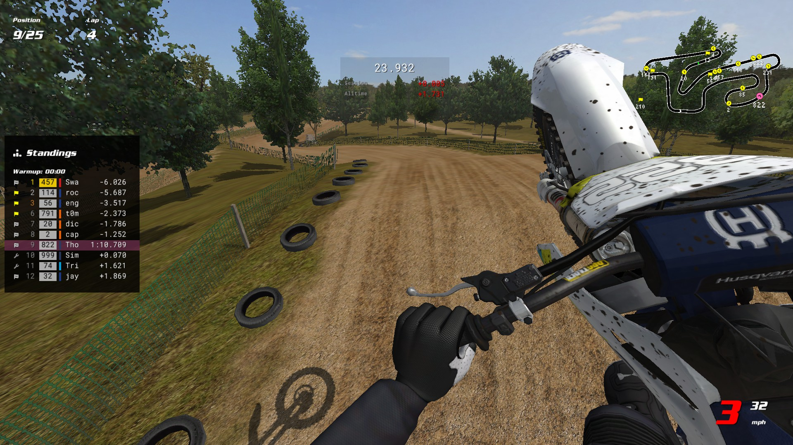
*Default HUD layout. All elements are fully customizable - see [Tips & Tricks](#tips--tricks) for setup ideas.*

## Features

- Customizable HUD layouts with drag-and-drop positioning, hotkeys, color themes, and auto-switching profiles
- Live race information covering standings, timing, gap-to-PB bar, track map, radar, event log, and online records
- Telemetry and lap analysis with splits, personal bests, race-progression charts, and fuel consumption tracking
- Social features including Steam friends, Discord Rich Presence, and rider tracking with custom colors/icons
- Broadcasting features with auto-director, OBS overlay, controller visualization, and companion window
- First-person helmet overlay with telemetry-driven tilt and vibration, plus configurable controller rumble
- Persistent stats and personal bests across sessions, plus FMX freestyle trick scoring
- Modding support for custom textures, fonts, icons, web overlay theming, and INI-level configuration

## Get Started

Download and install the plugin to begin customizing your HUD.

[](https://github.com/thomas4f/mxbmrp3/releases/latest/download/mxbmrp3-Setup.exe)
[](https://github.com/thomas4f/mxbmrp3/releases/latest/download/mxbmrp3.zip)

> **Quick Start**
> 1. Download the installer above, run it, and follow the on-screen steps\
>    Windows may show several "unknown publisher" warnings - [why & how to proceed](#windows-warns-me-when-downloading-or-installing).
> 2. Launch the game and load a track
> 3. Move the mouse to bring up the pointer, then right-click drag to reposition elements
> 4. Press **Tilde (~)** or click the settings button to toggle elements, adjust opacity, and more

See [Installation](#installation) for detailed setup instructions, or [Configuration](#configuration) to fine-tune everything.

## Contents

- [Installation](#installation)
- [Controls](#controls)
- [Configuration](#configuration)
- [HUDs & Widgets](#huds--widgets)
- [Web Overlay](#web-overlay)
- [Tips & Tricks](#tips--tricks)
- [Advanced Settings](#advanced-settings)
- [Modding](#modding)
- [Troubleshooting](#troubleshooting)
- [Privacy](#privacy)
- [Feedback & Issues](#feedback--issues)
- [Uninstallation](#uninstallation)

## Installation

**Requirements:**
- MX Bikes **beta21 or newer** / GP Bikes **beta22b or newer** / Kart Racing Pro **Release 14 or newer**

### Automatic Installation

1. Download the latest installer [`mxbmrp3-Setup.exe`](https://github.com/thomas4f/mxbmrp3/releases/latest/download/mxbmrp3-Setup.exe)
2. Run the installer - it will:
   - Auto-detect your MX Bikes, GP Bikes, and Kart Racing Pro installations (Steam or standalone)
   - Let you choose which games to install for
   - Install to the correct plugins folder for each game
   - Handle upgrades automatically (preserves your settings)

### Manual Installation

1. Download the latest release archive [`mxbmrp3.zip`](https://github.com/thomas4f/mxbmrp3/releases/latest/download/mxbmrp3.zip)
2. Find your game's plugins folder:
   - **Steam**: Right-click the game in your library > **Manage** > **Browse local files** > open `plugins`
   - **Standalone**: Navigate to your game installation folder (e.g., `C:\Program Files\[Game]\`) > open `plugins`
3. Extract the plugin files:
   - Copy the DLO for your game to the `plugins\` folder:
     - `mxbmrp3.dlo` for MX Bikes
     - `mxbmrp3_gpb.dlo` for GP Bikes
     - `mxbmrp3_krp.dlo` for Kart Racing Pro
   - Copy the `mxbmrp3_data\` folder to the `plugins\` folder

   **Do NOT delete the existing game files** (`proxy64.dlo`, `proxy_udp64.dlo`, `xinput64.dli`, or `telemetry64.dlo` for GP Bikes) - these are native game files, not old plugin versions.

   Your directory should look like this after installation (files vary slightly by game):
   ```
   [Game]/
   │   mxbikes.exe / gpbikes.exe / kart.exe
   │   ...
   │
   └───plugins/
       ├── mxbmrp3_data/        ← Add this folder (from release)
       │   ├── fonts/           ← Font files (.fnt)
       │   ├── textures/        ← Texture files (.tga)
       │   ├── icons/           ← Icon files (.tga)
       │   └── web/             ← Web overlay files (HTML/CSS/JS)
       ├── mxbmrp3.dlo          ← Add this (MX Bikes only)
       ├── mxbmrp3_gpb.dlo      ← Add this (GP Bikes only)
       ├── mxbmrp3_krp.dlo      ← Add this (Kart Racing Pro only)
       ├── proxy_udp64.dlo      ← Keep (native game file)
       ├── proxy64.dlo          ← Keep (native game file)
       ├── xinput64.dli         ← Keep (native game file)
       └── telemetry64.dlo      ← Keep (GP Bikes only)
   ```

### After Installation

Launch the game and load into a track. A few elements are enabled by default, so the HUD shows up right away - from there, open the settings menu to configure everything (see [Configuration](#configuration)). If nothing appears, see [Troubleshooting](#troubleshooting).

## Controls

### Mouse
- **Move Mouse** - Show mouse pointer and settings button (auto-hides after inactivity)
- **Left Click** - Interact with settings menu and HUD elements
- **Right Click & Drag** - Reposition elements

### Keyboard Shortcuts

Keyboard and controller hotkeys can be customized in Settings > Hotkeys. By default, only the settings menu hotkey is configured:

- **Tilde (~)** - Toggle settings menu

## Configuration

The plugin is active in-game only - it comes alive once you've loaded into a track and does nothing in the main menus, so all configuration happens on track.

Use the settings menu (**Tilde** or the settings button in the top-right) to configure all HUDs and widgets. **Hover over any setting to see its description** - all controls have in-game tooltips explaining their function.

With **Auto-Save** on (the default), your changes are saved automatically when you **leave the track** - returning to the pits or exiting the session. Nothing is written to disk while you're riding, so configuring HUDs never causes a stutter. You can also save at any time with the **Save** button at the bottom of the settings menu: it lights up whenever you have unsaved changes and reads "Saved" (greyed out) once everything is written. (If the game crashes mid-session, changes since you last left the track or clicked Save are lost - the same as any other unsaved in-game state.)

The settings menu provides global settings that apply to all profiles, followed by per-element tabs for the individual HUDs and widgets:

| Icon | Tab | Description |
|:----:|-----|-------------|
| 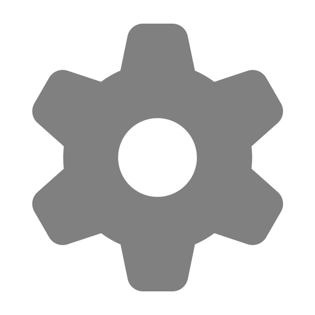 | **General** | Profiles, preferences, web overlay, presence integrations, usage analytics ([see privacy](#privacy)) |
| 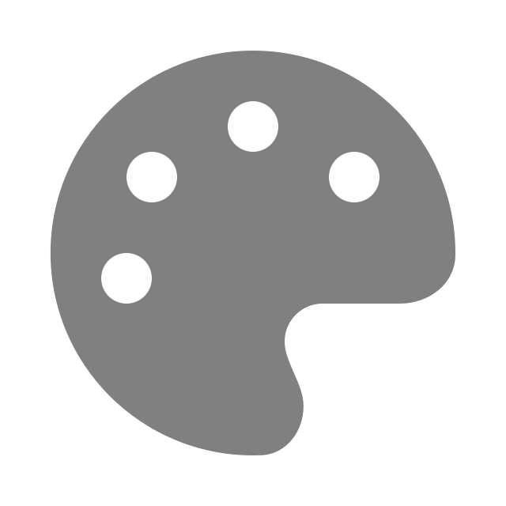 | **Appearance** | Display units/format, fonts, color theme, and HUD placement (grid snap, clamp) |
| 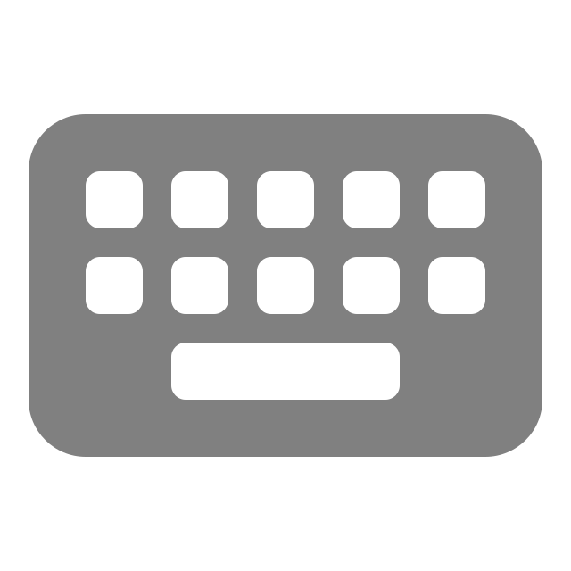 | **Hotkeys** | Keyboard and controller bindings |
| 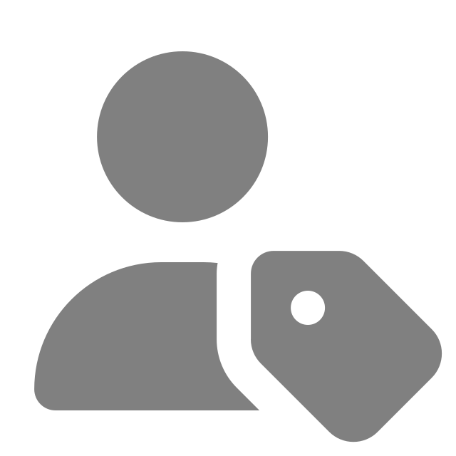 | **Riders** | Track specific riders with custom colors and icons |
| 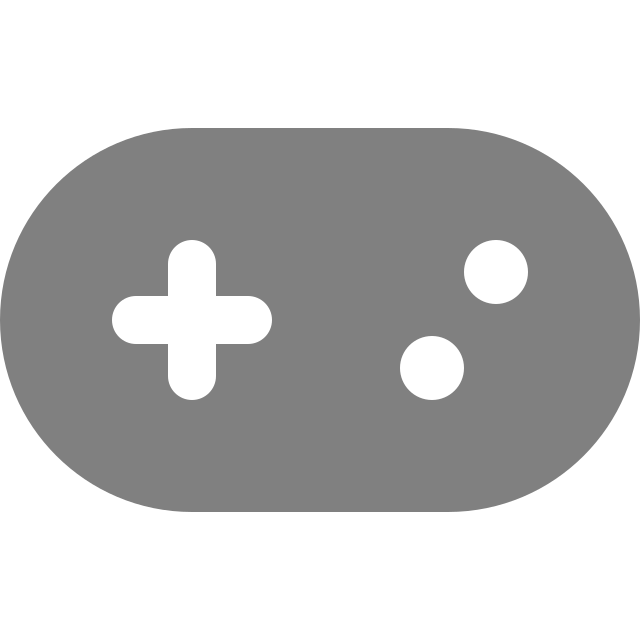 | **Rumble** | Controller vibration feedback effects |
| 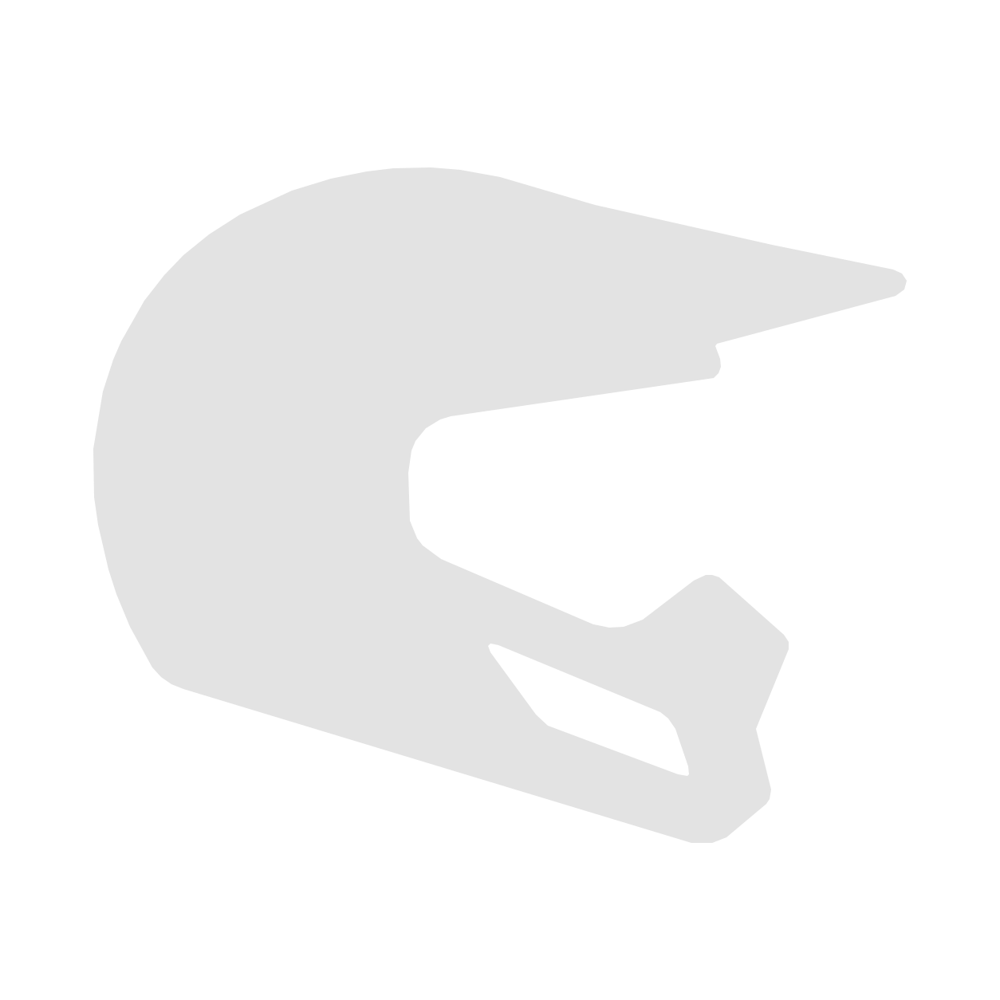 | **Helmet** | First-person helmet overlay configuration |
| 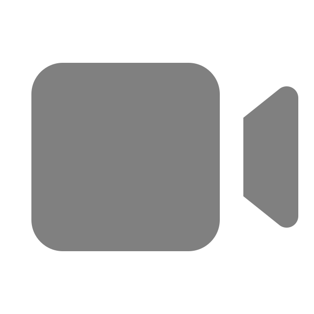 | **Director** | Auto-director for spectating and replays - automatically follows the most interesting rider |
| 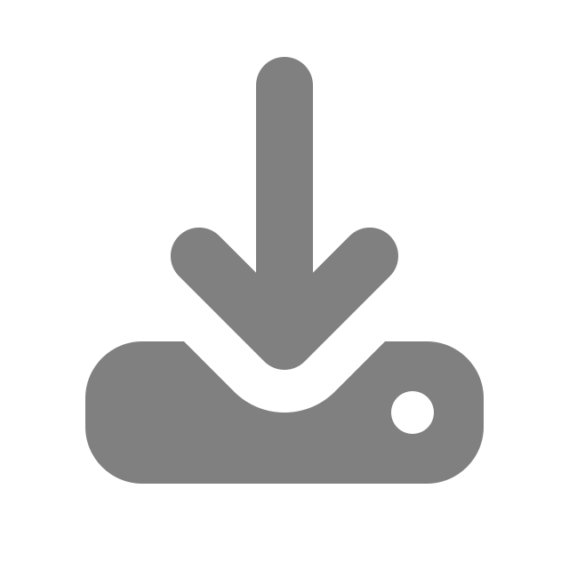 | **Updates** | Check for new versions and install updates in-game |

Plus a tab for each individual [HUD](#huds) and [Widget](#widgets), for per-element visibility, scale, opacity, and options.

### Profiles

Four separate profiles store complete HUD layout configurations:
- **Practice** - Practice and warmup sessions
- **Qualify** - Pre-qualify, qualify practice, and qualify sessions
- **Race** - Race 1, Race 2, Straight Rhythm sessions
- **Spectate** - Spectating or viewing replays

Auto-switch (disabled by default) automatically changes profiles based on session type.

## HUDs & Widgets

**HUDs** are the larger data displays - each gets its own settings tab with options like column/row toggles, gap modes, and textures. **Widgets** are simpler, single-purpose readouts (one number, gauge, or dial) with just position, scale, and opacity; rather than a tab each, they're all configured together under the shared **Widgets** tab.

### HUDs

| Icon | HUD | Description |
|:----:|-----|-------------|
| 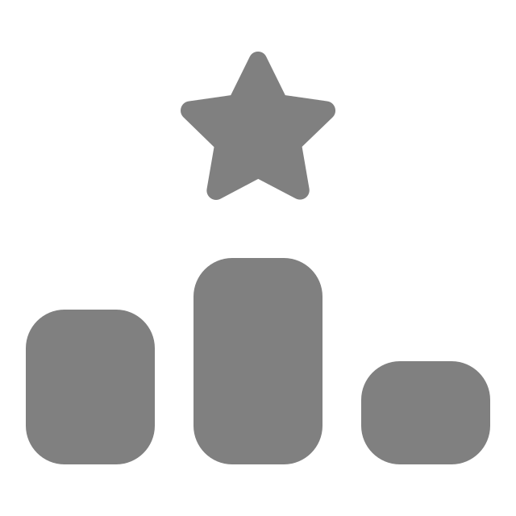 | **Standings** | Live race positions with gaps, status, and tracked rider indicators |
| 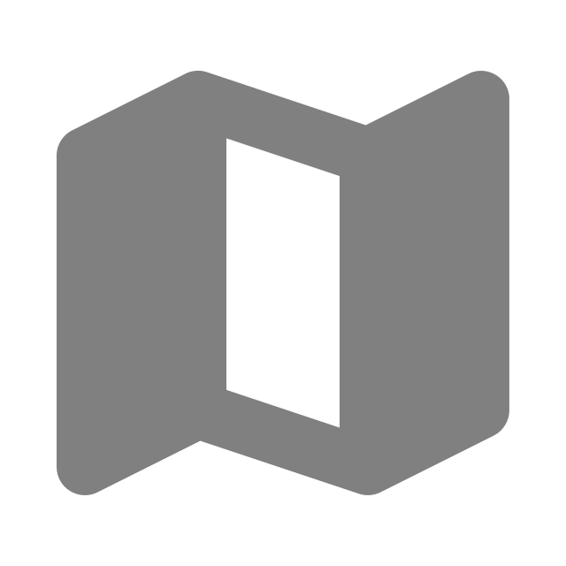 | **Map** | Top-down track map with rider positions (click to spectate) |
| 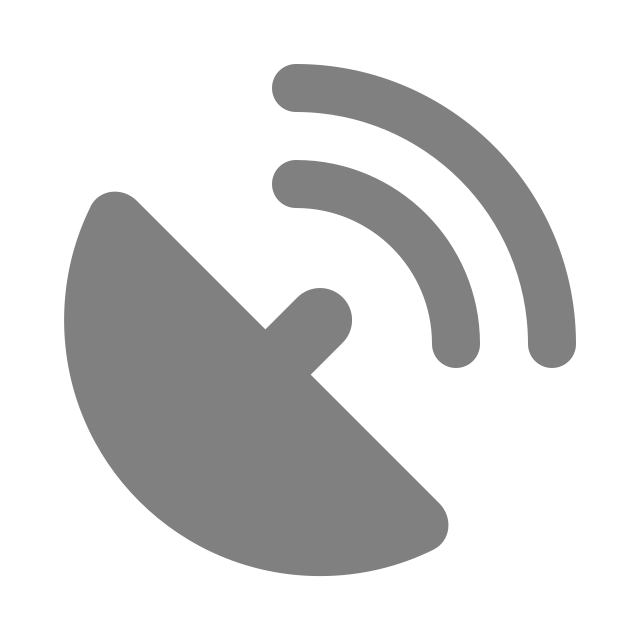 | **Radar** | Proximity radar with approach alerts and distance arrows |
| 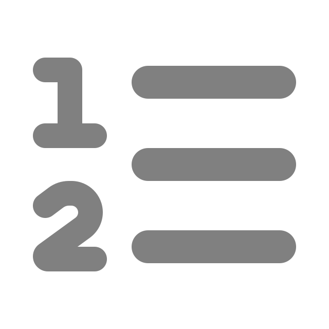 | **Lap Log** | Historical lap times with PB indicators |
|  | **Ideal Lap** | Best sector times and theoretical ideal lap |
|  | **Charts** | Session-progression charts: position, race trace, gap to leader, pace |
| 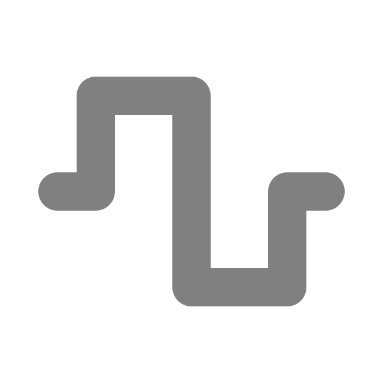 | **Telemetry** | Throttle, brake, suspension graphs |
|  | **Records** | Online lap records (CBR or MXB-Ranked) with personal bests (MX Bikes only) |
| 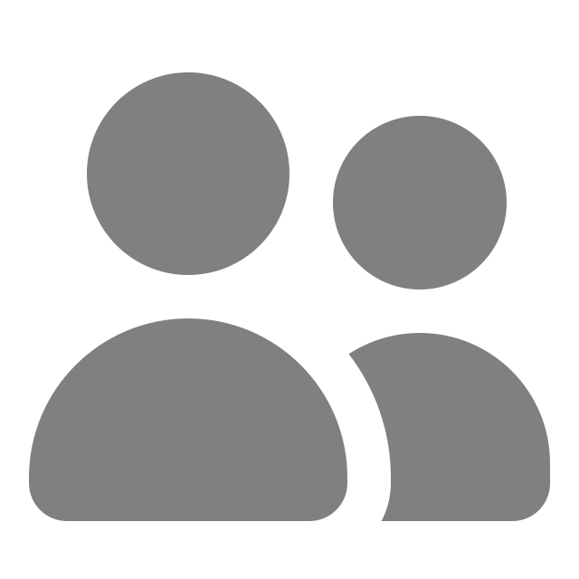 | **Friends** | Steam friends in-game: their server/track and who's joined your session |
| 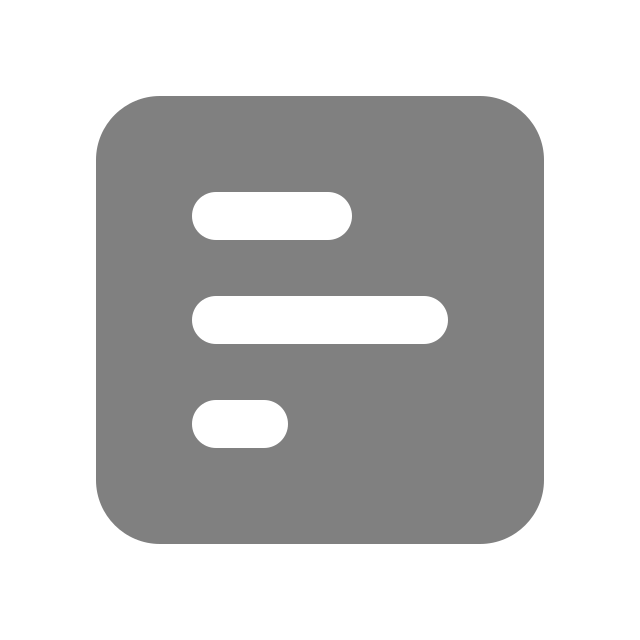 | **Pitboard** | Pitboard-style lap information display |
| 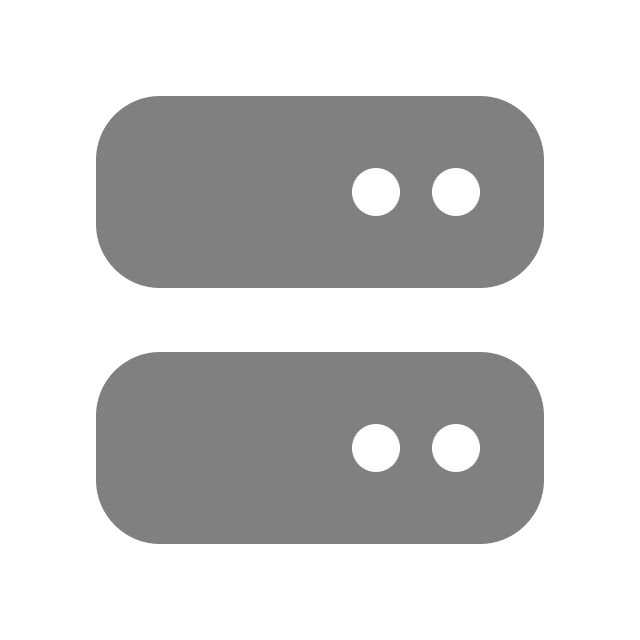 | **Session** | Session info (type, track, format, server, weather) |
| 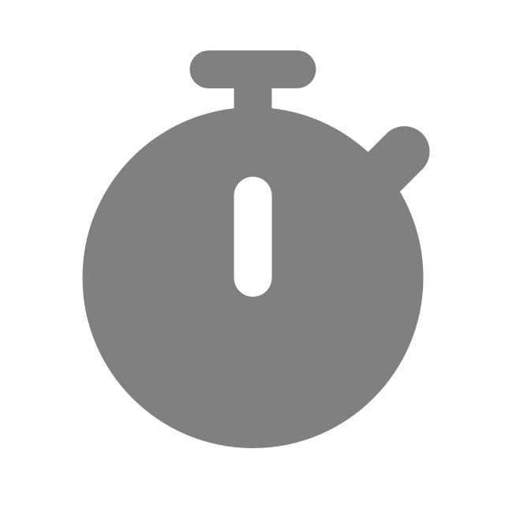 | **Timing** | Split and lap times with gap comparisons |
| 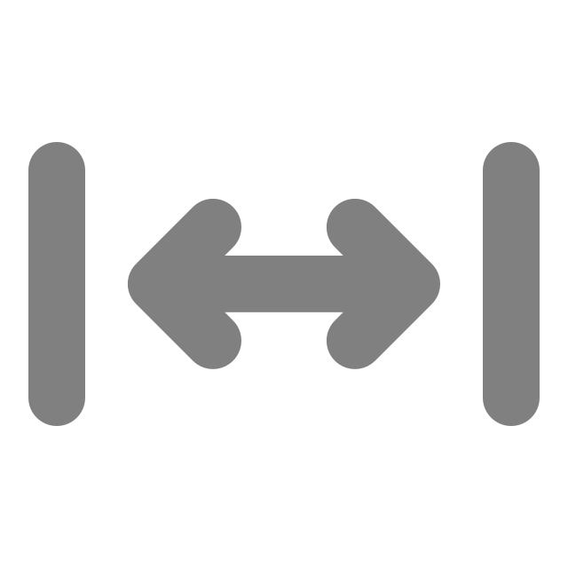 | **Gap Bar** | Visual gap-to-PB bar with position markers |
|  | **Notices** | Race status notices (wrong way, blue flag, PB alerts, last lap, finished) |
| 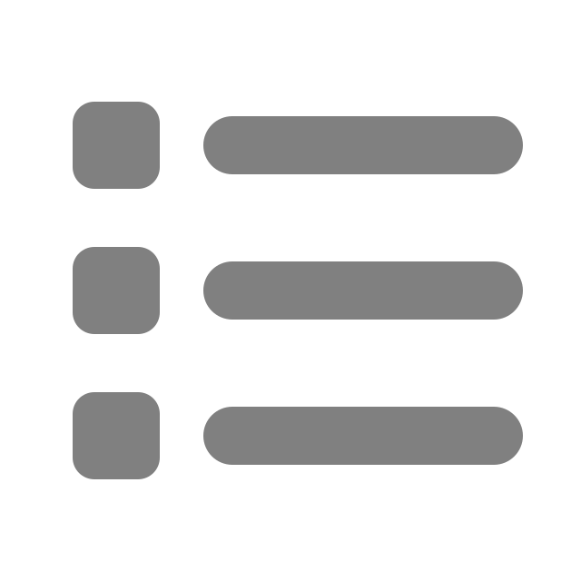 | **Event Log** | Timestamped feed of race events (laps, penalties, finishes, pit activity) |
|  | **FMX** | Freestyle trick detection with scoring and chain combos (MX Bikes and GP Bikes only) |
| 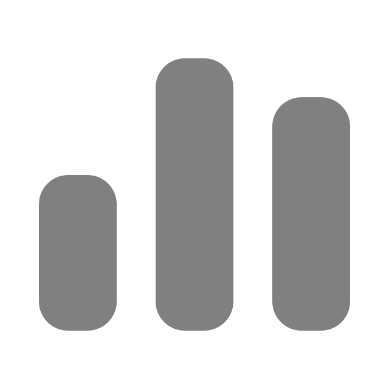 | **Stats** | Riding stats with columns for last lap, session, and all-time totals |
| 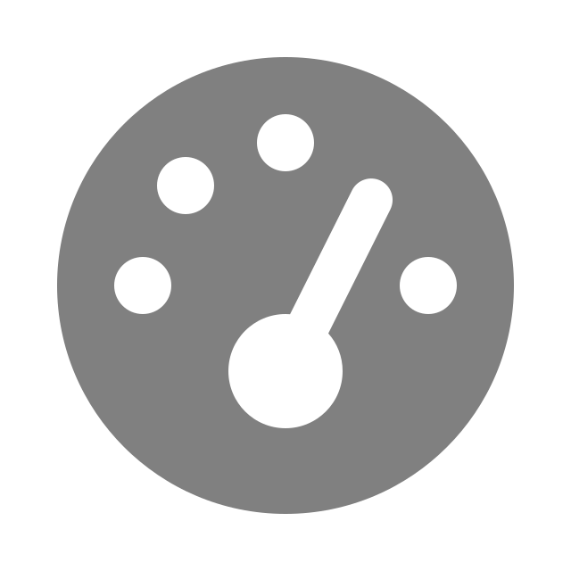 | **Performance** | FPS and plugin CPU usage |

### Widgets

| Widget | Description |
|--------|-------------|
| **Position** | Race position |
| **Lap** | Current lap number |
| **Time** | Session time/countdown |
| **Clock** | Real-time clock |
| **Gear** | Current gear |
| **Speed** | Current speed |
| **Bars** | Vertical telemetry bars (throttle, brake, suspension, etc.) |
| **Lean** | Bike lean angle with arc gauge |
| **G-Force** | Lateral/longitudinal G-force gauge with peak marker |
| **Fuel** | Fuel calculator with consumption tracking |
| **Speedo** | Analog speedometer |
| **Tacho** | Analog tachometer |
| **Compass** | Heading dial (classic needle or modern rotating card) |
| **Gamepad** | Controller visualization |
| **Tyre Temp** | Front and rear tyre temperatures (GP Bikes only) |
| **ECU** | Engine map, traction control, engine braking and anti-wheeling (GP Bikes only) |

## Web Overlay

The plugin includes a built-in HTTP server that streams live race data to a browser-based overlay. It's designed for use as an OBS Browser Source, but works just as well opened directly in a browser.

### Setup

1. Enable the web server in Settings > General > Web Server (the port number is shown when active)
2. In OBS, add a **Browser Source** with URL `http://localhost:8080` (default port - use the port shown in step 1 if changed)
3. Set width/height to match your stream resolution (e.g., 1920x1080)
4. The overlay auto-connects and displays a standings tower, event log, rider focus card, and periodic broadcast panels (fastest-lap boards, a "down the order" rundown, and on-track battles)

### Settings Panel

The overlay includes a built-in settings panel for configuring display options:

- **In OBS**, right-click the Browser Source and select **Interact** to get mouse access
- **Move your mouse** to reveal a gear icon in the top-right corner, then click to open the panel
- Configure compact times, tower size, event/chip filters, focus card, font size, and more
- **Drag the header bar** to reposition the tower
- All settings are saved to the browser's localStorage and persist across reloads

Colors and fonts sync automatically from your in-game settings. To customize the overlay's HTML, CSS, or JS, see [Modding > Web Overlay Files](#web-overlay-files).

## Tips & Tricks

**Track records** - The Records HUD fetches online lap records from CBR or MXB-Ranked. Enable "Auto-fetch" in Settings > Records to automatically load records when you enter a track. Records also work while spectating.

**Auto-director (spectating & replays)** - Enable the **Director** (Settings > Director, or click its camera-icon status button) and it automatically cuts the spectate camera to the most interesting rider or battle, broadcast-style, so you don't have to switch riders by hand. It works while spectating live **and in replays** - a great way to re-watch or record a session and let it direct the action for you. It's off by default (so it never overrides your manual camera unasked), and it also drives the [Web Overlay](#web-overlay)'s battle panel.

**Click-to-spectate** - Left-click on any rider on the Map HUD or Standings HUD to switch the spectate camera to that rider.

**Streaming setup** - Enable the Session HUD (Settings > Session) to show the server name, track, and session format on screen for your viewers. The Pitboard and Gamepad widgets also work well on stream - both have [fully customizable textures](#custom-textures), and the Gamepad widget shows your live controller inputs. Pair with Discord Rich Presence (Settings > General) to show your current session and track in your Discord profile. For a broadcast-style overlay, see [Web Overlay](#web-overlay).

**Second-monitor HUD (Companion window)** - Set **Settings > Appearance > HUD Display** to **Companion** (or **Both**) to open a standalone window you can drag and maximize on a second monitor - handy for keeping race data off your main game view while playing, streaming, or spectating. Each HUD keeps its own on/off state and position on the companion window (drag or toggle it while your mouse is over that window), so you can run a minimal in-game layout and a full dashboard on the second screen at once. It's local and needs no browser or OBS - for a streamable browser source instead, see [Web Overlay](#web-overlay).

**See where friends are racing** - Enable **Steam Friends** (Settings > General) to broadcast your session to friends and populate the Friends HUD: which of your Steam friends are in-game, the server and track they're on, and who's joined your session.

**Power-user INI tweaks** - Many additional options are available by editing the [INI file](#advanced-settings) directly. The file is well-commented and organized by HUD section. Each HUD section also supports per-element color and font overrides. Colors use ABGR hex values; fonts use the font filename (without `.fnt`) of any file in the `fonts/` folder. For example:
```ini
[StandingsHud]
classicLayout=1            ; remove number plates and brand color strips

[SpeedWidget]
color_primary=0xff00ff00   ; green text (ABGR format)
font_title=RobotoMono-Bold ; Roboto Mono Bold font
```
Use the [Color Override Picker](https://thomas4f.github.io/mxbmrp3/tools/color_override_picker.html) to convert RGB colors to ABGR format. See [Advanced Settings](#advanced-settings) for how to edit and hot-reload the INI file.

**Remove the stock pitboard** - This is a game tweak, not a plugin setting. Create an empty file called `pitboard.cfg` in `[Game]\misc\hud\` (create the directories if needed). This removes the default 2D pitboard while keeping the small 3D pitboard in the game world. Delete the file to restore it.

**Show/hide the rider stand icon** - This is a game setting, not a plugin setting. Enable it under Simulation > "Show Rider Stand". To customize the icon or its position, extract `rider.cfg` and `riderstand.tga` from `misc.pkz\misc\helpers\` to `[Game]\misc\helpers\` and edit them there.

**Show/hide the game's native gear indicator** - This is a game setting, not a plugin setting. Toggle it under Simulation > "Show HUD". Disable it if you'd rather use the plugin's GearWidget instead. To customize the graphics or position, extract `gear.tga`, `hud.cfg`, `LCD.fnt`, and `switch.tga` from `misc.pkz\misc\hud\` to `[Game]\misc\hud\` and edit them there.

## Advanced Settings

All plugin settings are stored in `mxbmrp3_settings.ini` in your [user data folder](#modding).

**In-game vs INI-only settings:**
- Most settings are configurable via the in-game settings menu
- Some power-user options are only accessible by editing the INI file directly
- INI-only settings are documented with inline comments

**INI structure:**
- `[HudName]` - Base/default settings for a HUD
- `[HudName:Practice]`, `[HudName:Qualify]`, `[HudName:Race]`, `[HudName:Spectate]` - Profile-specific overrides (only values that differ from base)

**Editing the INI file:**

*With the game closed* (recommended):
1. Exit the game completely
2. Edit `mxbmrp3_settings.ini`
3. Launch the game to apply changes

*Hot reload* (for rapid iteration):
1. Disable **Auto-Save** in Settings > General
2. Edit the INI file while the game is running
3. Use the **Reload Config** hotkey to apply changes (bind it in Settings > Hotkeys)

If Auto-Save is enabled, your in-game state is written back when you leave the track, overwriting any manual edits you made to the INI during that session - so disable Auto-Save first for hot reload.

## Modding

To customize MXBMRP3, place your files in `Documents\PiBoSo\[Game]\mxbmrp3\`. This is separate from the plugin install folder (`[Game]\plugins\mxbmrp3_data\`), so your customizations are preserved across plugin updates. Do not edit the bundled files in `[Game]\plugins\mxbmrp3_data\` directly - they will be overwritten on update (with the exception noted for `custom.css` below).

### Custom Assets

Add custom fonts, textures, and icons by placing them in the appropriate subfolder:

```
mxbmrp3/
├── fonts/       ← Custom .fnt files
├── textures/    ← Custom .tga textures
├── icons/       ← Custom .tga icons
└── web/
    └── logos/   ← Sponsor/logo PNGs for the web overlay slideshow
```

On game startup, the plugin syncs these files to the plugin's data directory (`[Game]\plugins\mxbmrp3_data\`). User files with the same name as bundled assets will override them. **Restart the game after adding or modifying assets.**

### Custom Textures

Textures use the naming convention `{element_name}_{number}.tga` (e.g., `standings_hud_1.tga`). They're auto-discovered and selectable via the Texture control in each HUD's settings.

**Pitboard** - Drop a custom `.tga` file (e.g., `pitboard_hud_2.tga`) into the `textures\` subfolder. It will be auto-discovered and selectable in Settings > Pitboard > Texture.

**Gamepad** - The Gamepad widget ships with Xbox and PlayStation layouts. To customize them, copy `gamepad_widget_1.tga` (Xbox) or `gamepad_widget_2.tga` (PlayStation) from `[Game]\plugins\mxbmrp3_data\textures\` to the `textures\` subfolder and edit them. Source design files (PSD) are available in [`assets/`](assets/).

**Helmet** - The helmet overlay uses two textures: `helmet_upper_1.tga` (visor rim/top) and `helmet_lower_1.tga` (chin bar). Author at screen resolution with transparent visor openings and ~10% bleed on all sides (extra opaque border beyond the visible area) so tilt and vibration don't expose hard edges.

### Custom Fonts

Fonts (`.fnt` files) are auto-discovered and assignable to categories (Title, Normal, Strong, Marker, Small) in Settings > Appearance. To generate fonts, use the `fontgen` utility provided by PiBoSo. See [this forum post](https://forum.piboso.com/index.php?topic=1458.msg20183#msg20183) for details. An example configuration is provided in [`fontgen.cfg`](fontgen.cfg).

### Custom Icons

Icons (`.tga` files) placed in the `icons\` subfolder are discovered alphabetically and available for tracked rider customization in Settings > Riders.

### Web Overlay Files

The overlay files are plain HTML, CSS, and JS. To customize them, place modified files in `Documents\PiBoSo\[Game]\mxbmrp3\web\` - user files override the bundled versions on startup and are preserved across updates.

- `style.css` - The `:root` block holds the theme tokens: colors, fonts, sizes, spacing, and animation timings. Colors and fonts sync from the game (to override those in `custom.css`, add `!important`); sizes, spacing, and animations can be set directly.
- `custom.css` - Optional file you create yourself for style overrides. **Copy the bundled `custom-sample.css` to `custom.css` to start** - it's a commented reference with ready-made recipes (light theme, compact, no-motion, fonts). Loaded after `style.css`, so anything here wins on specificity ties. Tip: append `?demo` to the overlay URL in a browser to preview your theme against a synthetic race without launching the game. Use this for small theme tweaks instead of forking the full stylesheet - edits apply on the next browser reload (after the next game restart, since the file is synced from `Documents` on startup). **For live iteration**, you can instead place `custom.css` directly in `[Game]\plugins\mxbmrp3_data\web\` and edit it there - it's the one web asset not bundled or replaced by the installer/updater, so browser-refresh applies your changes with no game restart. Pick one location; if you keep copies in both, the `Documents` copy overwrites the plugins copy on next game start.
- `index.html` - Overlay structure
- `overlay-config.js` - The `CONFIG` block at the top defines defaults for all settings. These are overridden by the settings panel (stored in localStorage).

### Data Files

| File | Description |
|------|-------------|
| `mxbmrp3_settings.ini` | All HUD settings (positions, visibility, options) |
| `mxbmrp3_tracked_riders.json` | Tracked riders with colors and icons |
| `mxbmrp3_rumble_profiles.json` | Per-bike rumble effect profiles |
| `mxbmrp3_stats.json` | Unified stats, personal bests, and odometer data |
| `mxbmrp3_analytics.json` | Anonymous random install ID for usage analytics (see [Privacy](#privacy)) |

## Troubleshooting

### Windows Warns Me When Downloading or Installing
The installer isn't code-signed yet, so Windows may show one or more "unknown publisher" / "not commonly downloaded" warnings. These are **reputation** warnings, not malware detections - the download is safe. Depending on your browser you may see up to three, in this order:

- **Downloading (browser):** "isn't commonly downloaded." In Microsoft Edge: open Downloads, click the `...` next to the file, then **Keep** > **Show more** > **Keep anyway** (Chrome is similar).
- **Running the installer (Windows SmartScreen):** a blue **"Windows protected your PC"** box - click **More info** > **Run anyway**.
- **Installing (User Account Control):** **"...app from an unknown publisher..."** - click **Yes**. Admin is required because the plugin is copied into the game's `plugins\` folder under `Program Files`.

Installing manually from the [ZIP archive](#manual-installation) avoids most of these, since there's no installer to run. If you'd like to check the download anyway, you can scan it on [VirusTotal](https://www.virustotal.com/).

The fix is a code-signing certificate - a paid yearly cost. Signing removes the "unknown publisher" label on the install prompt immediately, and the download/SmartScreen warnings clear as the signed installer builds reputation. It's not in place yet, so the steps above are all that's needed. (A certificate is one of the things [donations](#support) would go toward.)

### Make Sure You're on the Latest Version
- Many issues are already fixed in a newer release, so update before troubleshooting further
- Check your version in Settings > Updates (or the Version widget). The plugin notifies you on startup when a new stable release is available
- To update in-game, go to Settings > Updates and install directly - no manual download or reinstall needed
- If the in-game updater is set to "Off" or unavailable, download the latest release manually from [GitHub Releases](https://github.com/thomas4f/mxbmrp3/releases) and reinstall

### HUD Not Appearing
- Check the [Installation requirements](#installation) for your game's minimum version
- Verify the DLO file and `mxbmrp3_data\` are in the correct `plugins\` folder. Games have two directories - the **game installation** (contains the game .exe) and **user data** (`Documents\PiBoSo\[Game]\`). Plugins go in the game installation, not Documents.
- Use the correct DLO for your game: `mxbmrp3.dlo` (MX Bikes), `mxbmrp3_gpb.dlo` (GP Bikes), or `mxbmrp3_krp.dlo` (Kart Racing Pro)

### Installer Detected the Wrong Game Directory
- If you have multiple installations (e.g., standalone and Steam), the installer may pick the wrong one. Verify the plugin ended up in the `plugins\` folder next to the game `.exe` you actually launch. If not, run the installer again and select the correct path, or install manually.

### Text or Icons Not Appearing
- Ensure `mxbmrp3_data\` folder is in the `plugins\` folder alongside the DLO file (see [directory structure](#manual-installation))
- The `mxbmrp3_data\` folder contains fonts, textures, and icons required for rendering
- If you moved or renamed this folder, restore it from the release archive

### Gamepad Widget Appears Cut Off
- Go to Settings > Widgets tab and click "Reset Widgets" to correct the button positions.

### Elements Appearing Twice (Ghost/Duplicate)
- Check for duplicate MXBMRP3 DLO files - only one of `mxbmrp3.dlo` (MX Bikes), `mxbmrp3_gpb.dlo` (GP Bikes), or `mxbmrp3_krp.dlo` (Kart Racing Pro) should exist in your plugins folder. Other plugins' DLO files are fine.

### Elements Overlapping
- Drag elements to reposition them
- Use settings menu to adjust scale

### Controller or Rumble Not Working
- Verify the correct controller is selected in Settings > General
- If you accidentally deleted `xinput64.dli` from the plugins folder, controller input may stop working
- To restore: verify game files integrity (Steam) or reinstall the game

### Web Overlay Not Working
- If the settings show "Error" and "Port ... may be in use", another application is using the same port
- Change the port in Settings > General > Web Server Port (e.g., to 8081)
- Remember to update your OBS Browser Source URL to match the new port

### Game Fails to Launch, Crashes, or Shows Black Screen
- See the [MX Bikes Troubleshooting Guide](https://gist.github.com/thomas4f/1fd379fafb4ab402b48424ae1c9cf2bd) for general game issues (crashes, mods, plugins, RAM, controllers)
- If the Windows Event Log shows `mxbmrp3.dlo` as the faulting module, see [Feedback & Issues](#feedback--issues)

## Privacy

The plugin sends a small anonymous usage ping per game launch, so the developer can gauge how many people actively use it. It is **on by default** and you can **opt out anytime** in **Settings > General > Integrations** (the "Analytics" toggle). Turning it off sends one final anonymous opt-out ping, then nothing more.

What it sends:

| Data | Details |
|------|---------|
| Install ID | A random UUID made on your machine (stored in `mxbmrp3_analytics.json`), not tied to your name, account, hardware, or IP. Delete the file to reset it. |
| Version & game | The plugin version and game, and whether this launch is a fresh install or an upgrade |
| Enabled features | HUDs, widgets, web overlay, Discord, Steam, rumble, update channel, and so on, as anonymous on/off flags |
| Environment | Operating system and version/build (e.g. Windows 11 22631, or Wine/Proton on Linux), language, and whether it's the Steam or standalone build |
| Usage counters | How many times this install has launched, and how many days since it was first installed |
| Session length | How long a play session lasted (start to clean exit), so the developer can gauge typical usage |
| Crashes | If the game crashed last session, the faulting module and offset (e.g. `mxbikes.exe+0x1f1923`), the exception code, and the plugin version + game build at crash time - enough to bucket crashes, **not** the memory dump. Reported on the next launch |
| Link clicks | Which in-plugin link you click (docs, community, or support/donate) - nothing else |

What it does **not** send: no names, no in-game/online activity, no telemetry, no lap times, no server or rider data, and **no crash dump or log** (those stay on your machine) - nothing identifying. The pings are fire-and-forget and never affect performance.

Analytics are processed by two privacy-first, open-source services: [Aptabase](https://aptabase.com) handles the detailed events above, and [GoatCounter](https://www.goatcounter.com) receives a single per-launch hit (the plugin/game/version via the page path, plus the same anonymous install ID so it can count unique installs rather than raw launches) used purely as an aggregate headcount. Both are covered by the one Analytics toggle.

When analytics is on, the plugin also fetches a small public config file from this repository to decide how much of the above to send. This is a cost control for the developer (the events service bills per event): it can only ever **reduce** what's sent below what's described here - never add anything - and if the file is missing or unreachable it defaults to the full set. In the leanest setting only the anonymous launch ping (and a crash report, if any) is sent. Turning the Analytics toggle off stops this fetch too.

## Feedback & Issues

Bug reports, feature requests, and questions are all welcome. Open an issue on [GitHub](https://github.com/thomas4f/mxbmrp3/issues) or leave a comment on [MXB-Mods](https://mxb-mods.com/mxbmrp3/).

A short description of what you were doing when the issue happened (track, session type, bike, and any reproduction steps) helps a lot.

**For crashes**, please attach both files from `Documents\PiBoSo\[Game]\mxbmrp3\crashes\` - the plugin writes them automatically whenever it catches an unhandled fault. (These are almost always faults in the game engine itself, not plugin bugs: the plugin's crash handler is process-global, so it catches any unhandled fault in the game process and writes the dump - which is why it can capture crashes that have nothing to do with the plugin.)

Before reporting, check [**Known MX Bikes Crashes**](crash_analysis/KNOWN_GAME_CRASHES.md) — it lists game-engine crashes the plugin's crash handler has caught, with Event Viewer fault offsets you can match against yours. If your crash is listed, it's a known game bug with no plugin fix possible.

- `mxbmrp3_crash_<timestamp>_<pid>.dmp` - the minidump (state at the moment of crash)
- `mxbmrp3_crash_<timestamp>_<pid>.log` - a snapshot of the plugin log captured at crash time

Grab the matching pair (same timestamp/pid) for the crash you want to report. Note that the live `mxbmrp3_log.txt` is overwritten each time the game launches, so the paired `.log` snapshot is the only surviving record once you restart.

## Uninstallation

### Automatic Uninstallation

If you used the installer, remove the plugin like any other Windows app: open **Settings > Apps > Installed apps** (or **Control Panel > Programs and Features**), find **MXBMRP3**, and choose **Uninstall**. You can also run `mxbmrp3_uninstall.exe` directly from any game's `plugins\` folder. The uninstaller lets you pick which games to remove from, then deletes the plugin DLO, the `mxbmrp3_data\` folder, and the registry entry.

### Manual Uninstallation

If you installed from the ZIP, delete the files you added from each game's `plugins\` folder:

- the plugin DLO (`mxbmrp3.dlo`, `mxbmrp3_gpb.dlo`, or `mxbmrp3_krp.dlo`)
- the `mxbmrp3_data\` folder

**Leave the native game files in place** (`proxy64.dlo`, `proxy_udp64.dlo`, `xinput64.dli`, and `telemetry64.dlo` for GP Bikes). These are native game files, not part of the plugin.

### Settings & Data

Both methods leave your settings, profiles, and stats untouched, so an upgrade or reinstall keeps them. To remove them as well, delete the per-game folder:

```
Documents\PiBoSo\[Game]\mxbmrp3\
```

---

## Development

Built with C++17, Visual Studio 2022, the PiBoSo Plugin API, and Claude Code.

- **[`DEVELOPMENT.md`](DEVELOPMENT.md)** - building (Windows shipping build + Linux cross-build) and running the test suites
- [`TESTING.md`](TESTING.md) - the layered test suite (unit / integration / specialized) and how to add a test
- [`ARCHITECTURE.md`](ARCHITECTURE.md) - comprehensive technical documentation with diagrams
- [`CLAUDE.md`](CLAUDE.md) - quick-start context for developers and AI assistants

Quick start: clone, open `mxbmrp3.sln` in Visual Studio 2022 (x64), and build. The full configuration table, the Linux cross-build, and the unit/integration tests are documented in [`DEVELOPMENT.md`](DEVELOPMENT.md).

## License

Licensed under the [MIT License](LICENSE). See [THIRD_PARTY_LICENSES.md](THIRD_PARTY_LICENSES.md) for bundled asset attributions.

## Acknowledgments

- **bh5o** - Pitboard texture
- **Husk** - Gamepad widget source design files
- **HornetMaX** - [MaxHUD](https://forum.mx-bikes.com/index.php?topic=180.0), which served the MX Bikes community for over a decade

Thanks to everyone in the MX Bikes community who tested, reported bugs, and shared ideas.

## Support

MXBMRP3 is free and open-source, and will stay that way. If it's added something to your time in the game and you'd like to chip in toward continued development, you can do so here:

[](https://ko-fi.com/thomas4f)
[](https://github.com/sponsors/thomas4f)

No perks, no priority, no expectations. Just appreciated.
