# MXBMRP3 - Analytics Report

<!-- GENERATED by tools/analytics_report.py from Aptabase exports. Do not edit by hand; re-run the tool. Raw exports are not kept in the repo. -->

**Data window:** 2026-06-27 → 2026-07-18 (22 days)

| Installs | Launches | Games | Countries | Crash reports |
|---|---|---|---|---|
| **3,507** | **90,813** | **3** | **78** | **2,847** |

## Highlights

- **Reach:** 3,507 installs across 3 games in 78 countries; peak 1,472 active on a single day.
- **Main game:** MX Bikes - 99% of launches.
- **Platform:** among installs reporting each field, 85% run Windows 11 and 99% use Steam.
- **Repeat use:** 88% of installs launched more than once.
- **Most-used HUD:** Standings - 79% of MX Bikes installs.
- **Stability:** 16% of 1.27.5+ launches produced a crash report; where a location was recorded, the fault was outside the plugin (see the crash breakdown). Most common: *Offline track-load crash (bad string in per-profile data)*.

## Activity over time

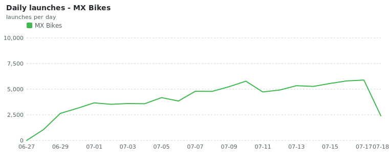

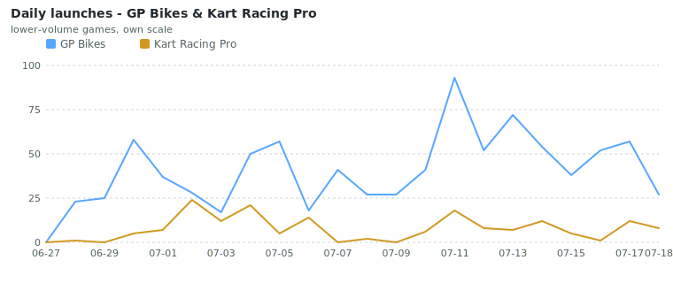

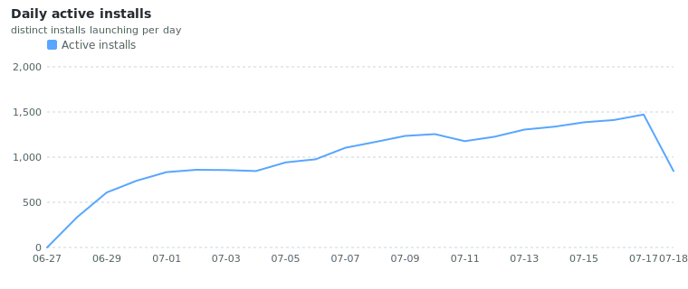

- **Peak daily active installs:** 1,472  ·  **avg launches/day:** 4,128

## Games

| Game | Installs | Launches | Share of launches |
|---|--:|--:|--:|
| MX Bikes | 3,450 | 89,751 | 98.8% |
| GP Bikes | 44 | 894 | 1.0% |
| Kart Racing Pro | 13 | 168 | 0.2% |

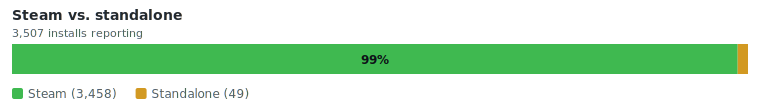

## Plugin version adoption

Each install is counted once, at its **most recent** launched version, so an install that upgraded (e.g. 1.26 to 1.27) counts only under the newer version - never both. Versions with fewer than 10 installs (pre-release / dev builds) are grouped.

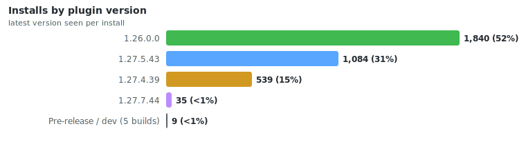

**By release line:** `1.26` 1,842 (53%)  ·  `1.27` 1,665 (47%)

**Update channel:** stable 3,501 (>99%)  ·  prerelease 6 (<1%)

## Geography

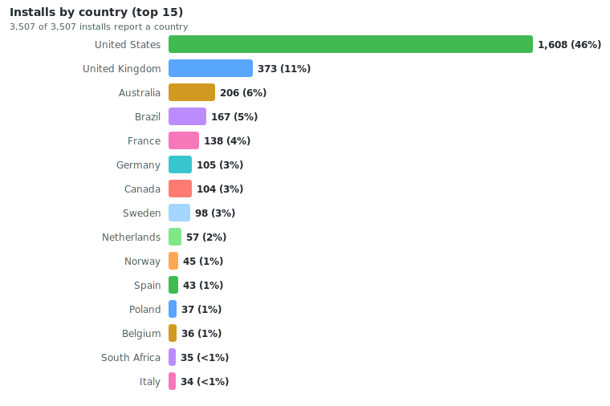

## Operating system

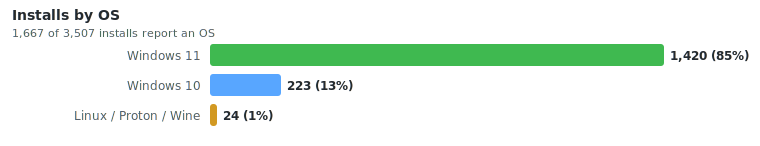

## Repeat usage

- **Returning installs (launched more than once):** 3,073 (88%) of 3,507 reporting  ·  **median launches per install:** 15

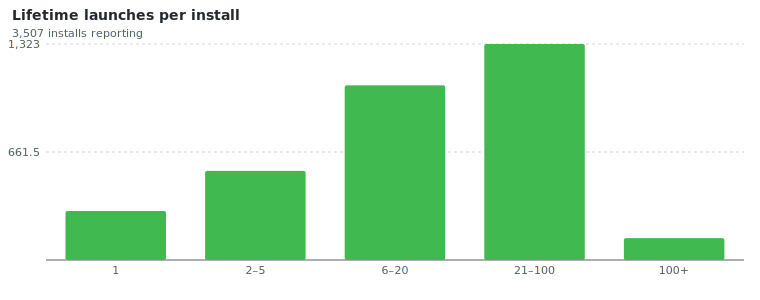

## Feature & HUD adoption - MX Bikes

HUDs and widgets differ by game, so adoption is shown for the primary game, MX Bikes, over its 3,450 installs. *(GP Bikes 44 and Kart Racing Pro 13 have too few installs for their own breakdown.)*

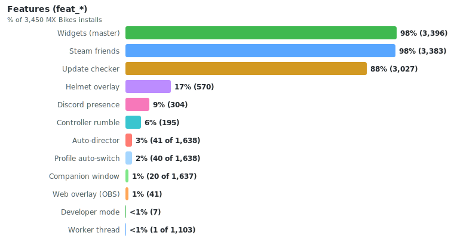

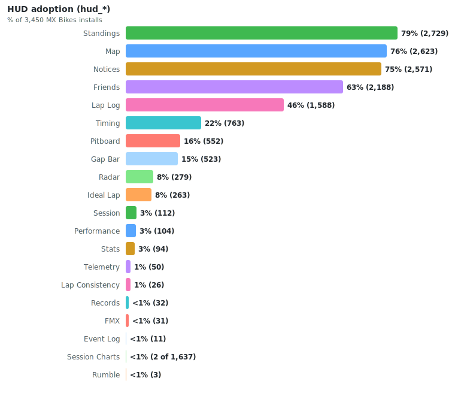

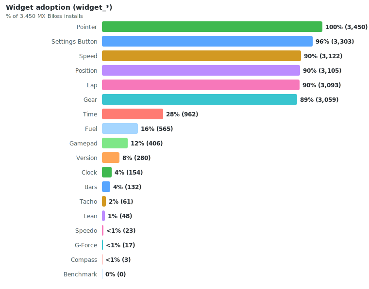

- **Median HUDs enabled per install:** 4  ·  **median widgets:** 6

## Crashes (upstream / stability)

Of **2,847** crash reports, **1,642** come from plugin **1.27.5+** builds, which record full diagnostics (a backtrace and the access-violation type). The rest are excluded from the analysis below: 1,194 from earlier builds and 11 from dev tooling.

- **Crash-report rate:** 16.0% (1,642 of 10,237 launches)
- **Affected installs:** 449 of 1,121 running 1.27.5+ (40%)

> The plugin's crash handler detects a fault, saves a report, and submits it on the next launch. Where a fault location was recorded, execution failed **outside the plugin binary** (in the game or another module), though that location is not necessarily the root cause. Reports are grouped by faulting module below and linked to the [known-crash list](../crash_analysis/KNOWN_GAME_CRASHES.md), where a fix or workaround may exist.

### Crash rate by game

| Game | Crash reports | 1.27.5+ launches | Launches with a crash report |
|---|--:|--:|--:|
| GP Bikes | 8 | 132 | 6.1% |
| Kart Racing Pro | 5 | 16 | 31.2% * |
| MX Bikes | 1,629 | 10,089 | 16.1% |

*\* based on fewer than 100 launches; interpret cautiously.*

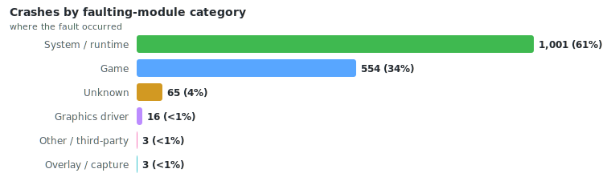

**Access-violation type:** read 1,462, write 110, execute 65  ·  **exception codes:** `0xC0000005` 1,637, `0xC0000094` 4, `0xE06D7363` 1

### Most common crashes

Ranked by number of crash reports. **89% (1,456)** of reports match signatures already catalogued in [`known_game_crashes.json`](../crash_analysis/KNOWN_GAME_CRASHES.md); each links to its full write-up.

| Crash | Share | Trigger | Fix / workaround |
|---|--:|---|:--:|
| [Offline track-load crash (bad string in per-profile data)](../crash_analysis/KNOWN_GAME_CRASHES.md) | 60% (990) | At track load (offline), a game-side parser reads a string field from loaded per-profile data, en… | [✔](../crash_analysis/KNOWN_GAME_CRASHES.md) |
| [Physics contact blow-up (bad table index)](../crash_analysis/KNOWN_GAME_CRASHES.md) | 14% (234) | During a physics contact event -- a hard object impact, but also ordinary terrain/ground contact… | - |
| [Session teardown null dereference (leaving a session / connecting)](../crash_analysis/KNOWN_GAME_CRASHES.md) | 8% (130) | While the player is idle between sessions (not riding), the game dereferences a null object point… | - |
| [OpenGL render buffer write (vertex-fill overrun)](../crash_analysis/KNOWN_GAME_CRASHES.md) | 5% (83) | The game's OpenGL render code (a +0x240xxx vertex/command-buffer fill loop handling ~4001 element… | [✔](../crash_analysis/KNOWN_GAME_CRASHES.md) |
| [Session-teardown crash via input/message pump (stale pointer)](../crash_analysis/KNOWN_GAME_CRASHES.md) | <1% (9) | While leaving/ending a session (teardown, idle after the race), the game dereferences a stale/gar… | - |
| [Out-of-range array index read at session end](../crash_analysis/KNOWN_GAME_CRASHES.md) | <1% (7) | As an online race session ends, the game indexes a 32-bit array with a roughly 985-million-elemen… | - |
| [Null dereference in network / session-end code](../crash_analysis/KNOWN_GAME_CRASHES.md) | <1% (3) | At the end of an online race the game dereferences a null object pointer (reads field at null - 0… | - |

*✔ = a documented workaround (follow the crash link). Matched on game build + fault offset.*

### Not yet catalogued

The remaining **11% (186)** of reports do not yet match the catalogue. The most frequent unmatched signatures are listed below by module and per-build offset:

| Fault (module + offset) | Category | Share |
|---|---|--:|
| `unknown+0x0` | Unknown | 4% (63) |
| `mxbikes.exe+0x1eea9c` | Game | <1% (12) |
| `mxbikes.exe+0x231cee` | Game | <1% (10) |
| `mxbikes.exe+0x1dc063` | Game | <1% (6) |
| `mxbikes.exe+0x255f1f` | Game | <1% (6) |
| `mxbikes.exe+0x7a860` | Game | <1% (4) |
| `mxbikes.exe+0x20a06c` | Game | <1% (3) |
| `mxbikes.exe+0xe8198` | Game | <1% (3) |
| `mxbikes.exe+0x255ef0` | Game | <1% (3) |
| `MSVCR90.dll+0x1e359` | System / runtime | <1% (3) |

## About this data

The plugin only sends anonymous, aggregate telemetry (no personal data - see the privacy note in the main README). Reporting began in **1.26** (a few stray older builds send only a basic launch event) and expanded through **1.27**, so older versions report fewer fields. Percentages are always taken over the installs that actually report a given field, and each chart notes how many installs that is, so incomplete rollout is never shown as a real trend.

**Definitions.** *Install* - a unique `install_id` (regenerated if the analytics file is deleted, so a wipe-and-reinstall reads as a new install). *Launch* - one plugin start (`app_started`). *Active install* - an install that launched on a given day. *Crash report* - one fault caught by the crash handler, saved on crash and sent on the next launch (≈ one per crashed launch). Each install belongs to one game (the plugin installs separately per game); its **game**, **country**, and **version** are its most recently seen values.

Developer/test machines are excluded report-wide (3 installs, 420 events): they launch every dev build and deliberately trigger crashes to validate the telemetry, which would otherwise read as phantom plugin crashes.

What each release line reports (share of its launches):

| Release line | Launches | Features | HUDs / widgets | OS version | Update channel | Crash detail |
|---|--:|--:|--:|--:|--:|--:|
| `1.25` | 1 | 0% | 0% | 0% | 0% | 0% |
| `1.26` | 70,271 | 100% | 100% | 0% | 100% | 0% |
| `1.27` | 20,541 | 100% | 100% | 100% | 100% | 50% |

---
*Generated by `tools/analytics_report.py`. Charts in `charts/`. Re-run after each monthly Aptabase export; the raw `.parquet` files stay out of the repo.*
