# MXBMRP3 - Analytics Report

<!-- GENERATED by tools/analytics_report.py from Aptabase exports. Do not edit by hand; re-run the tool. Raw exports are not kept in the repo. -->

**Data window:** 2026-06-27 → 2026-07-29 (33 days)

| Installs | Launches | Countries |
|---|---|---|
| **5,575** | **163,743** | **85** |

## Highlights

- **Reach:** 5,575 installs across 3 games in 85 countries; peak 1,906 active on a single day.
- **Main game:** MX Bikes - 99% of launches.
- **Platform:** among installs reporting each field, 81% run Windows 11 and 99% use Steam.
- **Repeat use:** 82% of installs launched more than once.
- **Most-used HUD:** Standings - 78% of MX Bikes installs.

## Activity over time

> Daily charts omit partial export days (2026-06-27, 2026-07-29); totals include them.

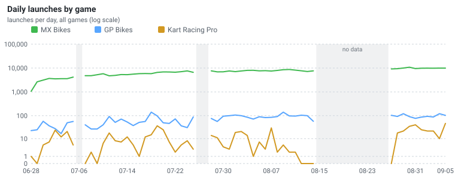

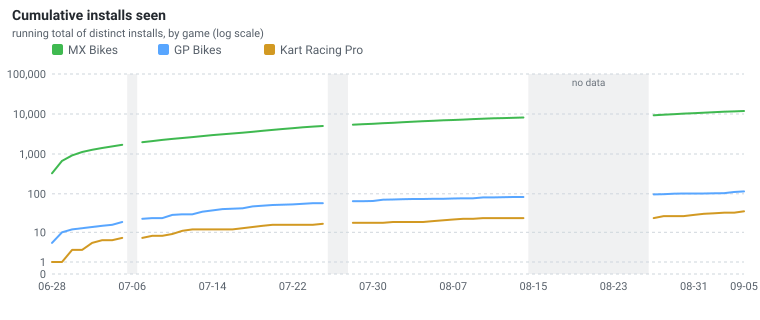

- **Installs seen to date:** 5,575

- **avg launches/day:** 5,165

## Games

| Game | Installs | Launches | Share of launches |
|---|--:|--:|--:|
| MX Bikes | 5,492 | 161,831 | 98.8% |
| GP Bikes | 65 | 1,612 | 1.0% |
| Kart Racing Pro | 18 | 300 | 0.2% |

## Plugin version adoption

Each install counts once, at its **most recent** version (an upgrade moves it, never double-counts). Versions under 10 installs are grouped.

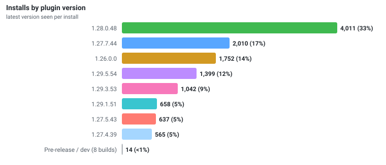

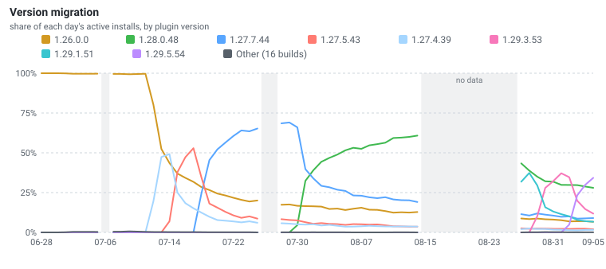

**By release line:** `1.27` 3,886 (70%)  ·  `1.26` 1,689 (30%)

**Update channel:** stable 5,569 (>99%)  ·  prerelease 6 (<1%)

## Geography

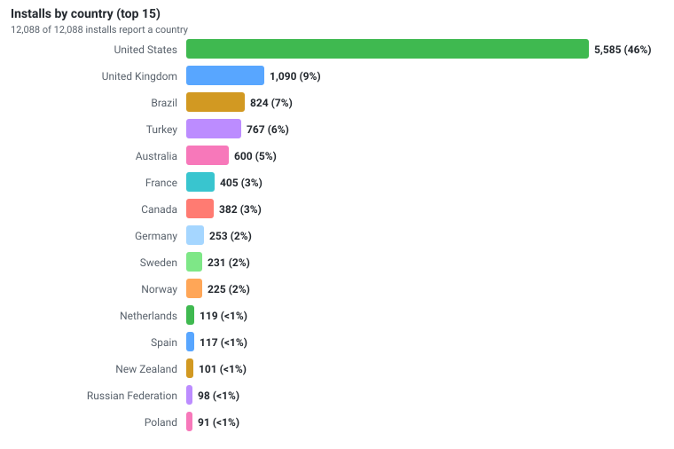

## Operating system

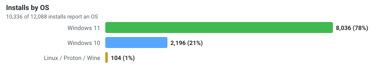

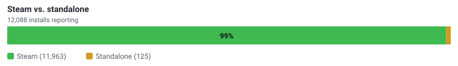

## Repeat usage

- **Returning installs (launched more than once):** 4,568 (82%) of 5,575 reporting  ·  **median launches per install:** 16

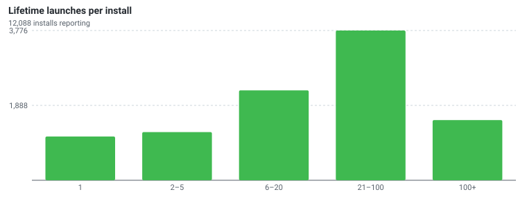

- **Median session:** 16 min  ·  **59,108 sessions**  ·  from 74% of launches on versions that report one; 83,672 launches on earlier versions report no session end

- **At least 1,455 days** of session time across those sessions

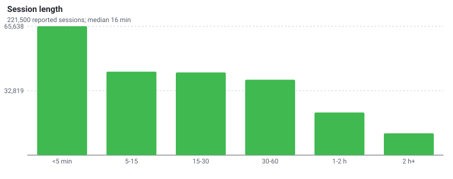

## Feature & HUD adoption - MX Bikes

HUDs and widgets differ by game, so adoption is shown for the primary game, MX Bikes, over its 5,492 installs. *(GP Bikes 65 and Kart Racing Pro 18 have too few installs for their own breakdown.)*

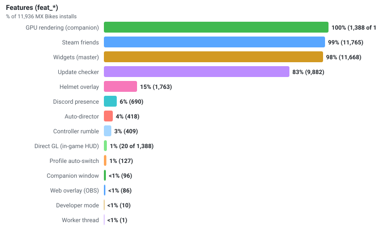

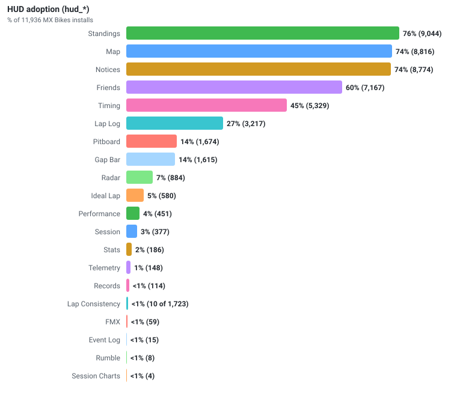

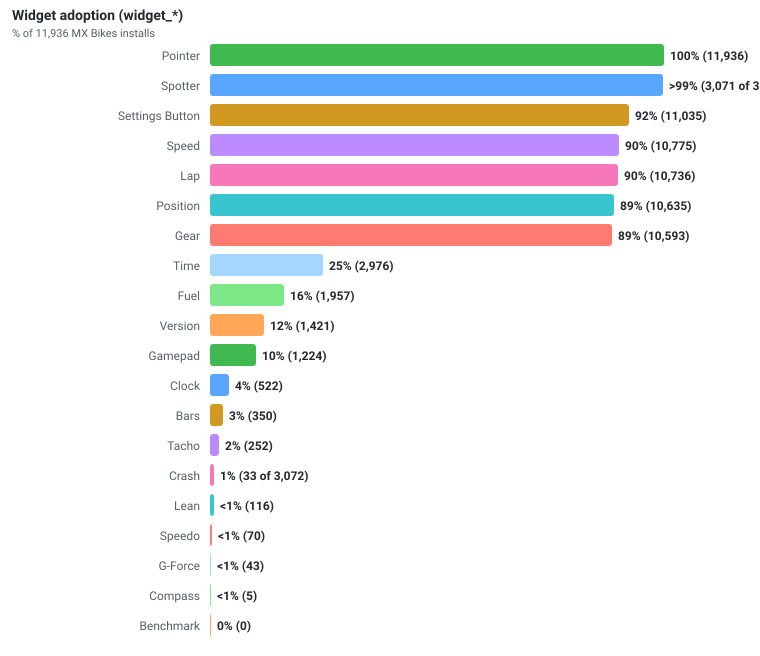

- **Median HUDs enabled per install:** 5  ·  **median widgets:** 6

## Crashes (upstream / stability)

Of **11,759** crash reports, **10,007** come from plugin **1.27.5+** builds, which record full diagnostics (a backtrace and the access-violation type). The rest are excluded from the analysis below: 1,741 from earlier builds and 11 from dev tooling.

- **Crash-report rate:** 15.4% (10,007 of 64,823 launches)
- **Affected installs:** 1,862 of 3,431 running 1.27.5+ (54%)

> The plugin's crash handler detects a fault, saves a report, and submits it on the next launch. Where a fault location was recorded, execution failed **outside the plugin binary** (in the game or another module), though that location is not necessarily the root cause. Reports are grouped by faulting module below and linked to the [known-crash list](../crash_analysis/KNOWN_GAME_CRASHES.md), where a fix or workaround may exist.

### Crash rate by game

| Game | Crash reports | 1.27.5+ launches | Launches with a crash report |
|---|--:|--:|--:|
| GP Bikes | 54 | 724 | 7.5% |
| Kart Racing Pro | 38 | 136 | 27.9% |
| MX Bikes | 9,915 | 63,963 | 15.5% |

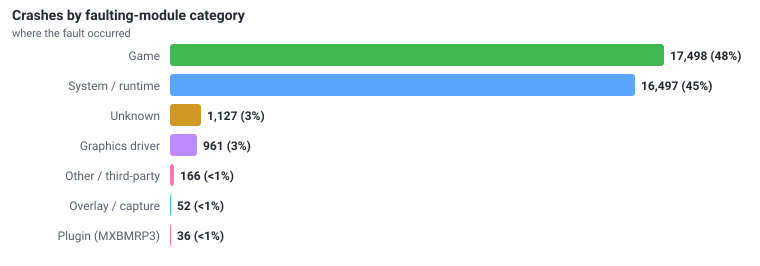

*The Plugin (MXBMRP3) slice (19 crashes) is where the fault offset landed, not proof the plugin caused it - inspect each via its backtrace.*

**Access-violation type:** read 8,916, write 694, execute 377  ·  **exception codes:** `0xC0000005` 9,987, `0xE06D7363` 12, `0xC0000094` 8

### Most common crashes

Ranked by number of crash reports. **84% (8,428)** of reports match signatures already catalogued in [`known_game_crashes.json`](../crash_analysis/KNOWN_GAME_CRASHES.md); each links to its full write-up.

| Crash | Share | Trigger | Fix / workaround |
|---|--:|---|:--:|
| [Offline track-load crash (bad string in per-profile data)](../crash_analysis/KNOWN_GAME_CRASHES.md) | 54% (5,422) | At track load (offline), a game-side parser reads a string field from loaded per-profile data, en… | [✔](../crash_analysis/KNOWN_GAME_CRASHES.md) |
| [Physics contact blow-up (bad table index)](../crash_analysis/KNOWN_GAME_CRASHES.md) | 16% (1,629) | During a physics contact event -- a hard object impact, but also ordinary terrain/ground contact… | - |
| [Session teardown null dereference (leaving a session / connecting)](../crash_analysis/KNOWN_GAME_CRASHES.md) | 8% (777) | While the player is idle between sessions (not riding), the game dereferences a null object point… | - |
| [OpenGL render buffer write (vertex-fill overrun)](../crash_analysis/KNOWN_GAME_CRASHES.md) | 4% (438) | The game's OpenGL render code (a +0x240xxx vertex/command-buffer fill loop handling ~4001 element… | [✔](../crash_analysis/KNOWN_GAME_CRASHES.md) |
| [Session-teardown crash via input/message pump (stale pointer)](../crash_analysis/KNOWN_GAME_CRASHES.md) | <1% (80) | While leaving/ending a session (teardown, idle after the race), the game dereferences a stale/gar… | - |
| [Null dereference in network / session-end code](../crash_analysis/KNOWN_GAME_CRASHES.md) | <1% (48) | At the end of an online race the game dereferences a null object pointer (reads field at null - 0… | - |
| [Out-of-range array index read at session end](../crash_analysis/KNOWN_GAME_CRASHES.md) | <1% (34) | As an online race session ends, the game indexes a 32-bit array with a roughly 985-million-elemen… | - |

*✔ = a documented workaround (follow the crash link). Matched on game build + fault offset.*

### Not yet catalogued

The remaining **16% (1,579)** of reports do not yet match the catalogue. The most frequent unmatched signatures are listed below by module and per-build offset:

| Fault (module + offset) | Category | Share |
|---|---|--:|
| `unknown+0x0` | Unknown | 4% (365) |
| `mxbikes.exe+0x2889e0` | Game | <1% (83) |
| `mxbikes.exe+0x1a29ae` | Game | <1% (80) |
| `mxbikes.exe+0x1eea9c` | Game | <1% (75) |
| `mxbikes.exe+0x255ef0` | Game | <1% (53) |
| `mxbikes.exe+0x255f1f` | Game | <1% (51) |
| `mxbikes.exe+0x1dc063` | Game | <1% (43) |
| `MSVCR90.dll+0x1e359` | System / runtime | <1% (33) |
| `OPENGL32.dll+0x2c221` | Graphics driver | <1% (28) |
| `mxbikes.exe+0x231cee` | Game | <1% (27) |

## About this data

The plugin only sends anonymous, aggregate telemetry (no personal data - see the privacy note in the main README). Reporting began in **1.26** (a few stray older builds send only a basic launch event) and expanded through **1.27**, so older versions report fewer fields. Percentages are always taken over the installs that actually report a given field, and each chart notes how many installs that is, so incomplete rollout is never shown as a real trend.

**Definitions.** *Install* - a unique `install_id` (regenerated if the analytics file is deleted, so a wipe-and-reinstall reads as a new install). *Launch* - one plugin start (`app_started`). *Active install* - an install that launched on a given day. *Crash report* - one fault caught by the crash handler, saved on crash and sent on the next launch (≈ one per crashed launch). Each install belongs to one game (the plugin installs separately per game); its **game**, **country**, and **version** are its most recently seen values.

Developer/test machines are excluded report-wide (3 installs, 451 events): they launch every dev build and deliberately trigger crashes to validate the telemetry, which would otherwise read as phantom plugin crashes.

What each release line reports (share of its launches):

| Release line | Launches | Features | HUDs / widgets | OS version | Update channel | Crash detail |
|---|--:|--:|--:|--:|--:|--:|
| `1.25` | 1 | 0% | 0% | 0% | 0% | 0% |
| `1.26` | 83,816 | 100% | 100% | 0% | 100% | 0% |
| `1.27` | 79,926 | 100% | 100% | 100% | 100% | 81% |

---
*Generated by `tools/analytics_report.py`. Charts in `charts/`. Re-run after each monthly Aptabase export; the raw `.parquet` files stay out of the repo.*
