# Achievements

Every achievement in the plugin, with its tiers worded the way the toast words them (a one-shot has one). **MX Bikes only.**

A **Hidden** row does not appear in Settings > Achievements until it is earned, and the pages marked *(does not count towards progress)* sit outside the Unlocked figure and the Completion rows. The leading number is a row's place in its GROUP, which the tab pages 8 at a time; a row switched off reads **off** instead.

Generated from `mxbmrp3/core/achievements.h` by `tests/unit/test_achievements.cpp` - do not edit. Run the unit gate and copy `/tmp/achievements.new.md` over this file.

## Mileage

| # | Id | Icon | Achievement | Bronze | Silver | Gold | Platinum |
|--:|---|---|---|---|---|---|---|
| 1 | `distance` | 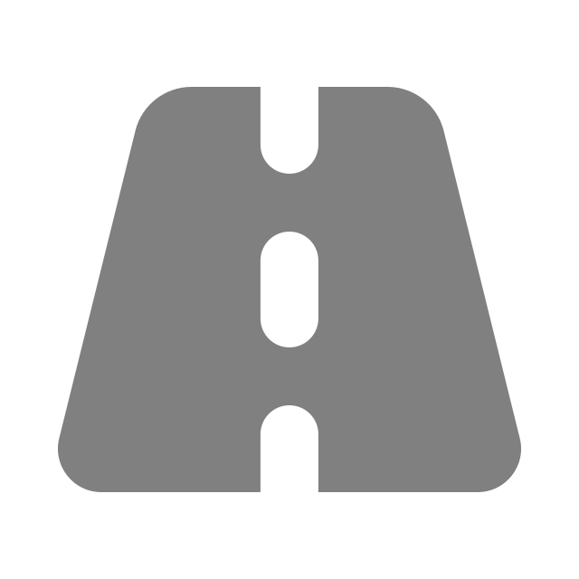 | Long Hauler | Ride 100km in total | Ride 1,000km in total | Ride 5,000km in total | Ride 25,000km in total |
| 2 | `ride_time` | 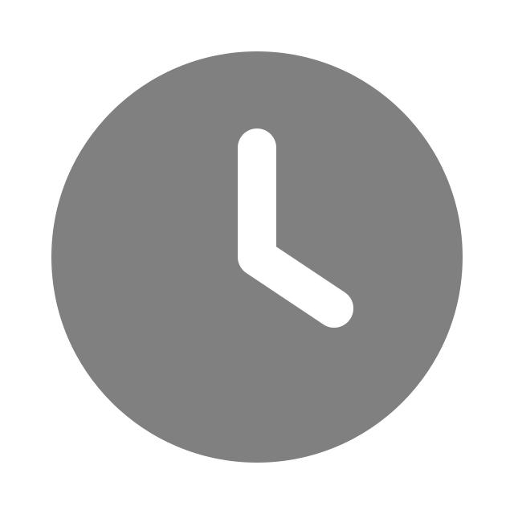 | Seat Time | Spend 10h on track | Spend 100h on track | Spend 500h on track | Spend 1,000h on track |
| 3 | `laps` | 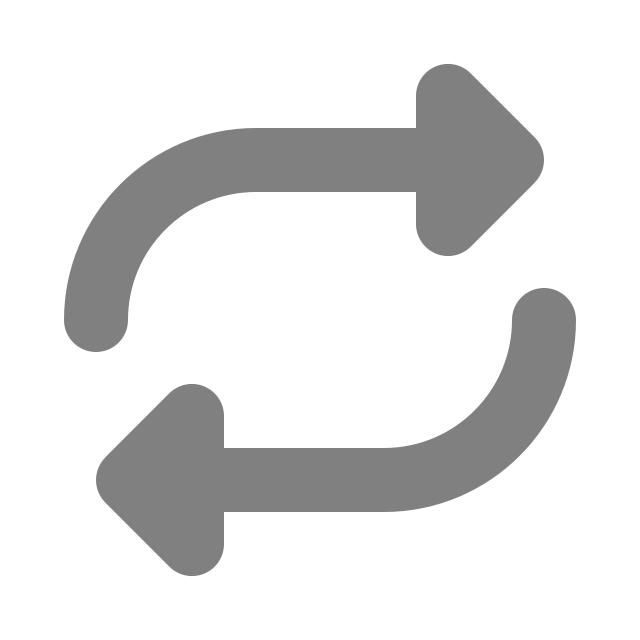 | Lap Counter | Complete 100 laps | Complete 500 laps | Complete 2,000 laps | Complete 5,000 laps |
| 4 | `gear_shifts` | 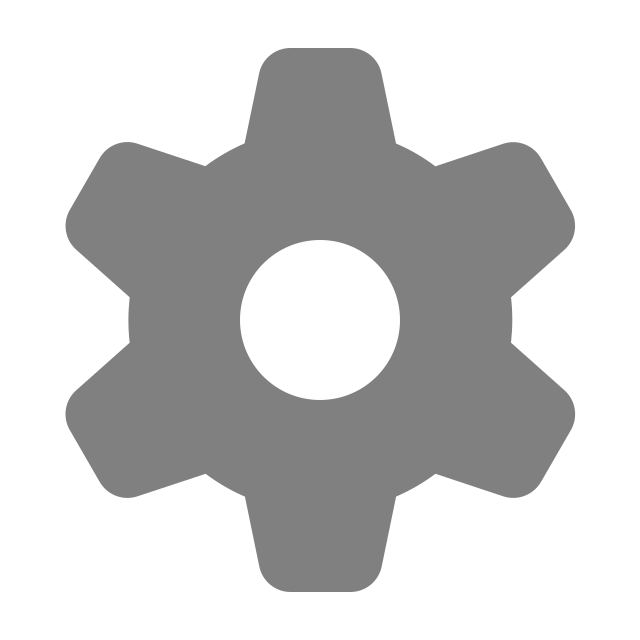 | Shift Happens | Shift 1,000 times | Shift 10,000 times | Shift 100,000 times | Shift 1,000,000 times |
| 5 | `session_laps` | 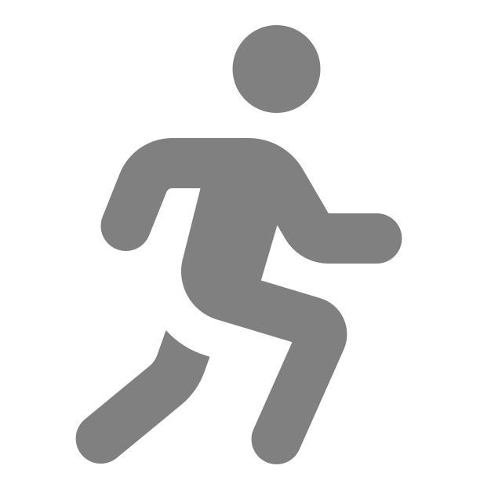 | Marathon | Complete 25 laps in one session | Complete 50 laps in one session | Complete 75 laps in one session | Complete 100 laps in one session |
| 6 | `session_time` | 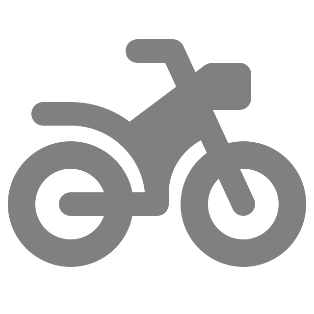 | Iron Butt | Ride 1h in one day (@soulberg3) | Ride 2h in one day (@soulberg3) | Ride 4h in one day (@soulberg3) | Ride 8h in one day (@soulberg3) |
| 7 | `track_laps` | 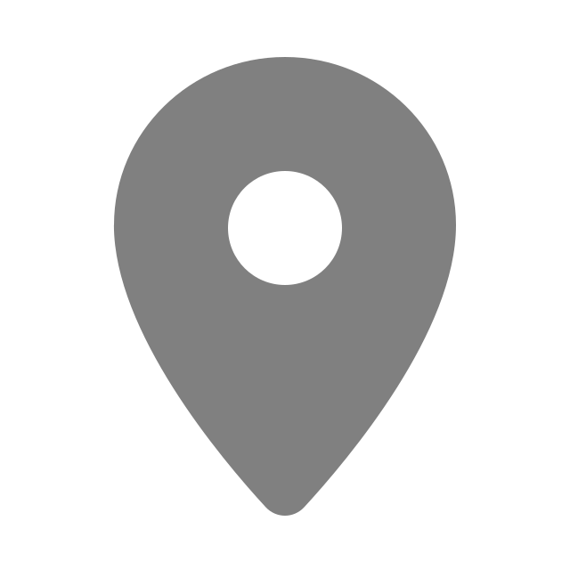 | Local Hero | Complete 50 laps at one track | Complete 250 laps at one track | Complete 500 laps at one track | Complete 1,000 laps at one track |
| 8 | `bike_km` | 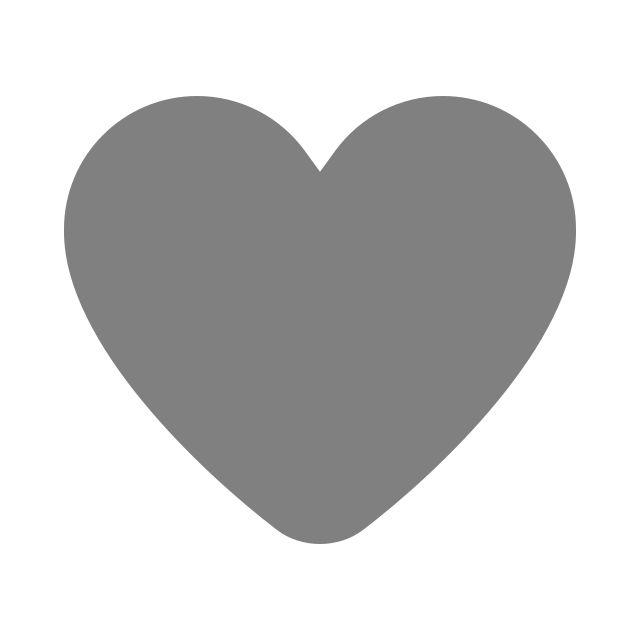 | Loyal | One bike, 100km (@BLAND525) | One bike, 500km (@BLAND525) | One bike, 2,500km (@BLAND525) | One bike, 5,000km (@BLAND525) |

## Racing

| # | Id | Icon | Achievement | Bronze | Silver | Gold | Platinum |
|--:|---|---|---|---|---|---|---|
| 1 | `races` | 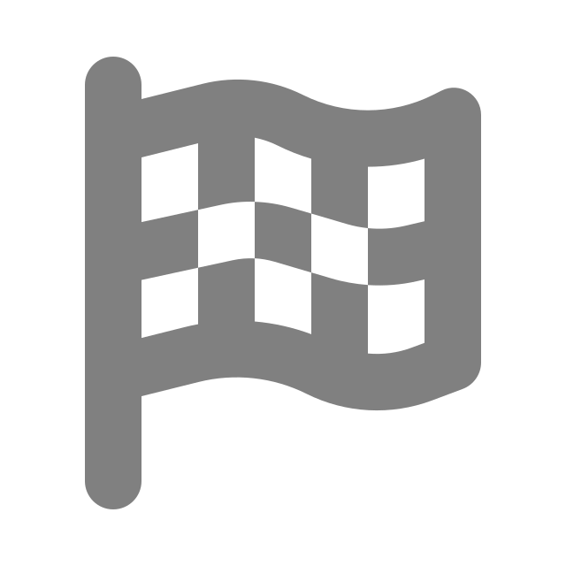 | Racer | Finish a race | Finish 10 races | Finish 100 races | Finish 500 races |
| 2 | `wins` |  | Winner | Win a race | Win 10 races | Win 50 races | Win 150 races |
| 3 | `podiums` | 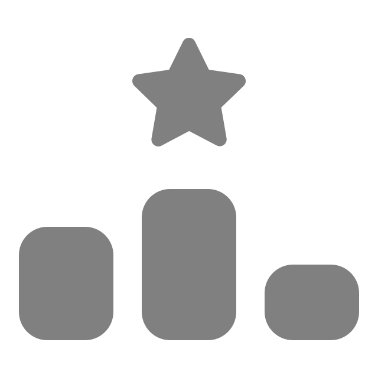 | Podium Regular | Finish on the podium | Finish on the podium 25 times | Finish on the podium 100 times | Finish on the podium 300 times |
| 4 | `lapped_field` | 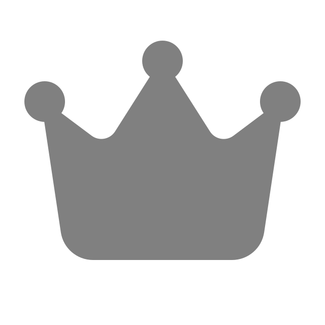 | Lapped the Field | Win with every rider at least a lap down | - | - | - |
| 5 | `fastest_laps` | 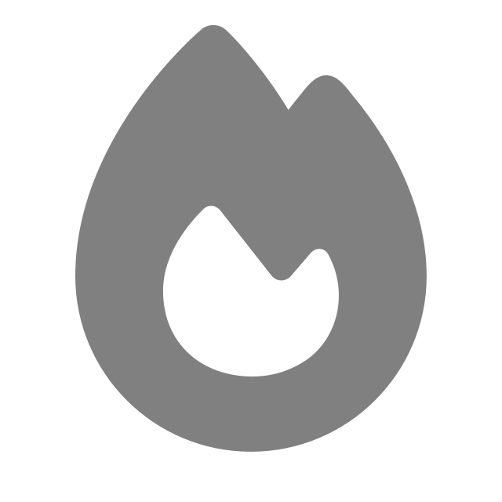 | Hot Lapper | Set the fastest lap in a race | Set the fastest lap in 10 races | Set the fastest lap in 50 races | Set the fastest lap in 200 races |
| 6 | `rain_races` | 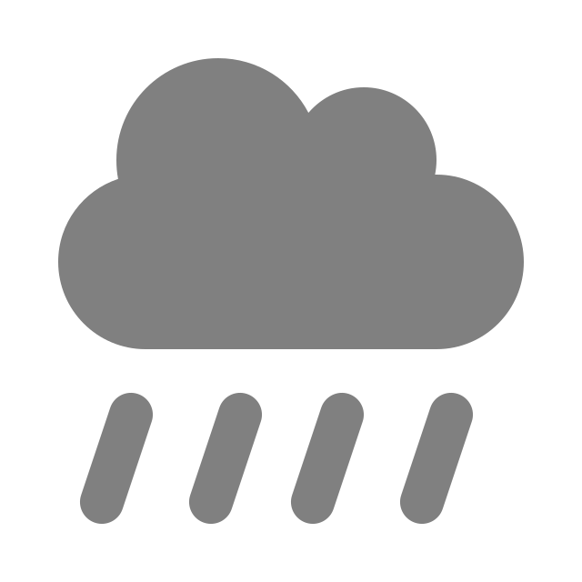 | Mudder | Finish a race in the rain | Finish 5 races in the rain | Finish 15 races in the rain | Finish 25 races in the rain |
| 7 | `big_grids` | 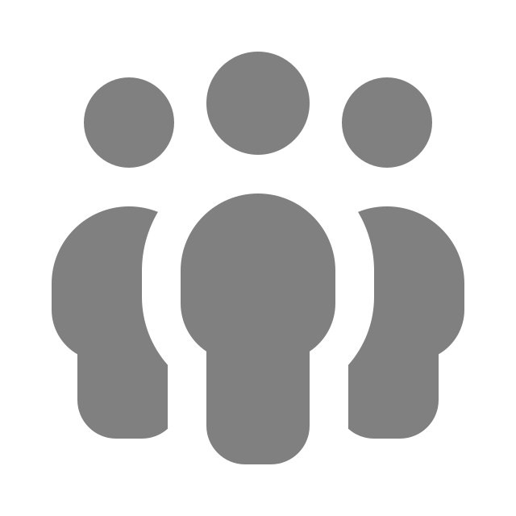 | Crowd Surfer | Finish a race on a 20+ rider grid | Finish 10 races on a 20+ rider grid | Finish 50 races on a 20+ rider grid | Finish 150 races on a 20+ rider grid |
| 8 | `holeshots` | 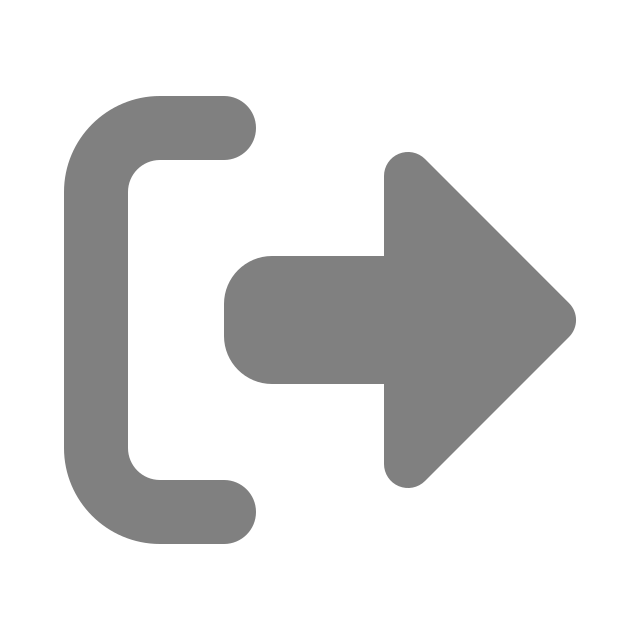 | Holeshot-ish | Lead at the first split | Lead at the first split in 10 races | Lead at the first split in 50 races | Lead at the first split in 150 races |
| 9 | `charger` |  | Charger | Climb 5 places from the first split | Climb 10 places from the first split | Climb 15 places from the first split | Climb 20 places from the first split |
| 10 | `last_lap_pass` | 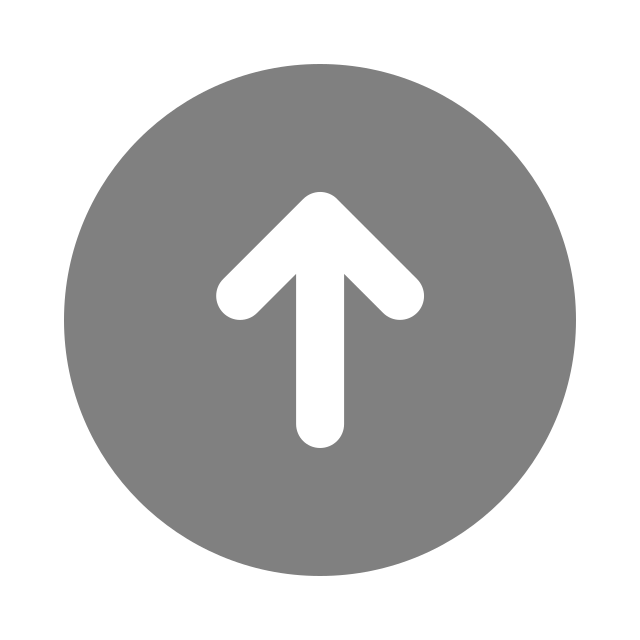 | Last Gasp | Pass on the last lap | Pass on the last lap in 10 races | Pass on the last lap in 50 races | Pass on the last lap in 150 races |
| 11 | `survivor` |  | Survivor | Finish a race where a quarter quit | Finish 5 races where a quarter quit | Finish 15 races where a quarter quit | Finish 40 races where a quarter quit |
| 12 | `roost` | 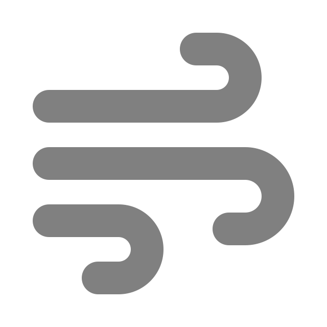 | Roost | Ride 5min in a rider's wake | Ride 30min in a rider's wake | Ride 2h in a rider's wake | Ride 5h in a rider's wake |
| 13 | `photo_finish` |  | Photo Finish | Win a race by under a tenth | - | - | - |
| 14 | `sandbagger` | 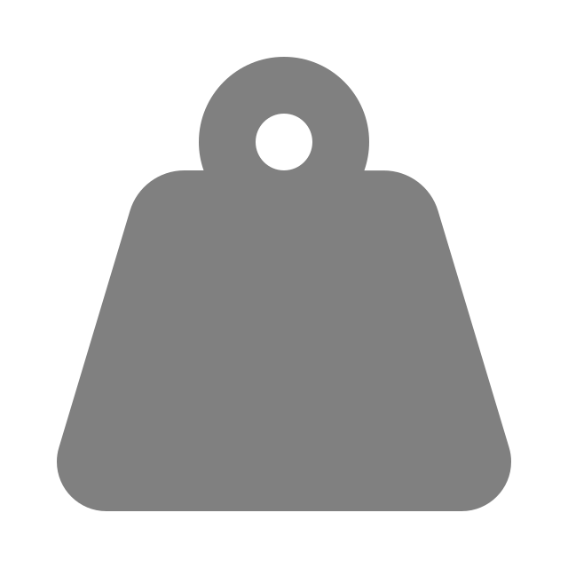 | Sandbagger | Set a PB on the last lap of a race | - | - | - |
| 15 | `fumes` | 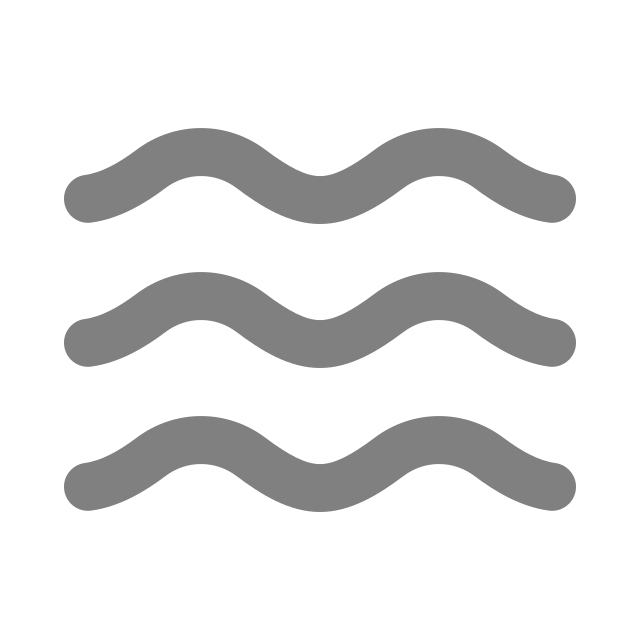 | Running on Fumes | Finish a race on 1% of a tank or less | - | - | - |

## Consistency

| # | Id | Icon | Achievement | Bronze | Silver | Gold | Platinum |
|--:|---|---|---|---|---|---|---|
| 1 | `clean_races` | 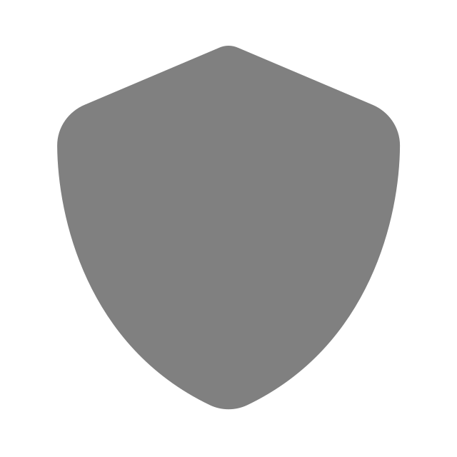 | Rubber Side Down | Finish a race without crashing | Finish 5 races without crashing | Finish 15 races without crashing | Finish 25 races without crashing |
| 2 | `penalty_free` |  | Clean Sheet | Go 5 races in a row penalty-free | Go 10 races in a row penalty-free | Go 15 races in a row penalty-free | Go 25 races in a row penalty-free |
| 3 | `wire_to_wire` | 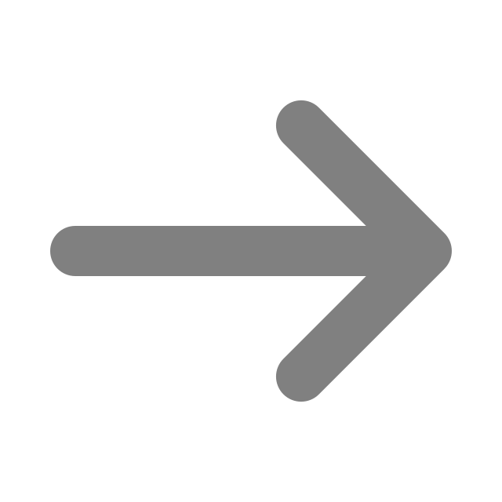 | Wire to Wire | Win a race leading every lap | Win 5 races leading every lap | Win 10 races leading every lap | Win 25 races leading every lap |
| 4 | `perfect_race` | 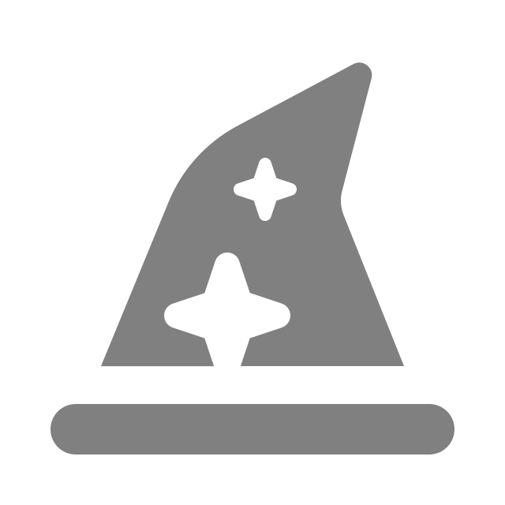 | Perfect Race | Holeshot, every lap led, fastest lap, win | - | - | - |
| 5 | `clean_laps` | 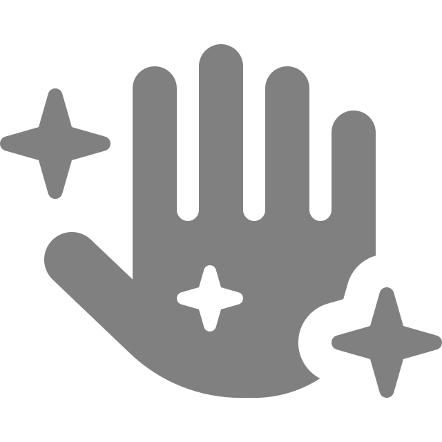 | Spotless | 5 laps in a row, crash/penalty free | 15 laps in a row, crash/penalty free | 30 laps in a row, crash/penalty free | 50 laps in a row, crash/penalty free |
| 6 | `metronome` | 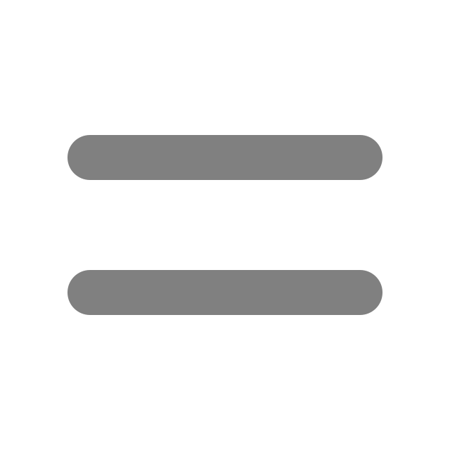 | Metronome | Five laps in a row, all within a tenth | - | - | - |
| 7 | `steady_hands` | 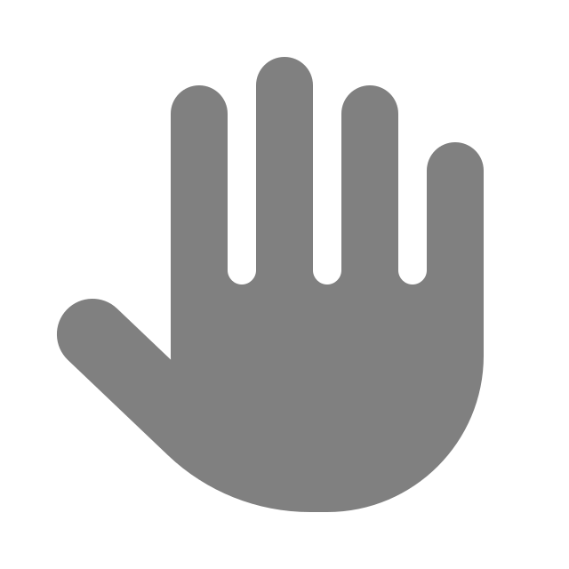 | Steady Hands | Ride 30min without crashing | - | - | - |

## Variety

| # | Id | Icon | Achievement | Bronze | Silver | Gold | Platinum |
|--:|---|---|---|---|---|---|---|
| 1 | `tracks` |  | Globetrotter | Ride 5 different tracks | Ride 25 different tracks | Ride 50 different tracks | Ride 100 different tracks |
| 2 | `bikes` | 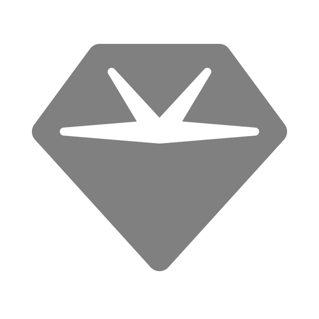 | Collector | Ride 3 different bikes | Ride 10 different bikes | Ride 25 different bikes | Ride 50 different bikes |
| 3 | `personal_bests` |  | Personal Best | Set a personal best | Set 10 personal bests | Set 100 personal bests | Set 500 personal bests |
| 4 | `pb_leaps` |  | Leap Forward | Beat a PB by a second or more | Beat 10 PBs by a second or more | Beat 50 PBs by a second or more | Beat 100 PBs by a second or more |
| 5 | `regular` | 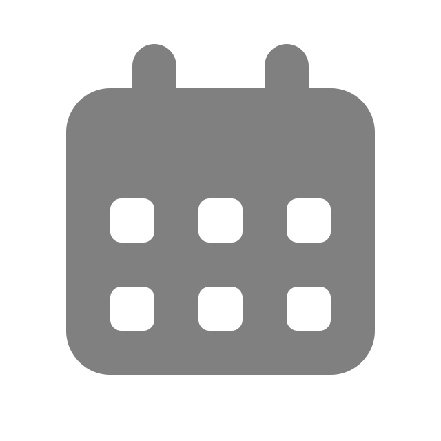 | Regular | Show up on 7 different days | Show up on 30 different days | Show up on 100 different days | Show up on 365 different days |
| 6 | `day_streak` | 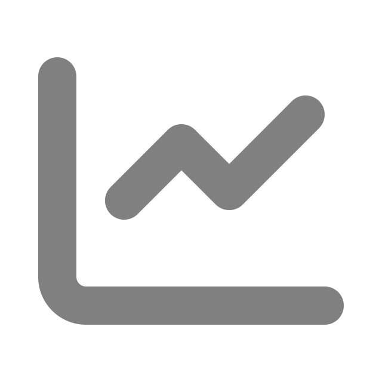 | On a Roll | Show up 3 days in a row | Show up 4 days in a row | Show up 5 days in a row | Show up 7 days in a row |
| 7 | `servers` | 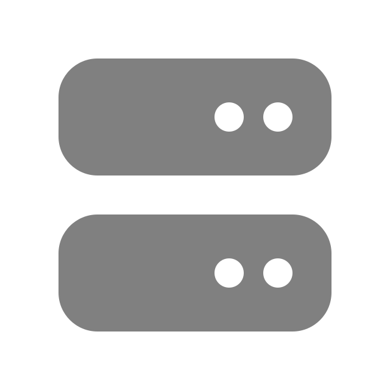 | Well Travelled | Join 5 different servers | Join 10 different servers | Join 25 different servers | Join 50 different servers |
| 8 | `bike_classes` | 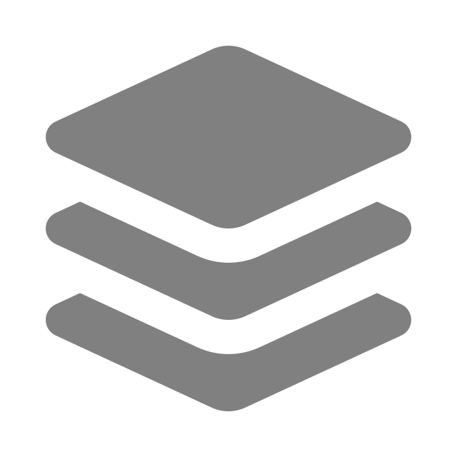 | Class Act | Ride bikes from 2 classes (@Aiden) | Ride bikes from 3 classes (@Aiden) | Ride bikes from 4 classes (@Aiden) | Ride bikes from 5 classes (@Aiden) |

## Air

| # | Id | Icon | Achievement | Bronze | Silver | Gold | Platinum |
|--:|---|---|---|---|---|---|---|
| 1 | `air_miles` | 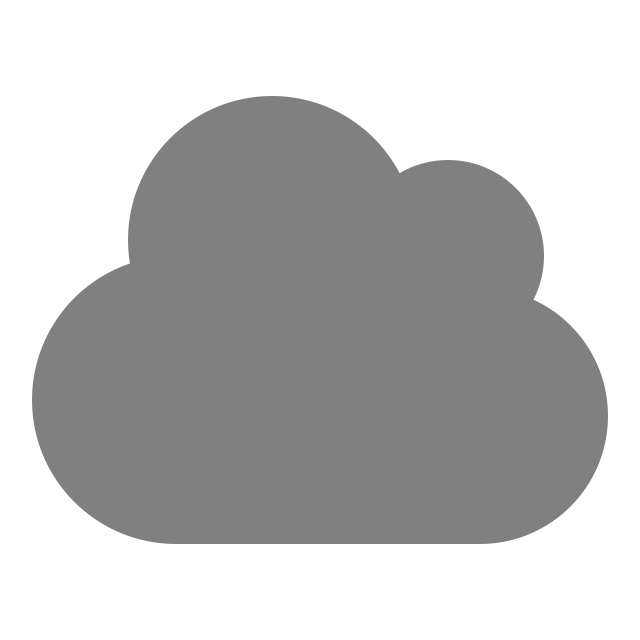 | Frequent Flyer | Spend 2h in the air | Spend 15h in the air | Spend 50h in the air | Spend 100h in the air |
| 2 | `air_distance` | 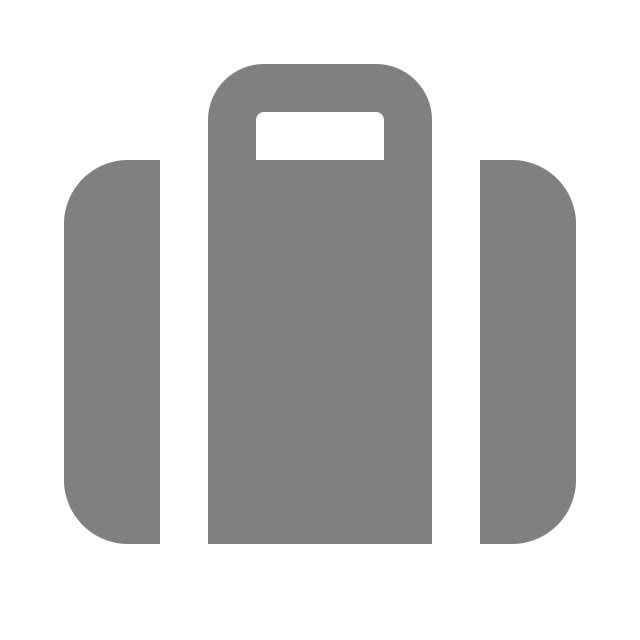 | Air Miles | Cover 1.0km through the air | Cover 10km through the air | Cover 50km through the air | Cover 150km through the air |
| 3 | `air_height` | 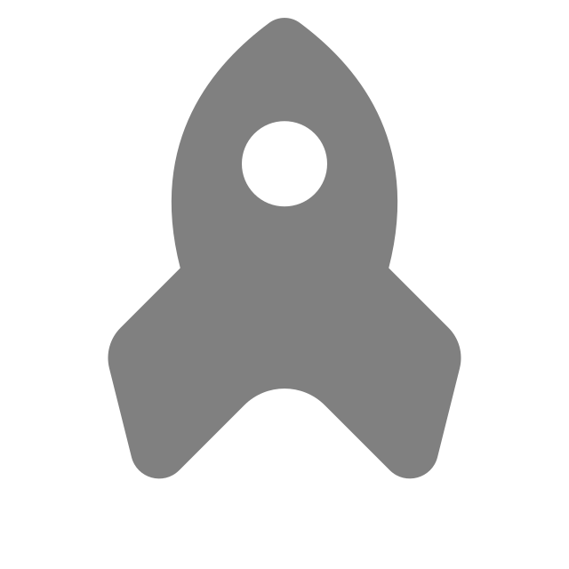 | To the Moon | Climb 1.0km in jumps | Climb 5.0km in jumps | Climb 20km in jumps | Climb 50km in jumps |
| 4 | `fmx_airtime` | 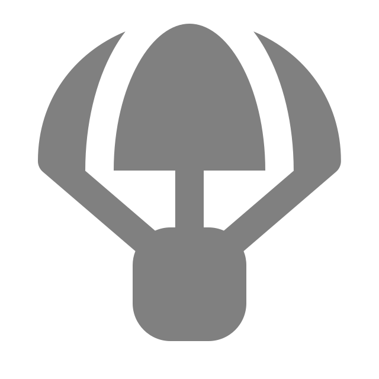 | Hang Time | Stay airborne 2.0s and land it | Stay airborne 3.0s and land it | Stay airborne 4.0s and land it | Stay airborne 5.0s and land it |
| 5 | `jump_distance` | 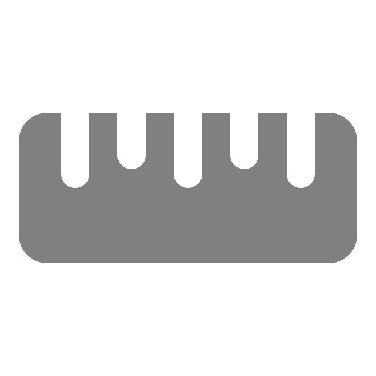 | Gap Jumper | Land a 10m jump | Land a 30m jump | Land a 60m jump | Land a 100m jump |
| 6 | `jump_height` | 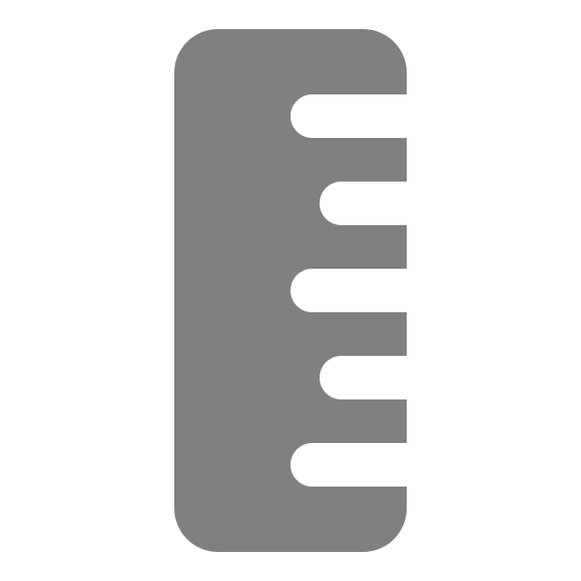 | Sent It | Reach 5m above takeoff and land it | Reach 10m above takeoff and land it | Reach 18m above takeoff and land it | Reach 25m above takeoff and land it |

## Freestyle

| # | Id | Icon | Achievement | Bronze | Silver | Gold | Platinum |
|--:|---|---|---|---|---|---|---|
| 1 | `fmx_tricks` | 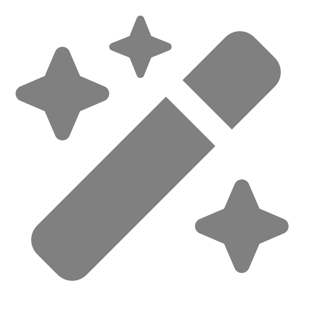 | Show-off | Land 10 freestyle tricks | Land 100 freestyle tricks | Land 1,000 freestyle tricks | Land 10,000 freestyle tricks |
| 2 | `fmx_points` | 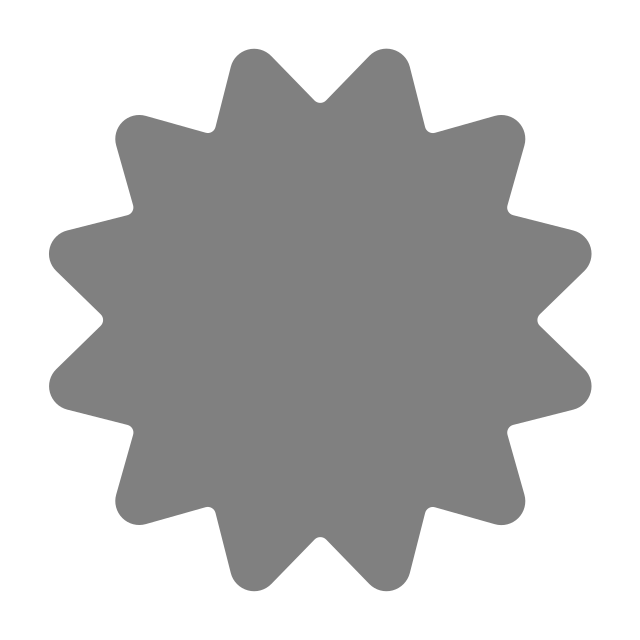 | Style Points | Score 1,000 FMX points | Score 10,000 FMX points | Score 100,000 FMX points | Score 500,000 FMX points |
| 3 | `fmx_chain` | 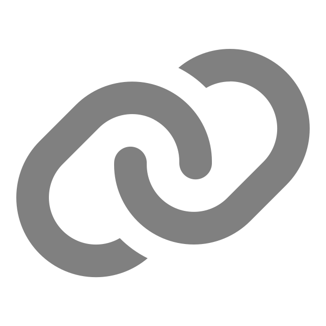 | Chain Reaction | Score 250 points in one chain | Score 750 points in one chain | Score 1,500 points in one chain | Score 2,500 points in one chain |
| 4 | `fmx_kinds` | 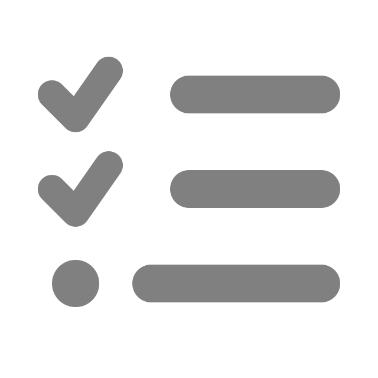 | Trick Collector | Land 4 kinds of freestyle trick | Land 8 kinds of freestyle trick | Land 12 kinds of freestyle trick | Land 15 kinds of freestyle trick |
| 5 | `fmx_wheelie_km` | 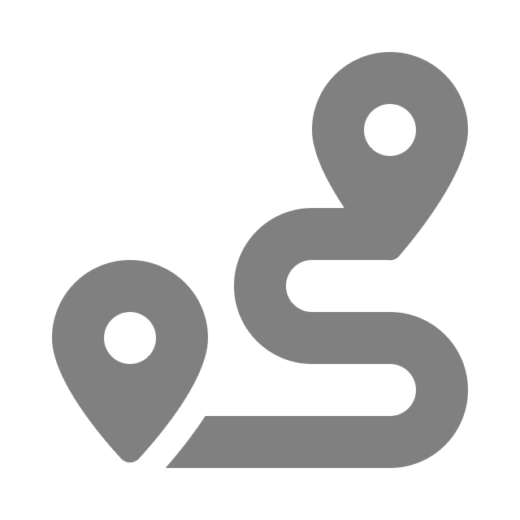 | One-Wheel Tour | Ride 1.0km on the back wheel | Ride 10km on the back wheel | Ride 50km on the back wheel | Ride 100km on the back wheel |
| 6 | `tyre_shredder` | 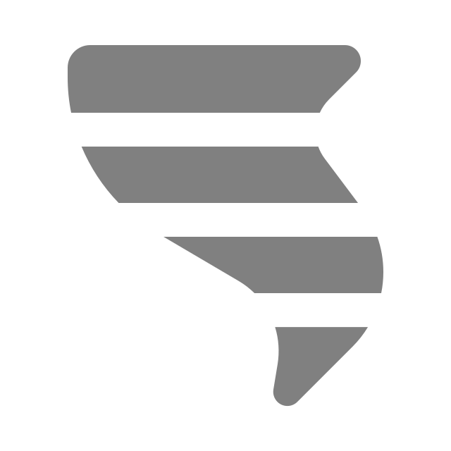 | Tyre Shredder | 1min in burnouts and drifts | 10min in burnouts and drifts | 30min in burnouts and drifts | 1h in burnouts and drifts |

## Tricks

| # | Id | Icon | Achievement | Bronze | Silver | Gold | Platinum |
|--:|---|---|---|---|---|---|---|
| 1 | `fmx_backflips` | 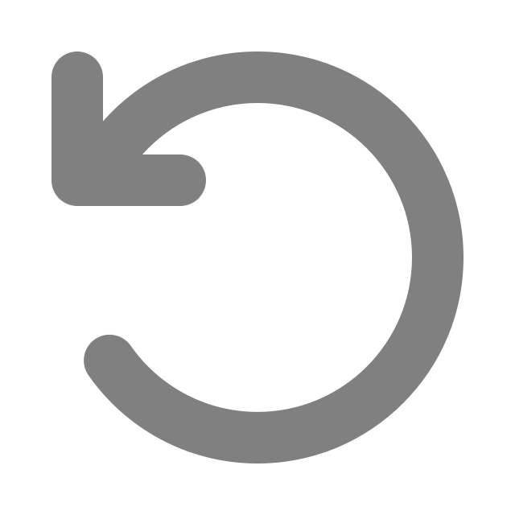 | Flipper | Land a backflip (@Lynds) | Land 10 backflips (@Lynds) | Land 50 backflips (@Lynds) | Land 100 backflips (@Lynds) |
| 2 | `fmx_wheelie` | 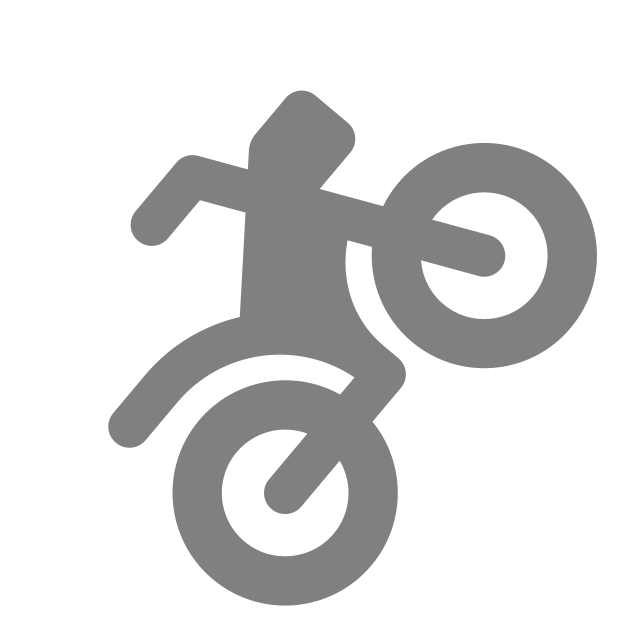 | Wheelie King | Land a 5.0s wheelie | Land a 10.0s wheelie | Land a 20.0s wheelie | Land a 30.0s wheelie |
| 3 | `fmx_whips` | 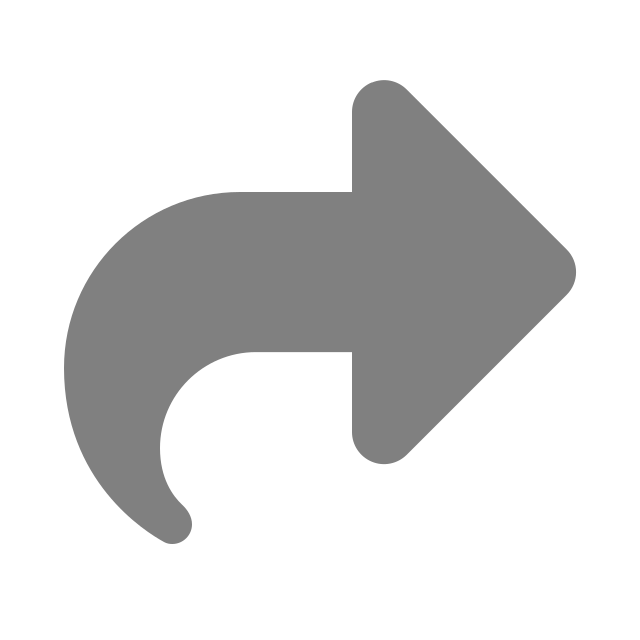 | Whip It | Land 10 whips | Land 100 whips | Land 500 whips | Land 2,500 whips |
| 4 | `fmx_scrubs` | 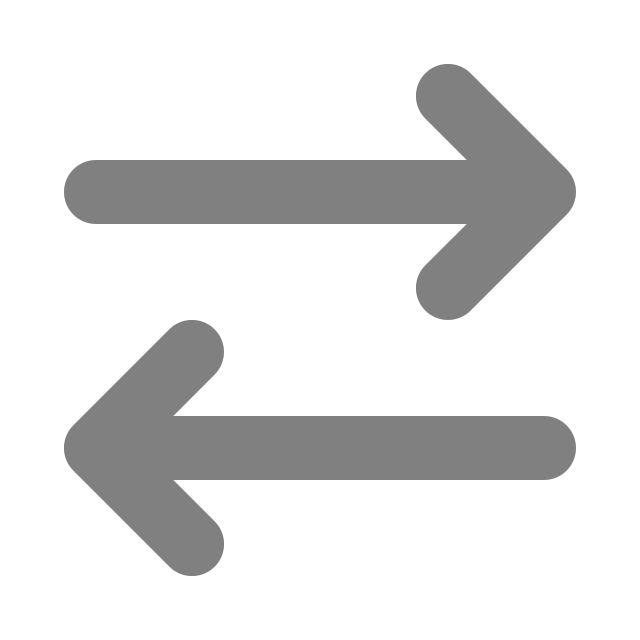 | Scrubber | Land 10 scrubs | Land 100 scrubs | Land 500 scrubs | Land 2,500 scrubs |
| 5 | `fmx_oppos` | 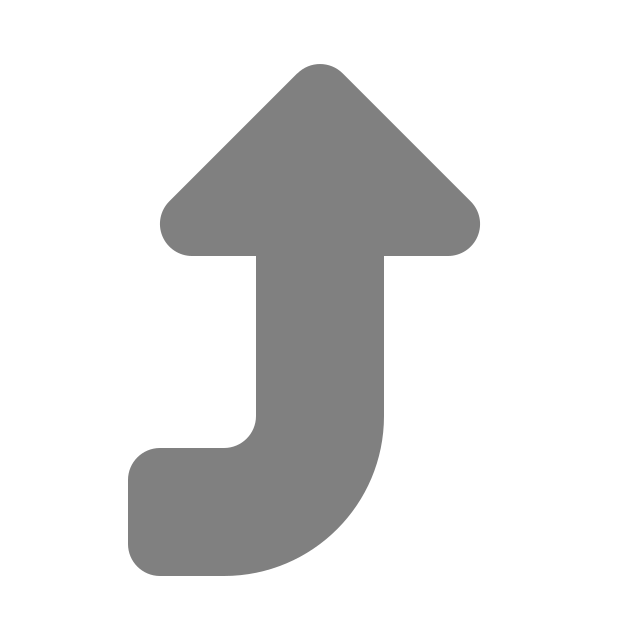 | Oppo | Land an oppo | Land 10 oppos | Land 100 oppos | Land 500 oppos |
| 6 | `fmx_endos` | 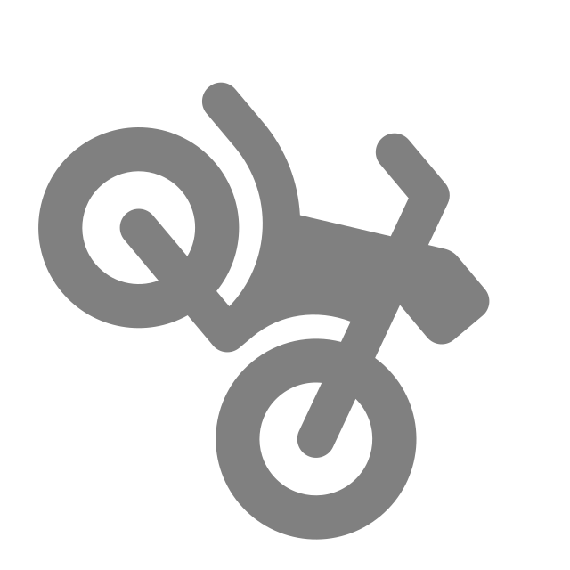 | Endo | Land a 3.0s endo or stoppie | - | - | - |
| 7 | `fmx_turn_downs` | 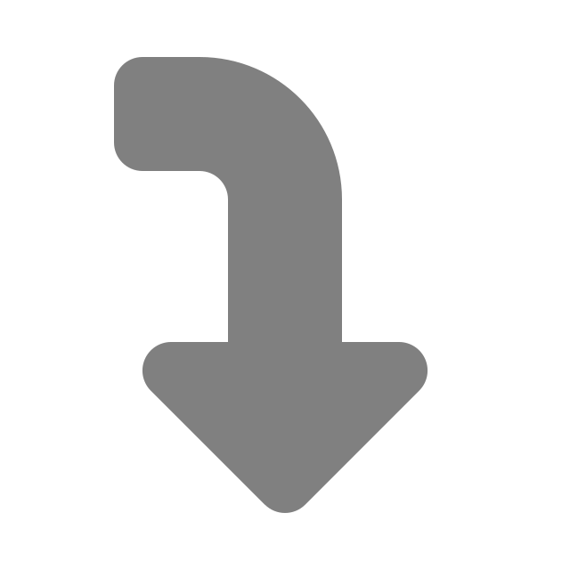 | Turn Down | Land a turn down | Land 10 turn downs | Land 100 turn downs | Land 500 turn downs |
| 8 | `fmx_frontflips` | 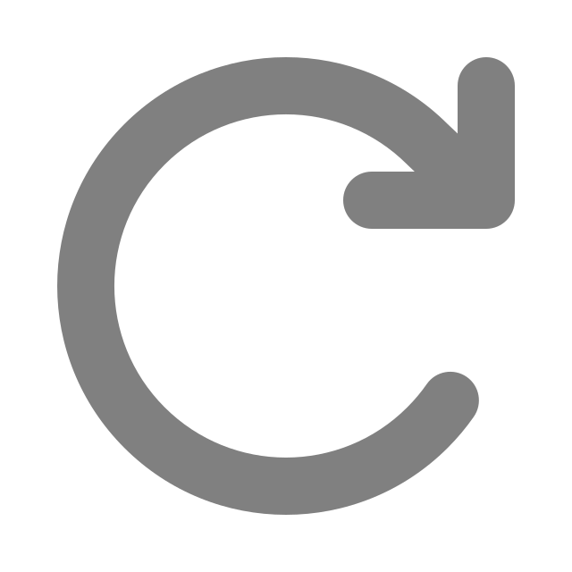 | Somersault | Land a frontflip | Land 3 frontflips | Land 13 frontflips | Land 25 frontflips |

## Completion (does not count towards progress)

| # | Id | Icon | Achievement | Bronze | Silver | Gold | Platinum |
|--:|---|---|---|---|---|---|---|
| 1 | `all_bronze` |  | Bronze Sweep | Counted achievements earned | - | - | - |
| 2 | `all_silver` |  | Silver Sweep | Counted achievements at Silver or max | - | - | - |
| 3 | `all_gold` |  | Gold Sweep | Counted achievements at Gold or max | - | - | - |
| 4 | `all_platinum` |  | Platinum Sweep | Counted achievements maxed out | - | - | - |

## Misfortune (does not count towards progress)

| # | Id | Icon | Achievement | Bronze | Silver | Gold | Platinum |
|--:|---|---|---|---|---|---|---|
| 1 | `crashes` |  | Skill Issue | Crash 1,000 times | - | - | - |
| 2 | `penalties` |  | Rule Bender | Collect 100 penalties (@Froxy) | - | - | - |
| 3 | `penalty_time` |  | Time Served | Serve 10min of penalty time | - | - | - |
| 4 | `so_close` |  | So Close | Lose a race by under a tenth | - | - | - |
| 5 | `back_marker` |  | Back Marker | Finish a race three or more laps down | - | - | - |
| 6 | `chain_lost` |  | Weakest Link | Crash out of a 2,500-point chain | - | - | - |
| 7 | `ninety_nine` |  | 99 Problems | Crash 99 times in total (@TheRealSliX) | - | - | - |
| 8 | `rage_quit` |  | Rage Quit | Retire from a race before the finish | - | - | - |
| 9 | `bakers_dozen` |  | Baker's Dozen | Crash 13 times in one session | - | - | - |
| 10 | `ran_dry` |  | Long Walk Home | Run out of fuel out on track | - | - | - |
| 11 | `peak_g` |  | Big Hit | Take a 35G hit | - | - | - |
| 12 | `mondays` |  | Case of the Mondays | Crash out of a chain of five tricks | - | - | - |
| 13 | `choke` |  | Choke | Lead into the final lap and lose the race | - | - | - |
| 14 | `consolation` |  | Consolation Prize | Fastest lap, and off the podium with it | - | - | - |
| 15 | `pile_up` |  | Pile-Up | Go down with three others | - | - | - |
| 16 | `favorite_spot` |  | Favorite Spot | Crash three times in a row in one place | - | - | - |

## mxbmrp3 (does not count towards progress)

| # | Id | Icon | Achievement | Bronze | Silver | Gold | Platinum |
|--:|---|---|---|---|---|---|---|
| 1 | `breakout` |  | Brick Breaker | Breakout score 5,000 (@BennyP118) | - | - | - |
| 2 | `tyre_kicker` |  | Tyre Kicker | Try each HUD and widget (@BrinkleyPT) | - | - | - |
| 3 | `grand_tour` |  | Grand Tour | Open every settings tab | - | - | - |
| 4 | `on_air` |  | On Air | Connect the web overlay (@Special Ed) | - | - | - |
| 5 | `second_screen` |  | Second Screen | Show the HUD on a second screen | - | - | - |
| 6 | `directors_cut` |  | Director's Cut | Watch 500 director cuts (@Tallon214) | - | - | - |
| 7 | `backseat` |  | Backseat Driver | Hear 500 spotter calls (@Foreign) | - | - | - |
| 8 | `good_vibrations` |  | Good Vibrations | Turn rumble on (@Debra) | - | - | - |
| 9 | `keymaster` |  | Keymaster | Bind a hotkey (@Vegi) | - | - | - |
| 10 | `profile_hopper` |  | Profile Hopper | Switch profiles 100 times | - | - | - |
| 11 | `fresh_coat` |  | Fresh Coat | Install an update in-game | - | - | - |
| 12 | `split_decision` |  | Split Decision | Time a segment (@ZealousidealWin823) | - | - | - |
| 13 | `armchair` |  | Armchair Marshal | Spectate or replay for 6h | - | - | - |
| 14 | `stalker` |  | Stalker | Track 10 riders (@turkishmonk) | - | - | - |

## Tinkering (does not count towards progress)

| # | Id | Icon | Achievement | Bronze | Silver | Gold | Platinum |
|--:|---|---|---|---|---|---|---|
| 1 | `config_reloads` |  | Tinkerer | Reload the config | - | - | - |
| 2 | `decorator` |  | Interior Decorator | Override a colour, font or theme | - | - | - |
| 3 | `dress_up` |  | Made It Yours | Install a pack of any type (@bh5o) | - | - | - |
| 4 | `stylist` |  | Stylist | Style the web overlay with custom.css | - | - | - |
| 5 | `ungrateful` |  | Ungrateful | Turn achievement toasts off | - | - | - |
| 6 | `factory_fresh` |  | Factory Fresh | Reset every setting to defaults | - | - | - |

## Hidden (does not count towards progress)

| # | Id | Icon | Achievement | Bronze | Silver | Gold | Platinum |
|--:|---|---|---|---|---|---|---|
| 1 | `fuel_burnt` |  | Carbon Footprint | Burn 100L of fuel | - | - | - |
| 2 | `prerelease` |  | Early Access | Switch to the pre-release channel (@Husk) | - | - | - |
| 3 | `frame_perfect` |  | Frame Perfect | Hit 480FPS (@Mave) | - | - | - |
| 4 | `phoenix` |  | Phoenix | Come back after a crash to desktop | - | - | - |
| 5 | `test_pilot` |  | Test Pilot | Turn on an experimental setting | - | - | - |
| 6 | `under_hood` |  | Under the Hood | Edit the settings file by hand | - | - | - |
| 7 | `backup_plan` |  | Backup Plan | Edit the stats file by hand | - | - | - |
| 8 | `homebrew` |  | Homebrew | Run a build you made yourself | - | - | - |
| 9 | `developer` |  | Developer | Enable developer mode | - | - | - |
| 10 | `night_owl` |  | Night Owl | Ride between two and five in the morning | - | - | - |
| 11 | `anniversary` |  | Anniversary | Ride on the anniversary of your first run | - | - | - |
| 12 | `palindrome` |  | Palindrome | Set a lap time the same backwards | - | - | - |
| 13 | `deja_vu` |  | Deja Vu | Set two identical lap times in a session | - | - | - |
| 14 | `solo_race` |  | Just Me Then | Finish a race nobody else started | - | - | - |
| 15 | `peace_out` |  | Peace Out | Ride through three riders down | - | - | - |
| 16 | `digging` |  | Digging a Hole | Spin the rear wheel in place for 10s | - | - | - |

114 achievements, 264 tiers.
