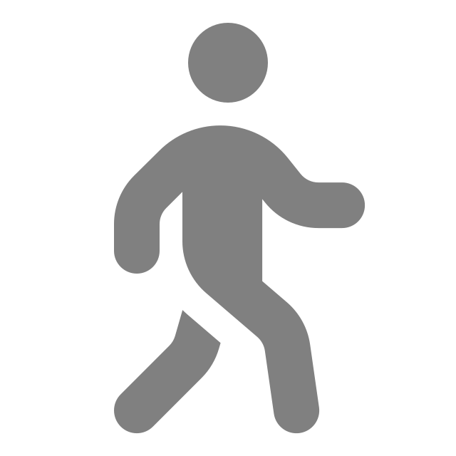
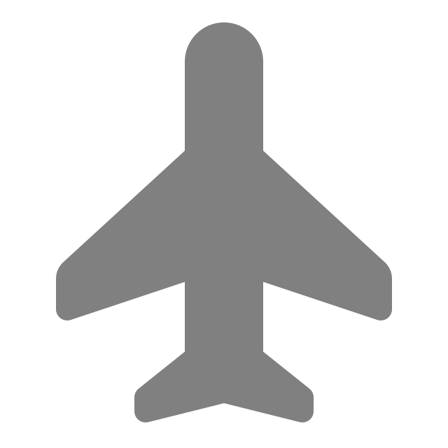
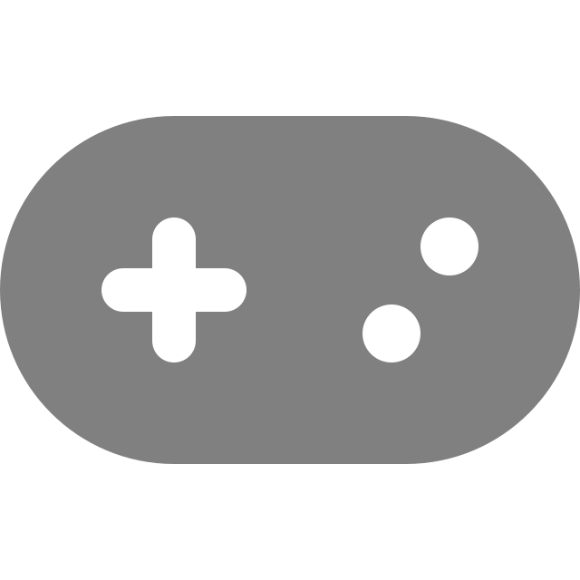
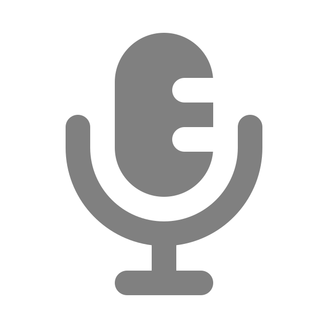
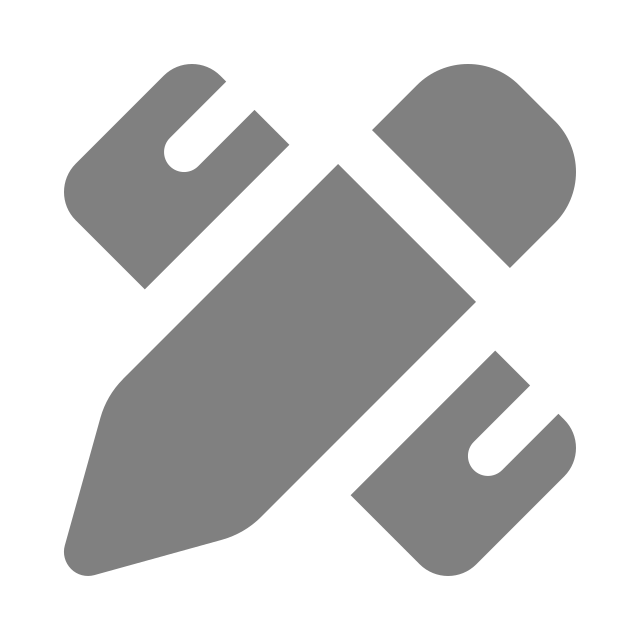
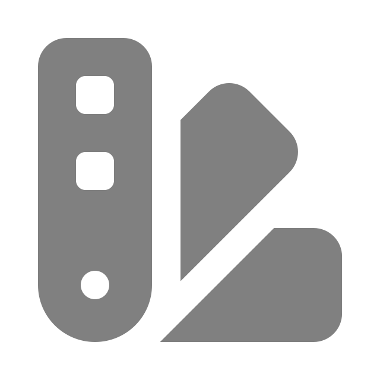
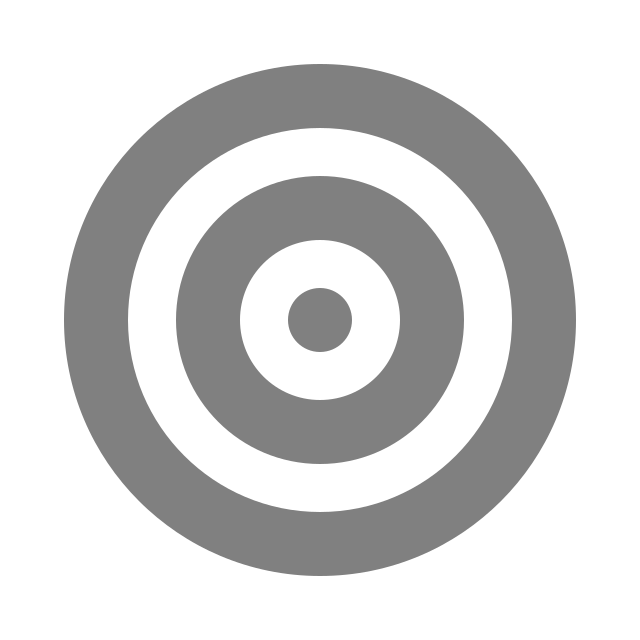
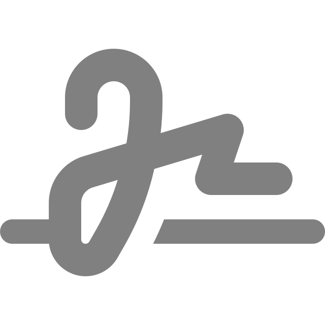

# Achievements

GENERATED from `mxbmrp3/core/achievements.h` by `tests/unit/test_achievements.cpp` - do not edit. When the table changes, run the unit gate and copy `/tmp/achievements.new.md` over this file.

A development overview of the whole catalogue: every row with its marker icon, its tiers as the toast will word them (a one-shot has one), and the page (group) it is listed on in Settings > Achievements. `crash state` rows exist only on games that report one; `FMX` rows only on games with freestyle detection; `DISABLED` marks an id in `kDisabledIds`. Hidden rows are unlisted in the tab until earned. Every row is one line in `kCatalogue`: delete it to remove the achievement, list its id to disable it.

## Mileage

| Id | Icon | Achievement | Bronze | Silver | Gold | Platinum | Needs |
|---|---|---|---|---|---|---|---|
| `distance` |  | Long Hauler | Ride 100 km in total | Ride 1,000 km in total | Ride 10,000 km in total | Ride 50,000 km in total | - |
| `ride_time` |  | Seat Time | Spend 10 h on track | Spend 100 h on track | Spend 500 h on track | Spend 1,000 h on track | - |
| `laps` |  | Lap Counter | Complete 100 laps | Complete 1,000 laps | Complete 10,000 laps | Complete 50,000 laps | - |
| `gear_shifts` |  | Shift Happens | Shift 1,000 times | Shift 10,000 times | Shift 100,000 times | Shift 1,000,000 times | - |
| `session_laps` |  | Marathon | Complete 25 laps in one session | Complete 50 laps in one session | Complete 75 laps in one session | Complete 100 laps in one session | - |
| `session_time` |  | Iron Butt | Ride 1 h in one session (@soulberg3) | Ride 2 h in one session (@soulberg3) | Ride 4 h in one session (@soulberg3) | Ride 8 h in one session (@soulberg3) | - |
| `track_laps` |  | Local Hero | Complete 50 laps at one track | Complete 250 laps at one track | Complete 1,000 laps at one track | Complete 5,000 laps at one track | - |
| `bike_km` |  | Loyal | One bike, 100 km (@BLAND525) | One bike, 500 km (@BLAND525) | One bike, 2,500 km (@BLAND525) | One bike, 5,000 km (@BLAND525) | - |

## Racing

| Id | Icon | Achievement | Bronze | Silver | Gold | Platinum | Needs |
|---|---|---|---|---|---|---|---|
| `races` |  | Racer | Finish a race | Finish 10 races | Finish 100 races | Finish 500 races | - |
| `wins` |  | Winner | Win a race | Win 10 races | Win 50 races | Win 150 races | - |
| `podiums` |  | Podium Regular | Finish on the podium | Finish on the podium 25 times | Finish on the podium 100 times | Finish on the podium 300 times | - |
| `fastest_laps` |  | Hot Lapper | Set the fastest lap of a race | Set the fastest race lap 10 times | Set the fastest race lap 50 times | Set the fastest race lap 200 times | - |
| `rain_races` |  | Mudder | Finish a race in the rain | Finish 5 races in the rain | Finish 25 races in the rain | Finish 50 races in the rain | - |
| `big_grids` |  | Crowd Surfer | Finish a race with 20+ riders | Finish 10 races with 20+ riders | Finish 50 races with 20+ riders | Finish 150 races with 20+ riders | - |
| `photo_finish` |  | Photo Finish | Win a race by under a tenth | - | - | - | - |

## Conduct

| Id | Icon | Achievement | Bronze | Silver | Gold | Platinum | Needs |
|---|---|---|---|---|---|---|---|
| `clean_races` |  | Rubber Side Down | Finish a race without crashing | Finish 10 races without crashing | Finish 50 races without crashing | Finish 250 races without crashing | crash state |
| `penalty_free` |  | Clean Sheet | Go 5 races in a row penalty-free | Go 10 races in a row penalty-free | Go 25 races in a row penalty-free | Go 100 races in a row penalty-free | - |
| `crashes` |  | Frequent Flyer | Crash once | Crash 100 times | Crash 1,000 times | Crash 10,000 times | crash state |
| `penalties` |  | Rule Bender | Collect a penalty (@Froxy) | Collect 10 penalties (@Froxy) | Collect 100 penalties (@Froxy) | Collect 1,000 penalties (@Froxy) | - |
| `penalty_time` |  | Time Served | Serve 10s of penalty time | Serve 1m 00s of penalty time | Serve 10m 00s of penalty time | Serve 1h 00m of penalty time | - |
| `ninety_nine` |  | 99 Problems | Crash tally to 99 (@TheRealSliX) | - | - | - | crash state |
| `rage_quit` |  | Rage Quit | Leave a race before the finish | - | - | - | - |
| `back_marker` |  | Back Marker | Get lapped three times in one race | - | - | - | - |

## Moments

| Id | Icon | Achievement | Bronze | Silver | Gold | Platinum | Needs |
|---|---|---|---|---|---|---|---|
| `charger` |  | Charger | Gain 5 places in one race | Gain 10 places in one race | Gain 15 places in one race | Gain 20 places in one race | - |
| `wire_to_wire` |  | Wire to Wire | Lead every lap of a race | Lead every lap of 10 races | Lead every lap of 50 races | Lead every lap of 250 races | - |
| `lapped_field` |  | Lapped the Field | Win with every rider a lap down | Win 5 races lapping the field | Win 25 races lapping the field | Win 100 races lapping the field | - |
| `metronome` |  | Metronome | Five laps within a tenth of each other | - | - | - | - |
| `sandbagger` |  | Sandbagger | Set a personal best on the last lap of a race | - | - | - | - |
| `bakers_dozen` |  | Baker's Dozen | Crash thirteen times in one session | - | - | - | crash state |
| `steady_hands` |  | Steady Hands | Ride an hour without crashing | - | - | - | crash state |

## Progress

| Id | Icon | Achievement | Bronze | Silver | Gold | Platinum | Needs |
|---|---|---|---|---|---|---|---|
| `tracks` |  | Globetrotter | Ride 5 different tracks | Ride 10 different tracks | Ride 25 different tracks | Ride 50 different tracks | - |
| `bikes` |  | Collector | Ride 3 different bikes | Ride 10 different bikes | Ride 25 different bikes | Ride 50 different bikes | - |
| `personal_bests` |  | Personal Best | Set a personal best | Set 10 personal bests | Set 100 personal bests | Set 500 personal bests | - |
| `pb_leaps` |  | Leap Forward | Beat a personal best by a second or more | Beat 10 PBs by a second or more | Beat 50 PBs by a second or more | Beat 100 PBs by a second or more | - |
| `regular` |  | Regular | Show up on 7 different days | Show up on 30 different days | Show up on 100 different days | Show up on 365 different days | - |
| `day_streak` |  | On a Roll | Show up 3 days in a row | Show up 7 days in a row | Show up 14 days in a row | Show up 30 days in a row | - |
| `servers` |  | Well Travelled | Ride on 5 different servers | Ride on 10 different servers | Ride on 25 different servers | Ride on 50 different servers | - |
| `bike_classes` |  | Class Act | Ride bikes from 2 classes (@Aiden) | Ride bikes from 3 classes (@Aiden) | Ride bikes from 4 classes (@Aiden) | Ride bikes from 5 classes (@Aiden) | - |

## Freestyle

| Id | Icon | Achievement | Bronze | Silver | Gold | Platinum | Needs |
|---|---|---|---|---|---|---|---|
| `fmx_tricks` |  | Show-off | Land 10 tricks | Land 100 tricks | Land 1,000 tricks | Land 10,000 tricks | FMX |
| `fmx_points` |  | Style Points | Score 1,000 FMX points | Score 10,000 FMX points | Score 100,000 FMX points | Score 500,000 FMX points | FMX |
| `fmx_chain` |  | Chain Reaction | Score 250 points in one chain | Score 1,000 points in one chain | Score 2,500 points in one chain | Score 5,000 points in one chain | FMX |
| `fmx_kinds` |  | Trick Collector | Land 4 different kinds of trick | Land 8 different kinds of trick | Land 12 different kinds of trick | Land 15 different kinds of trick | FMX |
| `fmx_airtime` |  | Hang Time | Stay airborne for 2.0s in one jump | Stay airborne for 3.0s in one jump | Stay airborne for 4.0s in one jump | Stay airborne for 5.0s in one jump | FMX |
| `air_miles` |  | Air Miles | Spend 1m 00s in the air | Spend 10m 00s in the air | Spend 30m 00s in the air | Spend 1h 00m in the air | FMX |
| `chain_lost` |  | Weakest Link | Lose a chain worth 250 points | Lose a chain worth 1,000 points | Lose a chain worth 2,500 points | Lose a chain worth 5,000 points | FMX |

## Tricks

| Id | Icon | Achievement | Bronze | Silver | Gold | Platinum | Needs |
|---|---|---|---|---|---|---|---|
| `fmx_backflips` |  | Flipper | Land a backflip (@Lynds) | Land 10 backflips (@Lynds) | Land 100 backflips (@Lynds) | Land 500 backflips (@Lynds) | FMX |
| `fmx_wheelie` |  | Wheelie King | Hold a wheelie for 5.0s | Hold a wheelie for 10.0s | Hold a wheelie for 20.0s | Hold a wheelie for 30.0s | FMX |
| `fmx_wheelie_km` |  | One-Wheel Tour | Ride 1.0 km on the back wheel | Ride 10 km on the back wheel | Ride 50 km on the back wheel | Ride 200 km on the back wheel | FMX |
| `fmx_whips` |  | Whip It | Land 10 whips | Land 100 whips | Land 500 whips | Land 2,500 whips | FMX |
| `fmx_scrubs` |  | Scrubber | Land 10 scrubs | Land 100 scrubs | Land 500 scrubs | Land 2,500 scrubs | FMX |
| `fmx_oppos` |  | Oppo | Land an oppo | Land 10 oppos | Land 100 oppos | Land 500 oppos | FMX |
| `fmx_turn_downs` |  | Turn Down | Land a turn down | Land 10 turn downs | Land 100 turn downs | Land 500 turn downs | FMX |
| `tyre_shredder` |  | Tyre Shredder | Shred tyres for 1m 00s | Shred tyres for 10m 00s | Shred tyres for 30m 00s | Shred tyres for 1h 00m | FMX |

## mxbmrp3

| Id | Icon | Achievement | Bronze | Silver | Gold | Platinum | Needs |
|---|---|---|---|---|---|---|---|
| `breakout` |  | Brick Breaker | Breakout score 100 (@BennyP118) | Breakout score 500 (@BennyP118) | Breakout score 2,000 (@BennyP118) | Breakout score 5,000 (@BennyP118) | - |
| `tyre_kicker` |  | Tyre Kicker | Try 25% of the HUDs (@BrinkleyPT) | Try 50% of the HUDs (@BrinkleyPT) | Try 75% of the HUDs (@BrinkleyPT) | Try 100% of the HUDs (@BrinkleyPT) | - |
| `grand_tour` |  | Grand Tour | Open 5 settings tabs | Open 10 settings tabs | Open 15 settings tabs | Open 20 settings tabs | - |
| `decorator` |  | Interior Decorator | Customise the look | Customise the look 3 ways | Customise the look 6 ways | Customise the look 10 ways | - |
| `dress_up` |  | Dress-up | Install a custom pack | Install 2 custom packs | Install 3 custom packs | Install 5 custom packs | - |
| `pad_painter` |  | Pad Painter | Install a custom gamepad pack | - | - | - | - |
| `voice_actor` |  | Voice Actor | Install a custom spotter pack | - | - | - | - |
| `sign_writer` |  | Sign Writer | Install a pit board or gauges pack (@bh5o) | - | - | - | - |
| `skin_deep` |  | Skin Deep | Install a custom panel theme | - | - | - | - |
| `stylist` |  | Stylist | Style the web overlay with custom.css | - | - | - | - |
| `on_air` |  | On Air | Connect the web overlay (@Special Ed) | On air 10 times (@Special Ed) | On air 50 times (@Special Ed) | On air 250 times (@Special Ed) | - |
| `second_screen` |  | Second Screen | Open the companion window | Open a second screen 10 times | Open a second screen 50 times | Open a second screen 250 times | - |
| `directors_cut` |  | Director's Cut | Watch 10 cuts (@Tallon214) | Watch 100 cuts (@Tallon214) | Watch 1,000 cuts (@Tallon214) | Watch 10,000 cuts (@Tallon214) | - |
| `backseat` |  | Backseat Driver | Hear 100 cues (@Foreign) | Hear 1,000 cues (@Foreign) | Hear 10,000 cues (@Foreign) | Hear 100,000 cues (@Foreign) | - |
| `good_vibrations` |  | Good Vibrations | Rumble on for 1 h (@Debra) | Rumble on for 10 h (@Debra) | Rumble on for 50 h (@Debra) | Rumble on for 100 h (@Debra) | - |
| `keymaster` |  | Keymaster | Bind 3 hotkeys (@Vegi) | Bind 6 hotkeys (@Vegi) | Bind 10 hotkeys (@Vegi) | Bind 15 hotkeys (@Vegi) | - |
| `profile_hopper` |  | Profile Hopper | Switch profiles 10 times | Switch profiles 100 times | Switch profiles 1,000 times | Switch profiles 10,000 times | - |
| `fresh_coat` |  | Fresh Coat | Install an update in-game | Install 5 updates in-game | Install 25 updates in-game | Install 100 updates in-game | - |
| `split_decision` |  | Split Decision | Time a segment (@ZealousidealWin823) | 10 splits (@ZealousidealWin823) | 100 splits (@ZealousidealWin823) | 500 splits (@ZealousidealWin823) | - |
| `armchair` |  | Armchair Marshal | Spectate or replay for 1 h | Spectate or replay for 10 h | Spectate or replay for 50 h | Spectate or replay for 100 h | - |
| `version_hopper` |  | Version Hopper | Run 3 plugin versions (@Husk) | Run 10 plugin versions (@Husk) | Run 20 plugin versions (@Husk) | Run 30 plugin versions (@Husk) | - |
| `frame_perfect` |  | Frame Perfect | Hit 480 FPS (@Mave) | - | - | - | - |
| `stalker` |  | Stalker | Track a rider (@turkishmonk) | Track 5 riders (@turkishmonk) | Track 25 riders (@turkishmonk) | Track 100 riders (@turkishmonk) | - |
| `completionist` |  | Completionist | Earn 25 percent of all tiers | Earn 50 percent of all tiers | Earn 75 percent of all tiers | Earn 100 percent of all tiers | - |

## Tinkering

| Id | Icon | Achievement | Bronze | Silver | Gold | Platinum | Needs |
|---|---|---|---|---|---|---|---|
| `config_reloads` |  | Tinkerer | Reload the config | Reload the config 10 times | Reload the config 100 times | Reload the config 500 times | - |
| `test_pilot` |  | Test Pilot | Turn on an experimental setting | - | - | - | - |
| `under_hood` |  | Under the Hood | Edit the settings file by hand | - | - | - | - |
| `homebrew` |  | Homebrew | Run a build you made yourself | - | - | - | - |
| `signed_copy` |  | Signed Copy | Run a build with a different name | - | - | - | - |
| `ungrateful` |  | Ungrateful | Turn achievement toasts off | - | - | - | - |
| `factory_fresh` |  | Factory Fresh | Reset every setting to defaults | - | - | - | - |
| `developer` |  | Developer | Enable developer mode | - | - | - | - |

## Hidden

| Id | Icon | Achievement | Bronze | Silver | Gold | Platinum | Needs |
|---|---|---|---|---|---|---|---|
| `phoenix` |  | Phoenix | Come back after a crash to desktop | - | - | - | - |
| `backup_plan` |  | Backup Plan | Edit the stats file by hand | - | - | - | - |
| `night_owl` |  | Night Owl | Ride between two and five in the morning | - | - | - | - |
| `anniversary` |  | Anniversary | Ride on the anniversary of your first run | - | - | - | - |
| `palindrome` |  | Palindrome | Set a lap time that reads the same backwards | - | - | - | - |
| `deja_vu` |  | Deja Vu | Set two identical lap times in one session | - | - | - | - |
| `mondays` |  | Case of the Mondays | Crash out of a chain of five tricks | - | - | - | FMX |
| `fmx_frontflips` |  | Somersault | Land a frontflip | Land 10 frontflips | Land 100 frontflips | Land 500 frontflips | FMX |

93 achievements, 288 tiers.
