# MXBMRP3 - Usage Survey Report

**Data window:** 2026-06-27 → 2026-09-13 (79 days, 62 observed)

Generated by `tools/analytics_report.py` from Aptabase exports - do not edit. Re-run the tool after each monthly export; the raw exports stay out of the repo, and the charts land in `charts/`.

| Installs | Launches | Countries |
|---|---|---|
| **14,355** | **478,558** | **100** |

## Highlights

- **Reach:** 14,355 installs across 3 games in 100 countries; peak 3,191 active on a single day.
- **Main game:** MX Bikes - 99% of launches.
- **Platform:** among installs reporting each field, 78% run Windows 11 and >99% use Steam.
- **Repeat use:** 70% of installs launched more than once.
- **Most-used HUD:** Standings - 76% of MX Bikes installs.

## Activity over time

> Daily charts omit partial export days (2026-06-27, 2026-09-13); totals include them.

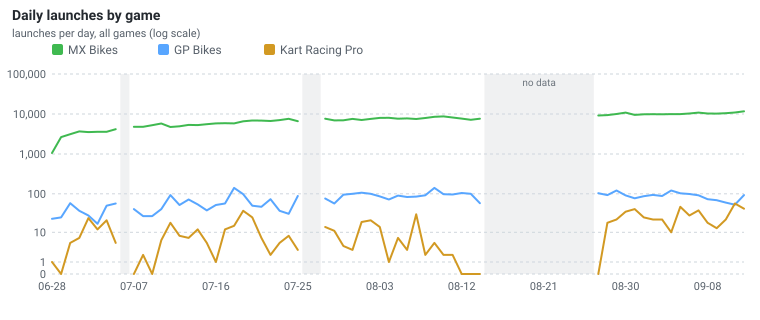

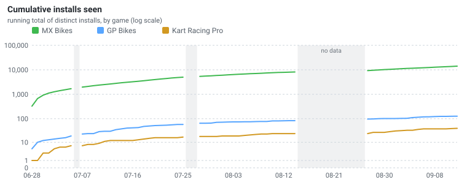

- **Installs seen to date:** 14,355

- **avg launches/day:** 7,330

## Games

| Game | Installs | Launches | Share of launches |
|---|--:|--:|--:|
| MX Bikes | 14,188 | 472,926 | 98.8% |
| GP Bikes | 127 | 4,754 | 1.0% |
| Kart Racing Pro | 40 | 878 | 0.2% |

## Plugin version adoption

Each install counts once, at its **most recent** version (an upgrade moves it, never double-counts). Versions under 10 installs are grouped.

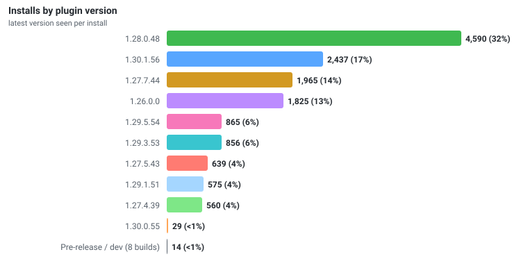

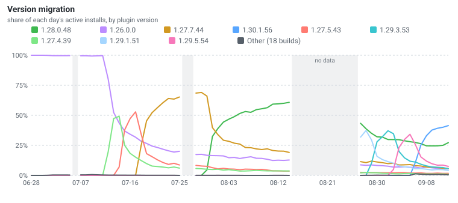

**By release line:** `1.28` 4,591 (32%)  ·  `1.27` 3,170 (22%)  ·  `1.30` 2,467 (17%)  ·  `1.29` 2,302 (16%)  ·  `1.26` 1,825 (13%)

**Update channel:** stable 14,347 (>99%)  ·  prerelease 8 (<1%)

## Geography

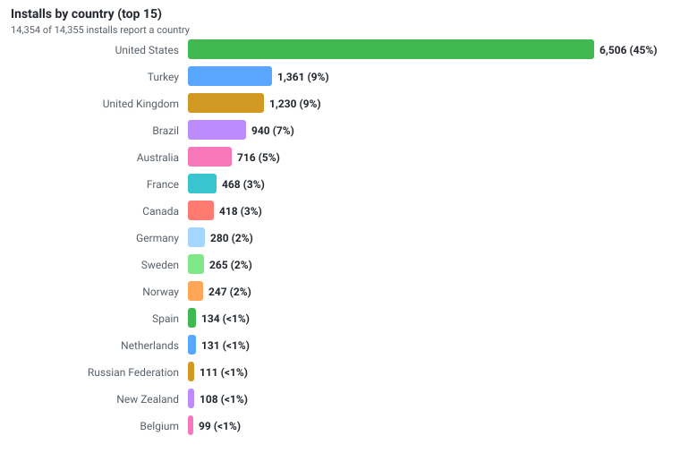

## Operating system

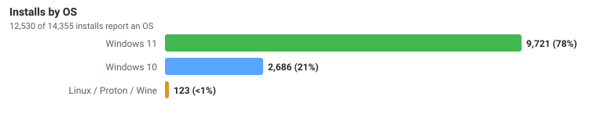

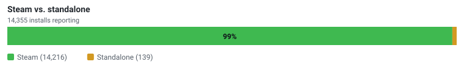

## Repeat usage

- **Returning installs (launched more than once):** 10,068 (70%) of 14,355 reporting  ·  **median launches per install:** 12

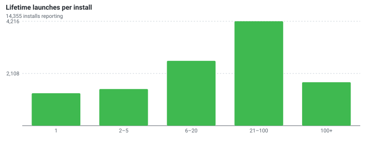

- **Median session:** 16 min  ·  **276,220 sessions**  ·  from 75% of launches on versions that report one; 110,435 launches on earlier versions report no session end

- **At least 6,995 days** of session time across those sessions

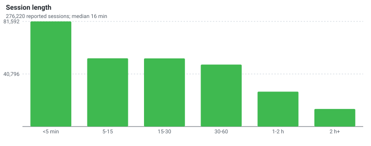

## Achievements

- **Achievement tiers earned, median per install:** 16%  ·  **installs holding at least one achievement:** 2,282 (94%) of 2,438 reporting

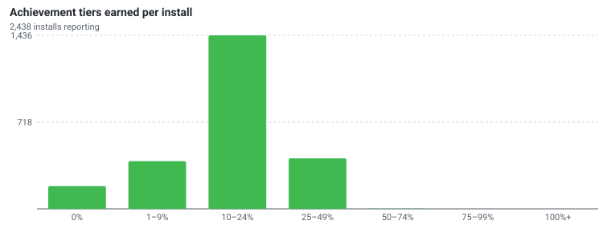

- **Achievements unlocked, median per install:** 30

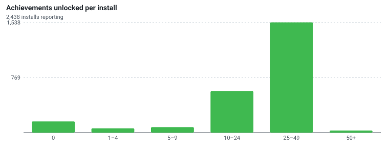

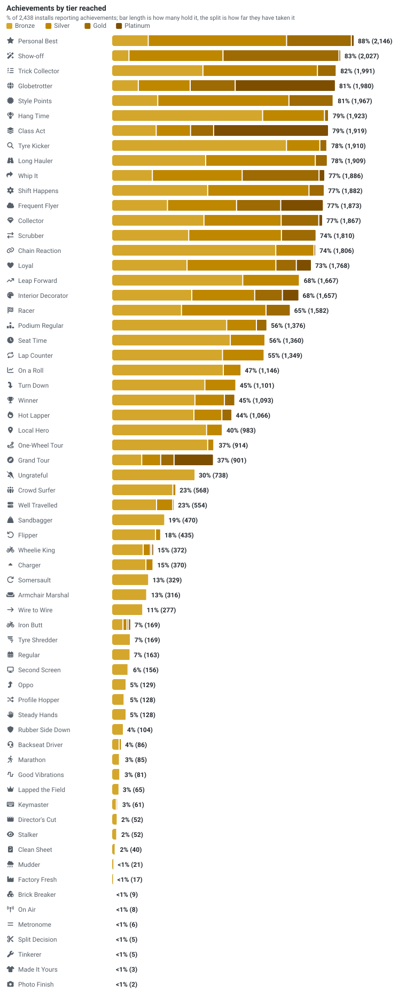

- **Earned so far:** 64 of the 82 listed achievements, which is what the chart shows. 32 hidden ones are never charted or named - they still count towards the totals above, which is why that percentage can pass 100%.

- **Rarest, of those earned by anyone:** Photo Finish 2 (<1%)  ·  Made It Yours 3 (<1%)  ·  Tinkerer 5 (<1%)  ·  Split Decision 5 (<1%)  ·  Metronome 6 (<1%)  ·  On Air 8 (<1%)  ·  Brick Breaker 9 (<1%)  ·  Factory Fresh 17 (<1%)  ·  Mudder 21 (<1%)  ·  Clean Sheet 40 (2%)

## Feature & HUD adoption - MX Bikes

HUDs and widgets differ by game, so adoption is shown for the primary game, MX Bikes, over its 14,188 installs. *(GP Bikes 127 and Kart Racing Pro 40 have too few installs for their own breakdown.)*

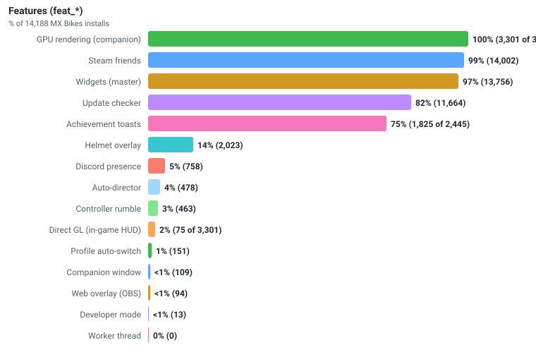

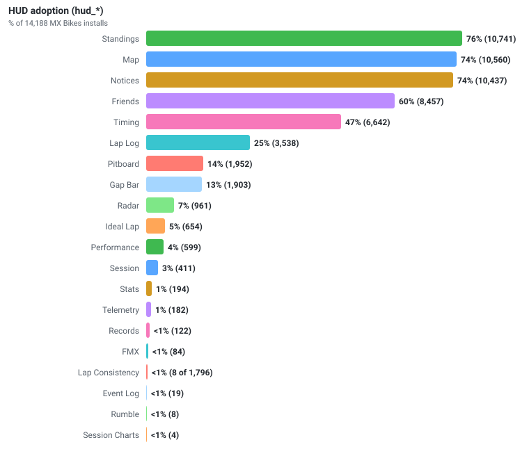

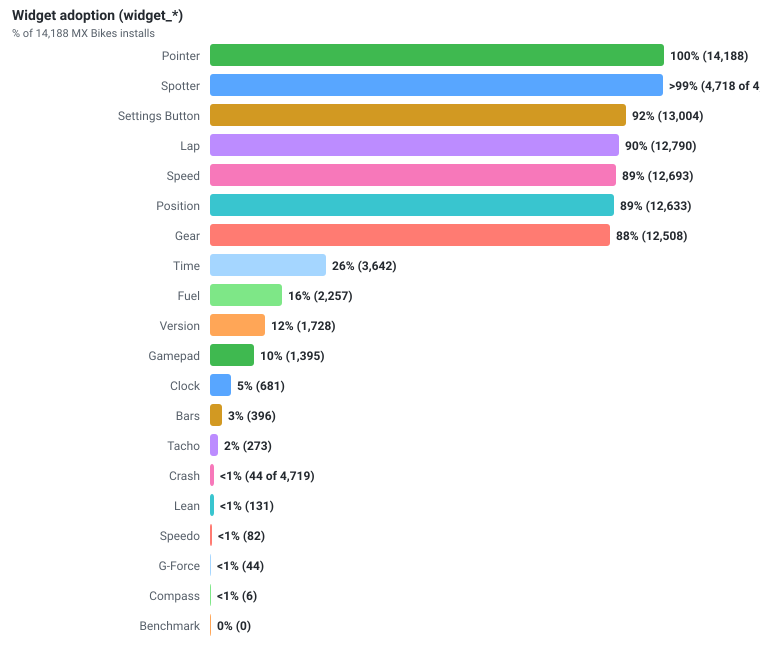

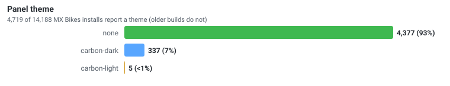

- **Median HUDs enabled per install:** 5  ·  **median widgets:** 7

## Crashes (upstream / stability)

Of **46,246** crash reports, **43,841** come from plugin **1.27.5+** builds, which record full diagnostics (a backtrace and the access-violation type). The rest are excluded from the analysis below: 2,394 from earlier builds and 11 from dev tooling.

- **Crash-report rate:** 12.7% (43,841 of 345,363 launches)
- **Affected installs:** 6,165 of 11,967 running 1.27.5+ (52%)

> The plugin's crash handler detects a fault, saves a report, and submits it on the next launch. Where a fault location was recorded, execution failed **outside the plugin binary** (in the game or another module), though that location is not necessarily the root cause. Reports are grouped by faulting module below and linked to the [known-crash list](../crash_analysis/KNOWN_GAME_CRASHES.md), where a fix or workaround may exist.

### Crash rate by game

| Game | Crash reports | 1.27.5+ launches | Launches with a crash report |
|---|--:|--:|--:|
| GP Bikes | 357 | 3,548 | 10.1% |
| Kart Racing Pro | 130 | 661 | 19.7% |
| MX Bikes | 43,354 | 341,154 | 12.7% |

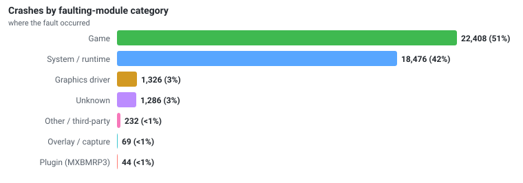

*The Plugin (MXBMRP3) slice (44 crashes) is where the fault offset landed, not proof the plugin caused it - inspect each via its backtrace.*

**Access-violation type:** read 37,434, write 4,873, execute 1,304  ·  **exception codes:** `0xC0000005` 43,612, `0xE06D7363` 149, `0xC0000094` 72, `0x80000001` 2

### Most common crashes

Ranked by number of crash reports. **75% (32,768)** of reports match signatures already catalogued in [`known_game_crashes.json`](../crash_analysis/KNOWN_GAME_CRASHES.md); each links to its full write-up.

| Crash | Share | Trigger | Fix / workaround |
|---|--:|---|:--:|
| [Offline track-load crash (bad string in per-profile data)](../crash_analysis/KNOWN_GAME_CRASHES.md) | 39% (17,231) | At track load the game passes a garbage string pointer to an sprintf-family call and the CRT walk… | [✔](../crash_analysis/KNOWN_GAME_CRASHES.md) |
| [Physics contact blow-up (bad table index)](../crash_analysis/KNOWN_GAME_CRASHES.md) | 18% (8,046) | During a physics contact event -- a hard object impact, but also ordinary terrain/ground contact… | - |
| [Session teardown null dereference (leaving a session / connecting)](../crash_analysis/KNOWN_GAME_CRASHES.md) | 8% (3,661) | While the player is idle between sessions (not riding), the game dereferences a null object point… | - |
| [OpenGL render buffer write (vertex-fill overrun)](../crash_analysis/KNOWN_GAME_CRASHES.md) | 7% (3,044) | The game's OpenGL render code (a +0x240xxx vertex/command-buffer fill loop handling ~4001 element… | [✔](../crash_analysis/KNOWN_GAME_CRASHES.md) |
| [Session-teardown crash via input/message pump (stale pointer)](../crash_analysis/KNOWN_GAME_CRASHES.md) | <1% (365) | While leaving/ending a session (teardown, idle after the race), the game dereferences a stale/gar… | - |
| [Null dereference in network / session-end code](../crash_analysis/KNOWN_GAME_CRASHES.md) | <1% (256) | At the end of an online race the game dereferences a null object pointer (reads field at null - 0… | - |
| [Out-of-range array index read at session end](../crash_analysis/KNOWN_GAME_CRASHES.md) | <1% (164) | As an online race session ends, the game indexes a 32-bit array with a roughly 985-million-elemen… | - |
| [64-bit pointer truncated to 32-bit (stack above 4 GB)](../crash_analysis/KNOWN_GAME_CRASHES.md) | <1% (1) | Game code narrows a 64-bit pointer to 32 bits (e.g. a 'mov ecx,edx' where a full 64-bit move was… | [✔](../crash_analysis/KNOWN_GAME_CRASHES.md) |

*✔ = a documented workaround (follow the crash link). Matched on game build + fault offset.*

### Not yet catalogued

The remaining **25% (11,073)** of reports do not yet match the catalogue. The most frequent unmatched signatures are listed below by module and per-build offset:

| Fault (module + offset) | Category | Share |
|---|---|--:|
| `unknown+0x0` | Unknown | 3% (1,277) |
| `mxbikes.exe+0x1902be` | Game | 1% (599) |
| `MSVCR90.dll+0x3ec27` | System / runtime | 1% (477) |
| `mxbikes.exe+0x1e403c` | Game | 1% (471) |
| `mxbikes.exe+0x1d742c` | Game | 1% (448) |
| `mxbikes.exe+0x1a29ae` | Game | <1% (375) |
| `mxbikes.exe+0x255f1f` | Game | <1% (374) |
| `mxbikes.exe+0x2889e0` | Game | <1% (305) |
| `mxbikes.exe+0x255ef0` | Game | <1% (304) |
| `mxbikes.exe+0x1eea9c` | Game | <1% (249) |

## About this data

The plugin only sends anonymous, aggregate telemetry (no personal data - see the privacy note in the main README). Reporting began in **1.26** (a few stray older builds send only a basic launch event) and expanded through **1.27**, so older versions report fewer fields. Percentages are always taken over the installs that actually report a given field, and each chart notes how many installs that is, so incomplete rollout is never shown as a real trend.

**Definitions.** *Install* - a unique `install_id` (regenerated if the analytics file is deleted, so a wipe-and-reinstall reads as a new install). *Launch* - one plugin start (`app_started`). *Active install* - an install that launched on a given day. *Crash report* - one fault caught by the crash handler, saved on crash and sent on the next launch (≈ one per crashed launch). Each install belongs to one game (the plugin installs separately per game); its **game**, **country**, and **version** are its most recently seen values.

Developer/test machines are excluded report-wide (3 installs, 1,294 events): they launch every dev build and deliberately trigger crashes to validate the telemetry, which would otherwise read as phantom plugin crashes.

What each release line reports (share of its launches):

| Release line | Launches | Features | HUDs / widgets | OS version | Update channel | Panel theme | Crash detail |
|---|--:|--:|--:|--:|--:|--:|--:|
| `1.25` | 1 | 0% | 0% | 0% | 0% | 0% | 0% |
| `1.26` | 110,579 | 100% | 100% | 0% | 100% | 0% | 0% |
| `1.27` | 147,389 | 100% | 100% | 100% | 100% | 0% | 85% |
| `1.28` | 123,622 | 100% | 100% | 100% | 100% | 0% | 100% |
| `1.29` | 68,930 | 100% | 100% | 100% | 100% | 100% | 100% |
| `1.30` | 28,037 | 100% | 100% | 100% | 100% | 100% | 100% |
