# MXBMRP3 - Usage Survey Report

**Data window:** 2026-06-27 → 2026-11-08 (135 days, 118 observed)

Generated by `tools/analytics_report.py` from Aptabase exports - do not edit.

| At a glance | |
|---|--:|
| Unique installs | **21,213** |
| Downloads | **97,461** |
| Releases since Nov 2025 | **46** |
| Avg active/day | **2,543** |
| Launches | **1,126,061** |
| Countries | **116** |

*Unique installs: plugin copies that have reported since 1.26, each counted once however often it is updated. Downloads: installer and zip from GitHub, updates included.*

## Games

| Game | Installs | Launches | Share of launches |
|---|--:|--:|--:|
| MX Bikes | 20,884 | 1,112,411 | 98.8% |
| GP Bikes | 229 | 11,319 | 1.0% |
| Kart Racing Pro | 100 | 2,331 | 0.2% |

## Activity over time

> Daily charts omit partial export days (2026-06-27, 2026-11-08); totals include them.

Curves pool all games (GP Bikes and Kart Racing Pro are 1% of launches).

- **unique installs:** 21,213  ·  **avg new installs/day:** 165 (over the last 30 full days)

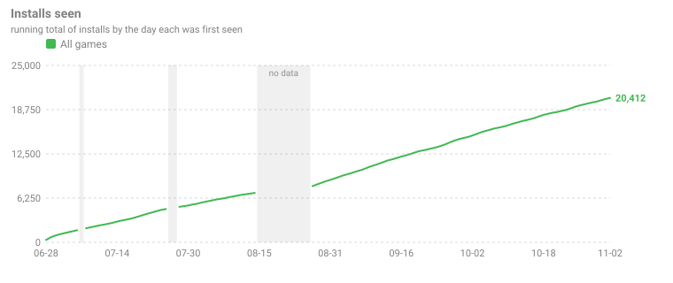

- **share of a day's active installs that are new:** 5% (over the last 30 full days)

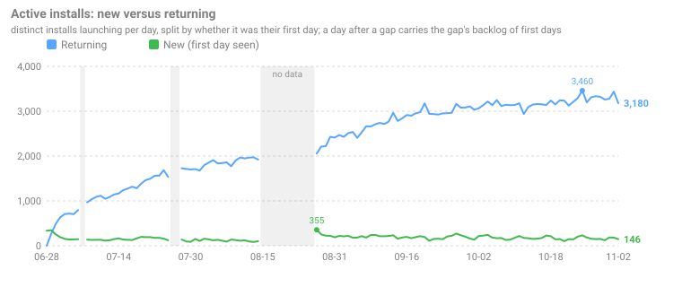

> The first weeks are existing users upgrading, not new ones; averages use the last 30 full days.

- **downloads:** 97,461  ·  **avg downloads/day:** 399 (over the last 30 days)

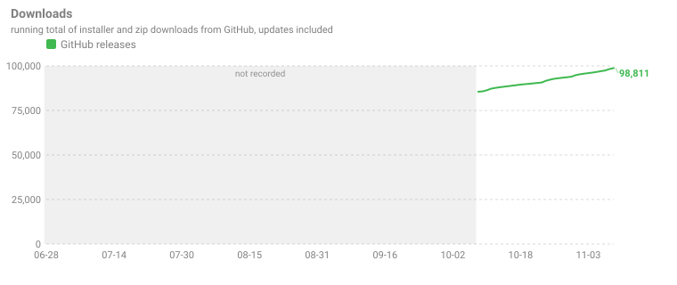

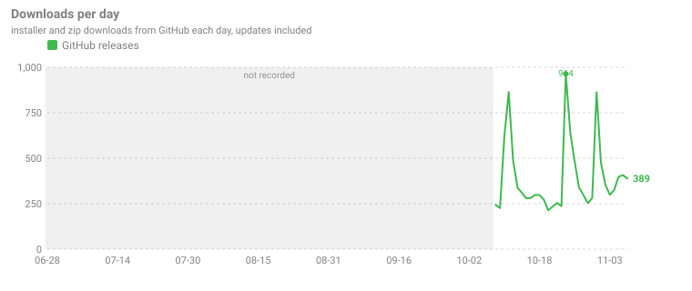

- **avg launches per active install:** 3.7  ·  **avg launches/day:** 9,339

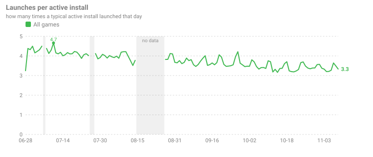

- **Busiest hour:** Sundays 19:00 UTC, 650 launches  ·  **quietest hour of the day:** 07:00 UTC, 189 launches

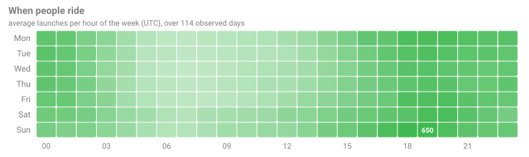

- **Median session:** 16 min  ·  **mean:** 36 min  ·  **748,911 sessions**
- **About 453,000 hours** in total; sessions left open pull the mean above the median.

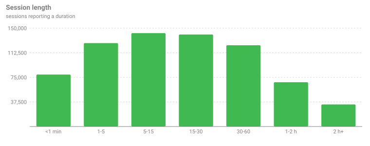

## Retention

- **Half** of new installs are still playing with the plugin a month later: 63% after a week, 46% after a month, of 14,662 installs old enough to measure.
- **75% come back after their first day;** after the first week the curve is nearly flat.

> A floor: an install that stops playing looks the same as one that removed the plugin. The report's first week (existing users arriving) is not counted.

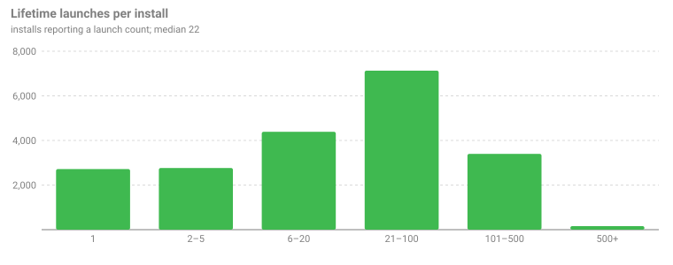

## Geography

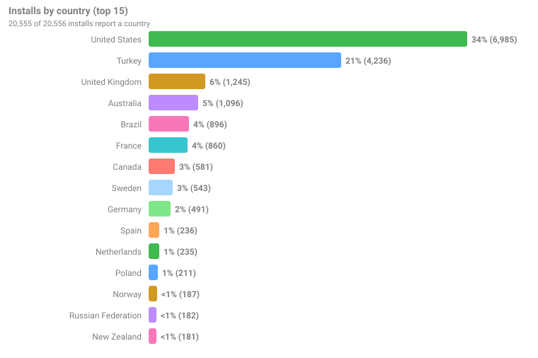

## Achievements

- **Achievement tiers earned, median per install:** 15%  ·  **installs holding at least one achievement:** 97% (11,794 of 12,104)

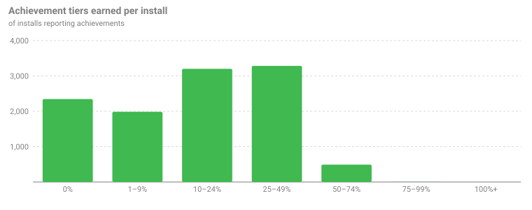

- **Achievements unlocked, median per install:** 22

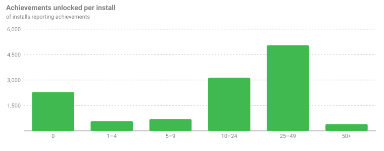

- **Earned so far:** 79 of the 82 listed achievements; the 32 hidden ones are under the fold below.

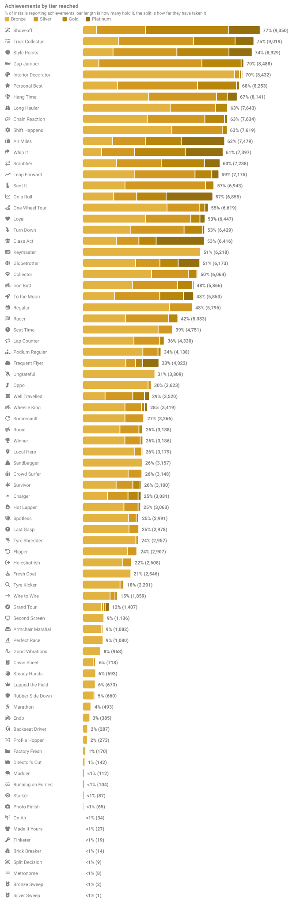

<b>Hidden achievements</b> - 31 of the 32 earned by anyone (spoilers)

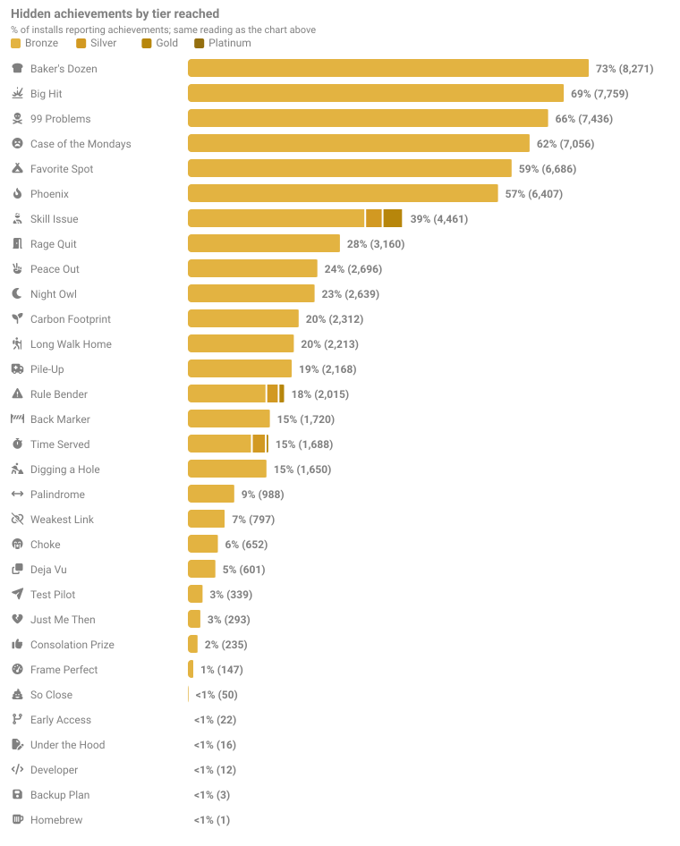

## Feature & HUD adoption - MX Bikes

MX Bikes only (20,884 installs). *(GP Bikes 229 and Kart Racing Pro 100 have too few for their own.)*

- **Median HUDs enabled per install:** 5  ·  **median widgets:** 7

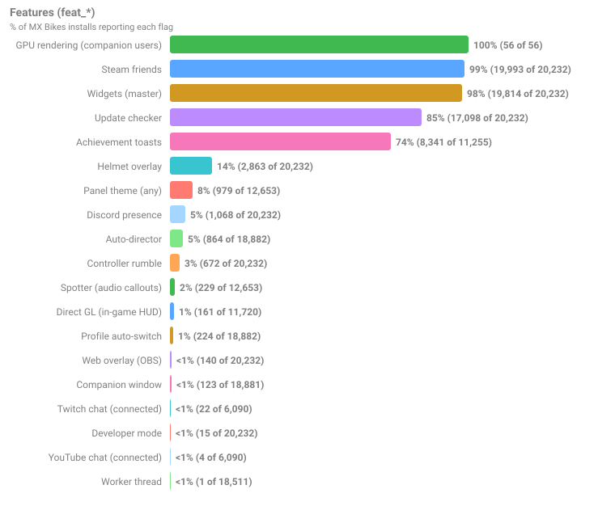

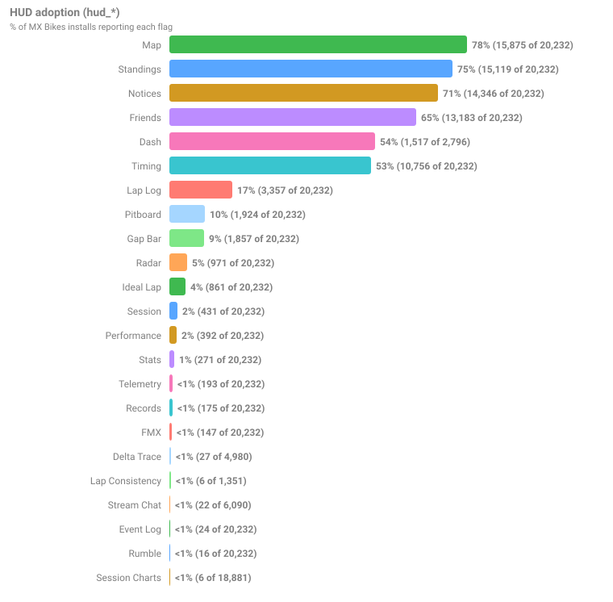

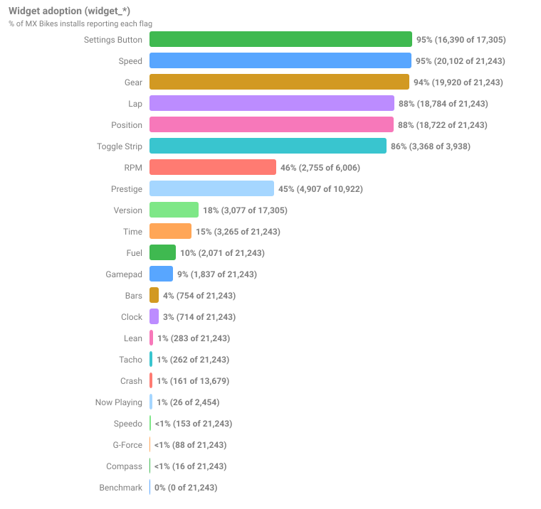

*Not charted: Pointer (always on); Spotter (follows the spotter, see Features).*

## Operating system

| OS | Installs |
|---|--:|
| Windows 11 | 78% (15,388) |
| Windows 10 | 21% (4,203) |
| Linux / Proton / Wine | 1% (243) |
| Other Windows | <1% (1) |

*19,835 of 21,213 installs report an OS*

## Plugin version adoption

Each install counts once, at its most recent version; 20 of 21,213 run the prerelease channel.

| Release line | Released | Unique installs | Downloads |
|---|--:|--:|--:|
| 1.34 | 2026-10-26 | 10% (2,035) | 3,507 |
| 1.33 | 2026-10-24 | 7% (1,570) | 3,145 |
| 1.32 | 2026-10-10 | 10% (2,150) | 4,797 |
| 1.31 | 2026-10-03 | 5% (1,114) | 3,257 |
| 1.30 | 2026-09-06 | 25% (5,249) | 9,698 |
| 1.29 | 2026-08-26 | 7% (1,415) | 6,063 |
| 1.28 | 2026-07-30 | 20% (4,146) | 5,464 |
| 1.27 | 2026-07-12 | 10% (2,156) | 7,649 |
| 1.26 | 2026-06-28 | 6% (1,378) | 3,858 |
| 1.25 | 2026-06-21 |  | 2,151 |
| 1.24 | 2026-06-14 |  | 2,437 |
| 1.23 | 2026-05-30 |  | 3,820 |
| 1.22 | 2026-04-26 |  | 6,580 |
| 1.21 | 2026-04-05 |  | 4,746 |
| 1.20 | 2026-03-30 |  | 1,576 |
| 1.19 | 2026-03-28 |  | 650 |
| 1.18 | 2026-03-22 |  | 370 |
| 1.17 | 2026-03-15 |  | 728 |
| 1.16 | 2026-03-08 |  | 1,221 |
| 1.15 | 2026-02-11 |  | 4,400 |
| 1.14 | 2026-01-24 |  | 5,610 |
| 1.13 | 2026-01-18 |  | 2,115 |
| 1.12 | 2026-01-11 |  | 3,204 |
| 1.11 | 2026-01-05 |  | 1,840 |
| 1.10 | 2025-12-29 |  | 1,952 |
| 1.9 | 2025-12-23 |  | 1,306 |
| 1.8 | 2025-12-16 |  | 1,185 |
| 1.7 | 2025-12-13 |  | 526 |
| 1.6 | 2025-12-09 |  | 1,212 |
| 1.5 | 2025-11-29 |  | 2,394 |
| **Total** |  | **21,213** | **97,461** |

- **on 11-07, the last full day:** a majority of active installs run 1.32 or newer (56%)  ·  29% run the newest line, 1.34

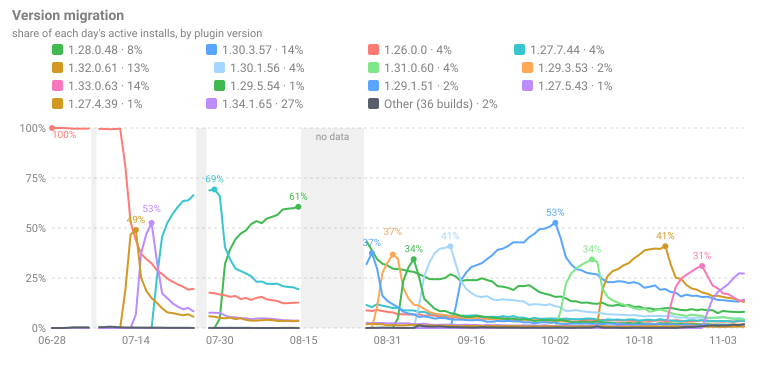

## Crashes (upstream / stability)

Analysed: **114,506** of **117,348** crash reports (1.27.5+ builds, full diagnostics). Excluded: 2,831 from earlier builds and 11 from dev tooling.

- **Affected installs:** 11,971 of 19,459 running 1.27.5+ (62%) sent at least one crash report

> Recorded faults landed **outside the plugin** (in the game or another module), not necessarily the root cause. [Known crashes](../crash_analysis/KNOWN_GAME_CRASHES.md) are grouped by cause, the rest by module.

### Crash rate by game

| Game | Installs | 1.27.5+ launches | Crash reports | Launches with a crash report |
|---|--:|--:|--:|--:|
| GP Bikes | 200 | 9,536 | 1,110 | 11.6% |
| Kart Racing Pro | 91 | 2,108 | 445 | 21.1% * |
| MX Bikes | 19,170 | 956,065 | 112,951 | 11.8% |

*\* Kart Racing Pro has 91 installs: a few machines can set this rate.*

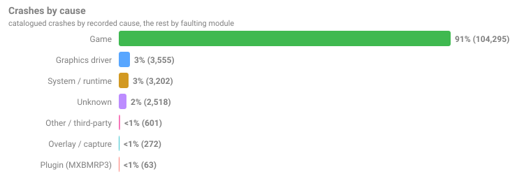

*The Plugin (MXBMRP3) slice (63 crashes) is where the fault landed, not proof the plugin caused it.*

| Access-violation type | Reports |
|---|--:|
| read | 79% (89,897) |
| write | 19% (21,280) |
| execute | 2% (2,502) |
| not recorded | <1% (827) |

### Most common crashes

**66% (75,649)** of reports match the [known-crash list](../crash_analysis/KNOWN_GAME_CRASHES.md).

| Crash | Share | Fix / workaround |
|---|--:|:--:|
| [Offline track-load crash (bad string in per-profile data)](../crash_analysis/KNOWN_GAME_CRASHES.md) | 32% (36,319) | [✔](../crash_analysis/KNOWN_GAME_CRASHES.md) |
| [Physics contact blow-up (bad table index)](../crash_analysis/KNOWN_GAME_CRASHES.md) | 17% (19,038) | - |
| [OpenGL render buffer write (vertex-fill overrun)](../crash_analysis/KNOWN_GAME_CRASHES.md) | 9% (10,603) | [✔](../crash_analysis/KNOWN_GAME_CRASHES.md) |
| [Session teardown null dereference (leaving a session / connecting)](../crash_analysis/KNOWN_GAME_CRASHES.md) | 7% (7,889) | - |
| [Session-teardown crash via input/message pump (stale pointer)](../crash_analysis/KNOWN_GAME_CRASHES.md) | <1% (786) | - |
| [Null dereference in network / session-end code](../crash_analysis/KNOWN_GAME_CRASHES.md) | <1% (586) | - |
| [Out-of-range array index read at session end](../crash_analysis/KNOWN_GAME_CRASHES.md) | <1% (381) | - |
| [64-bit pointer truncated to 32-bit (stack above 4 GB)](../crash_analysis/KNOWN_GAME_CRASHES.md) | <1% (47) | [✔](../crash_analysis/KNOWN_GAME_CRASHES.md) |

*✔ = a documented workaround.*

### Not yet catalogued

The other **34% (38,857)**, most frequent first. `unknown+0x0` is an address in no loaded module (likely freed memory).

| Fault (module + offset) | Category | Share |
|---|---|--:|
| `mxbikes.exe+0x22765c` | Game | 4% (4,882) |
| `mxbikes.exe+0x1d742c` | Game | 3% (3,094) |
| `mxbikes.exe+0x1a29ae` | Game | 2% (2,646) |
| `unknown+0x0` | Unknown | 2% (2,460) |
| `mxbikes.exe+0x255f1f` | Game | 1% (1,237) |
| `mxbikes.exe+0x1eea9c` | Game | <1% (957) |
| `mxbikes.exe+0x2889e0` | Game | <1% (933) |
| `mxbikes.exe+0x1902be` | Game | <1% (910) |
| `mxbikes.exe+0x255ef0` | Game | <1% (871) |
| `mxbikes.exe+0x10ced3` | Game | <1% (860) |

## About this data

The plugin only sends anonymous, aggregate telemetry (no personal data - see the privacy note in the main README). Reporting began in **1.26** (a few stray older builds send only a basic launch event) and expanded through **1.27**, so older versions report fewer fields. Percentages are always taken over the installs that actually report a given field, and each chart notes how many installs that is, so incomplete rollout is never shown as a real trend.

**Definitions.** *Unique install* - a unique `install_id` (regenerated if the analytics file is deleted, so a wipe-and-reinstall reads as a new install). *Launch* - one plugin start (`app_started`). *Active install* - an install that launched on a given day. *Crash report* - one fault caught by the crash handler, saved on crash and sent on the next launch (≈ one per crashed launch). Each install belongs to one game (the plugin installs separately per game); its **game**, **country**, and **version** are its most recently seen values.

Developer/test machines are excluded report-wide (3 installs, 1,860 events): they launch every dev build and deliberately trigger crashes to validate the telemetry, which would otherwise read as phantom plugin crashes.

**Unidentified launches are excluded report-wide** (7,779 of them, 27% of what the install total would otherwise be, from at least 120 machines): a plugin whose analytics file had become unreadable minted a throwaway id on every launch, so each launch arrived as a brand-new install that never returned. Their launches go with them (1% of launches). The plugin now repairs the file, so this shrinks as those installs update.

What each release line reports (share of its launches):

| Release line | Launches | Features | HUDs / widgets | OS version | Update channel | Panel theme | Crash detail |
|---|--:|--:|--:|--:|--:|--:|--:|
| `1.25` | 1 | 0% | 0% | 0% | 0% | 0% | 0% |
| `1.26` | 131,552 | 100% | 100% | 0% | 100% | 0% | 0% |
| `1.27` | 181,355 | 100% | 100% | 100% | 100% | 0% | 85% |
| `1.28` | 202,163 | 100% | 100% | 100% | 100% | 0% | 100% |
| `1.29` | 118,021 | 100% | 100% | 100% | 100% | 100% | 100% |
| `1.30` | 281,938 | 100% | 100% | 100% | 100% | 100% | 100% |
| `1.31` | 54,510 | 100% | 100% | 100% | 100% | 100% | 100% |
| `1.32` | 88,533 | 100% | 100% | 100% | 100% | 100% | 100% |
| `1.33` | 42,303 | 100% | 100% | 100% | 100% | 100% | 100% |
| `1.34` | 25,685 | 100% | 100% | 100% | 100% | 100% | 100% |
